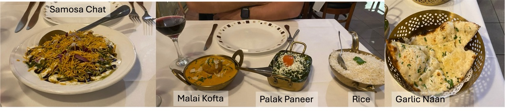

For dinner tonight, Nick made a reservation at Majits in Corrimal for 7 pm. Manjits is an Indian restaurant. It is very popular and almost everyone in the Illawarra knows of it. We often order from Manjits using Uber Eats. We have only dined here once before, in September last year. 

As Majits is a BYO restaurant, we took one of our New Zealand Syrah's with us that we got from Te Mata Estate in Hawke's Bay. They charge a $5 corking fee which is silly to be honest, as we pour the wine ourselves. But it works out to be a lot cheaper than ordering wines/beers at the restaurant. I also think it's a better option for us because our wines are probably much nicer than any of the one's they serve at the restaurant. 

When we arrived, the restaurant was very empty. We sat on the balcony, and there was probably 5 other tables occupied. However, considering that this restaurant is very large, it felt very empty.

Nick opened the wine to allow it to oxidise a little before we drank. The first sip was amazing! I was feeling a bit of regret that we opened this bottle tonight. My eyes watered at the amazing taste of the wine. It was so flavoursome with a full body. Even with the crazy spices of the Indian, it never overpowered the wine. *Side note: looking online, these bottles are $30 NZD. However, they do not ship to Australia ☹️*

As we sipped our wine and read through the menu, we were trying to remember the things that we ordered last time we were here (because they don't offer everything through Uber Eats). As I looked through my photos, I found a picture of the Samosa Chat that we ordered last year. I remember it being so delicious! Therefore, we ordered it again for an entre. On the menu, it says that the Samosa Chat comes in 2 pieces. We were tempted to get 2 but we stuck with only 1. This was a good decision as the serving was quite large. If we ordered more than one entre, it would have filled our bellies so much! 

For the mains, we ordered Malai Kofta and Palak Paneer, with a side of rice and naans - Garlic for me and Chilli for Nick. The palak paneer was a must. This is the meal that I always order and the meal that I love! We were a little unsure of the Malai Kofta but once we tried it, we were in awe of the flavours and textures. It was served in a butter-like sauce, similar to their butter chicken. This was too much food though and I could not finish my naan or the Palak Paneer. Nontheless, our bellies were very satisfied! 

||
|:---:|
|*Img caption: Our meals for the evening at Manjits*|