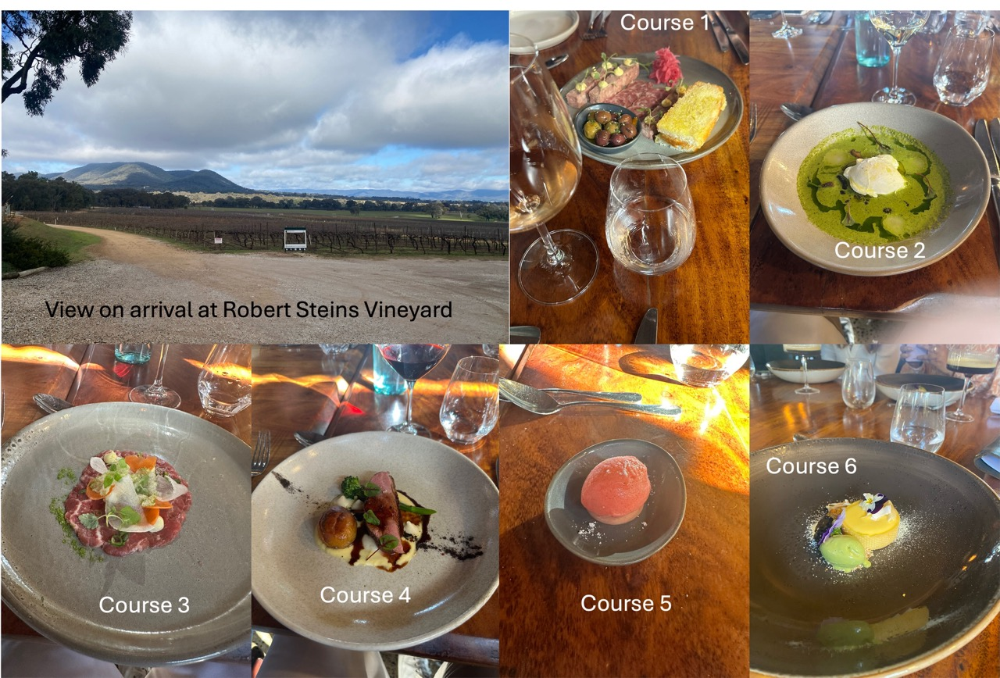
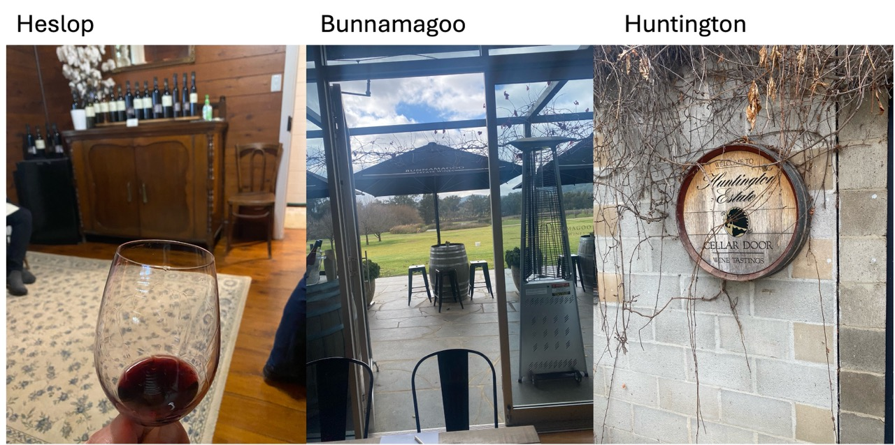
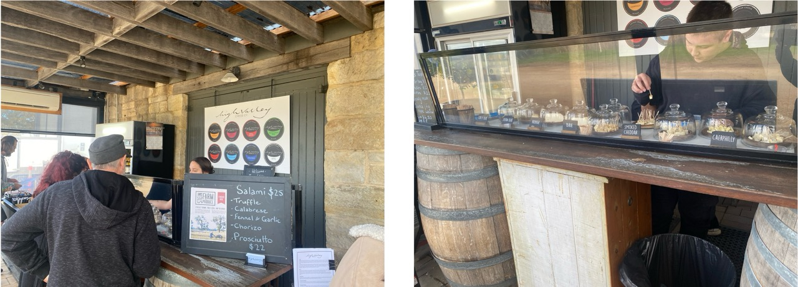
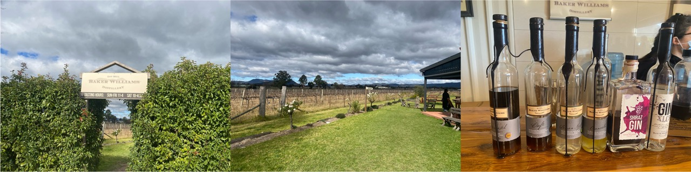
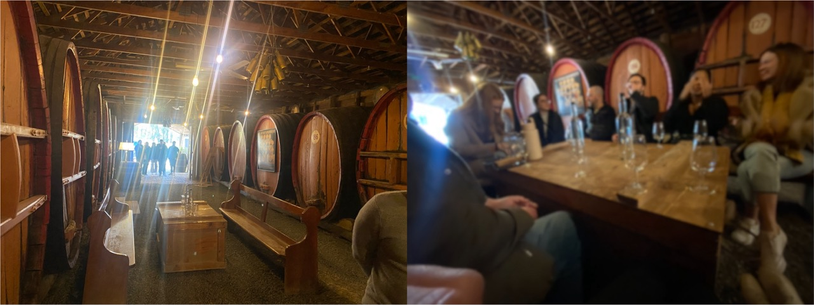
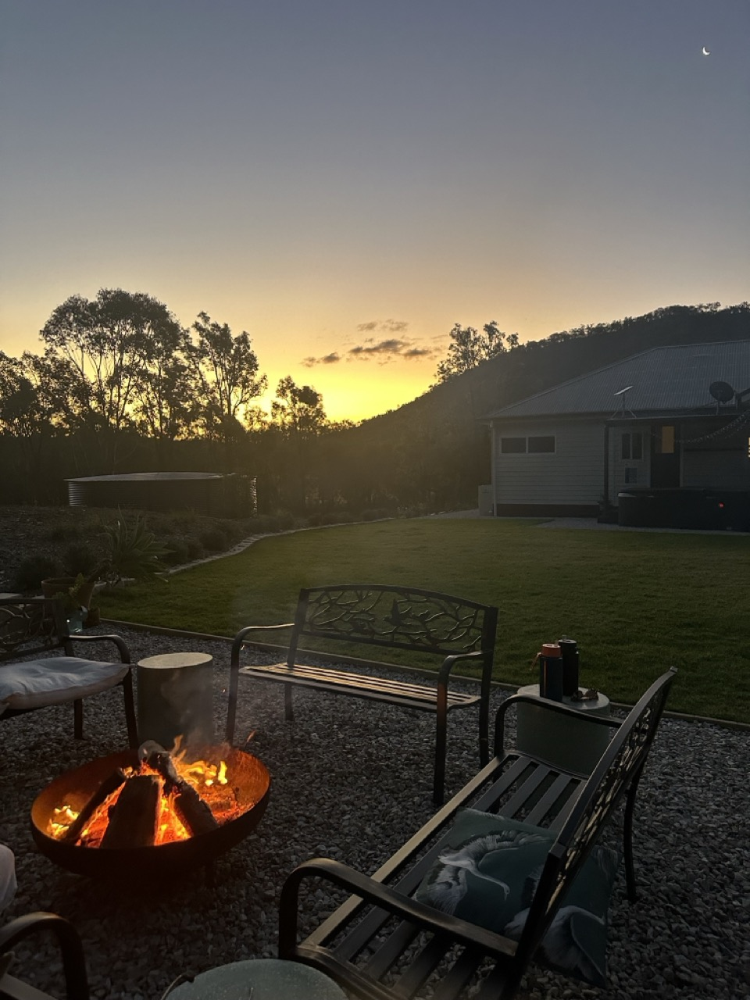

Over the long weekend, Nick and I headed to 📍 [Mudgee, NSW, Australia](https://maps.app.goo.gl/mc1zKcQgysVsQXE17) with a group of Nick's friends. We were staying in a cute house in Erudgere (~10 mins from Mudgee centre). It was a large house, with 2 bathrooms (and an ensuite, which was apart of a different bedroom - not ours), which were very modern. The house appeared to be recently renovated. There were 7 bedrooms, each containing double beds. We took the bedroom opposite the kitchen. 

This place had a large backyard with the most incredible spa (we went in every night!!! I cannot resist a large body of water). There was also a fire pit located in the yard (about 25 m from the house). Every night, we sat by the fire. It was pretty great. Over the time that we were here, the temperatures were very cool with a maximum of 14 °C. 

#### *Friday 7 June 2024*
We drove up on Friday afternoon. We were very lucky that our neighbours were happy to mind Chip and we said that we should gift them some wine as a thankyou. We arrived at 8.30 pm, after a 4 hour long trip, with very little traffic (most traffic through the Blue Mountains). On the drive, I was astounded at how many cars were travelling this far west. I thought to myself that surely they are not all going to Mudgee? Once we passed Lithgow, all the traffic mostly subsided and we drove alone on the roads.

#### *Saturday 8 June 2024*
On the Saturday morning, we headed into town and bought coffee from *Althea by Zin.* This was a very cute little bakery, which sold artisan bread and other pastry treats. The coffee was pretty good, despite us having to order a double shot, and also considering that it was pretty expensive ($11 for two coffees). 

We returned home by 10 am and at 11 am, Adam (a local wine tour guy) picked us up to take us to and from Robert Steins Vineyard (for $100). We had a 11.30 am wine tasting. The wines were good (not sure how else to comment about them). My favourites were definitely the Dry rose and the 2021 Shiraz. 

Lunch was booked at 12 pm at Pipeclay (the restaurant attached). We sat at a long table booked for 11. Our lunch consisted of a 6 course meal, each meal with a wine pairing, which spanned 3.5 hours! The six courses included: 
1. Pipeclay Pumphouse Charcuterie: which was basically a cheese/meat board with bread. The bread served was pretty amazing. 
2. Watercress, shiitake mushrooms, chestnut and poached egg: A green soup which I thought was super tasty! However, the poached eggs were over cooked and very hard, despite the waiter describing that the main feature of the dish was the "soft egg and runny yolk."
3. Beef carpaccio with ginger and lemongrass: It looked amazing, however, for me (the vegetarian), they substituted the meat for sweet potato. It was tasty!
4. Chinese Five Spice  duck breast with squash, potato and broccolini. This meal was the highlight. The duck alternative was pumpkin. The dish was exactly the same, only the duck was substituted. I noted the flavours of the spice and the milky mash potato underneath. I especially liked the peppery taste of the pumpkin. I would like to try and recreate this dish at some point.
5. Strawberry sorbet as the palate cleanser before dessert, which was: 
6. Spiced coconut custard tart with banana and green tea ice cream. I can't comment too much about it. It was good. Probably as good as a tart can get. 

||
|:---:|
|*Img Caption: Robert Steins six course meal.*|

While the meals were tasty, I left the restaurant after 3.5 hours still feeling hungry. It is not enough to simply substitute the meat for vegetables. It seemed like it wasn't really considered, and they only cared for creating a similar flavour. In addition, the service was very slow! I felt like I spent my whole day there, and I did!

The wine pairings were pretty good as well. However, the waiter forgot our last pairing! It really did undermine their services there and I probably would not recommend this place, nor return, considering that we paid $110 per person + $60-80 for the wine pairing. Furthermore, it seemed like the staff constantly forgot about us, with people who arrived hours after us, leaving before us!! 

Just before we got our coffees, the bus driver arrived to pick us up. We ended up taking a takeaway coffee on the bus on the drive back to our accomodation, where we enjoyed a fire and BBQ dinner. 

*Sunday 9 June 2024*
We were up at 7 am, and headed into Mudgee on a coffee run. We drove about 10 minutes to the Dancing Goat, where we ordered 9 coffees (including a coffee for ourselves). 

The Dancing Goat was a cute coffee shop, which seemed to be family owned and run. There were kids under 12 working as the Hostess and the Cashier. We immediately felt bad for our large order, but it didn't matter because they handled it rather well. The coffees came out in under 10 minutes, hand delivered to us in two very stable carry trays. 

After returning back to the house and eating breakfast with coffee, we headed off on a wine tour with Scotty (an employee of Adam). He picked us up at 9.35 am to which we arrived at our first winery for the day: 

### 1. Heslop: 

When we arrived (~9.50 am), I was thinking that we would have to wait until they open (usually 10 am?), but they let us start early. As we walked through the front Garden, we arrived at a house. There were two people who greeted us - a woman named Julie, of about 65-70 years and a male of about 40 years of age, named Liam. They were a mother and son duo. They also mentioned that there was another member, Bob (Julie's husband) but he was currently constructing a new wine cellar.  

They led us into a small cosy room, decorated with a wide variety of wines. Julie was leading the wine tour and she allowed us to try a wide range (7-10 wines) of wines, with 95% of the grapes grown on site (the other 5% were grown at Bunnamagoo). Some wines of interest include the vermentino and Shiraz. We later learned that Vermentino is a grape that is trying to replace the Savignon Blanc (from NZ), as the acidity can be better controlled. The Rose, and Zinfandel were also pretty amazing wines and the best of Mudgee. 

Although, Zinfandel (I knew nothing about this grape variety previously), is a grape grown in California. Liam (the wine maker) spent 1 year abroad in California and fell in love with "Zin" and decided to invest in it. They now are one of a few wineries that grow Zinfandel in Mudgee. 

As we were deciding of the wines to buy, Julie said "If you are saving yourself for the rest of the day because you think they might get better.... let me tell you, they  don't. They are not as good as here." She was right. They were the best wines of the day to which I later (Monday) voted them as the best Wine cellar of Mudgee. 

We purchased 3 bottles from Heslop, including 2x Vermentino's and 1x Shiraz. I will put this winery on my list to return to next time I visit Mudgee. Despite purchasing 3 bottles, they didn't wave the tasting fee. This was a common theme of the day. 

### 2. Bunnamagoo:

The next place was *Bunnamagoo*. It was more of a commercial vineyard, yet it had a really pretty lookout onto the landscape. Most of the white wines I did not enjoy here... Until we got to the reds. The reds were quite enjoyable and we ended up buying a Cabernet Shiraz Merlot and a Shiraz which were so delicious! Funny story though, as we were loading the van with our wines, Nick set off the fire extinguisher. It let out a whole lot of foam, which everyone joked about for the rest of the day. 

### 3. Huntington:

*Huntington* followed. It was also a very pretty vineyard. Lots of bushery and trees still containing their 'autumn leaves.' When we entered the cellar, we were escorted upstairs to a medium sized room, with a long, narrow, wooden table to seat 11. We sat on wooden stools and a tall guy (sorry I do not recall his name) talked us through the wines. Attached to the room was a bathroom. From where I was sitting I could clearly see a bathtub and a shower. Over the bath was a long board and wine bottles stacked atop. It seemed like it was once a residence. 

The wines here were nicer than Bunnamagoo (in my opinion). Some noteworthy wines were the Chardonnay which I finally realised, has a certain butteriness to it. I had heard people comment about the butteriness of Chardonnays but I never really tasted it or realised this taste until now! All the reds were again very nice, and we ended up buying a Shiraz Cabernet. 

### 4. Moothi Estate

The next place we showed up at was *Moothi Estate.* It was meant to be for lunch, but the only thing on their menu were cheese boards and fries. Their service was also very slow. Later I was informed that it was shutting down the next day. I wondered why they would take us to a place that was closing down, if we were discovering Mudgee.. Nevertheless, this place was not memorable for me. 

### 5. Craigmoor and Burnbrae Vineyards

We went to a few more places after this, including *Craigmoor* and *Burnbrae Vineyards*. There was nothing really memorable about these places. For one thing, the staff at Craigmoor were very distracted, and did not explain much of the wines. This is most likely due to everyone getting to choose their own wines and our wine conniseur trying to meet everyones needs. The staff at Burnbrae were very nice, however, by this point we were so tired and I was almost sick with each sip of wine. However, we did buy a bottle from here, as usual, a Shiraz. 

| |
|:---:|
|*Img Caption: A few pics of my favourite wineries of the day*|

### Some notes

I have a few observatory notes about the wineries and vineyards around Mudgee: 
1. You will always pay a Wine Tasting fee regardless of the amount of wine that you buy. 
2. The wines are cheaper than those in the Hunter Valley. 
3. It is a different vibe, less laid back than the Hunter Valley. 
4. It was less touristy than the Hunter Valley. 
5. Maybe a little more "snobby" about the wines here. 

I also want to comment that five wineries in one day is TOO MUCH. I already knew this before hand, but I must stress this here. After the first three, the wines felt like a chore to drink and I enjoyed them far less. It was very annoying that we arrived back so late (close to 5 pm), and I was feeling very stressed that I could not run or do anything else aside from drink wine. 

#### *Monday 10 June 2024*
We slept in until 8 am. My legs were hurting a little bit, maybe from laying down for so long, or the lack of training over this weekend. We got up, dressed, and cleaned the kitchen from last nights pizza's and then headed into Mudgee for breakfast. 

We were planning to go back to the Dancing Goat, however, when we parked, there were lots of people lined up waiting for a seat and therefore, we decided to go somewhere else. We ended up going to Alby and Esters. It was a cute cafe in a garden. There were street side seating, then once you walked through a short alley way, there was an open garden filled with tables, and two different indoor seating areas. It was a rather large space for dinning in. When we walked in, it was pretty busy but we still managed to get a seat inside. It was noisy inside but since it was pretty cold (under 10 degrees), we decided to stay put. 

We ordered coffees (strong) and breakfast: Poached eggs for me and a jaffle for Nick. It was a nice breakfast. Our meals came with a side of tomato relish which gave the eggs more flavour. The tomato relish was amazing, which we later realised that they made themselves, with jars onsale to the public. I commented about how we should eat tomato relish more often. I noted that I should add it to our breakfast rolls. 

After breakfast, we ordered  another coffee and a lemon + blueberry (gluten free) cake. It was an enjoyable morning and we left the cafe with full bellies. We returned back to the house at 10.30 am but we were straight out of the door again as the gang wanted to go to the Cheese shop. We headed to High Valley Cheese Co. 

### High Valley Cheese Co.

||
|:---:|
|*Img Caption: Cheese tasting at High Valley Cheese Co.*|

The High Valley Cheese Co. is located very close to Mudgee town,maybe 5 mins or so. It is clearly visible from the road. It was a rather small shop located on a large property. The shop fit about 10 people at one time (very squashed). The cool thing was that the cheese tastings here were free! This is the only tasting that we have been to thus far that has been free. 

We tried a range of cheeses, from feta to cheddar and blue cheese. They were very tasty. I didn't have much of an appetite when we arrived and so I did not try the Feta. However, I was told that it was delicious and there were many people in the group who bought one of the Feta variations. The other cheeses that we tasted included the Caerphilly, Smoked Cheddar, Smoked Chilli cheddar, Brie, Rouge, Stefan Blue and Coil Y Blue. All the cheese were enjoyable aside from the last one. The Coil Y Blue literally tasted like a farm (but I do not enjoy blue cheese). 

As there were 11 people in our group, there was a backlog of people lining up, and the line spanned out a few meters. I later thought to myself that I would hate to stand in that line, because it moved very slowly. But the cheese conniseurs were very good at their job and it was my favourite tasting today!!!

We ended up buying the Smoky cheddar cheese and the Rouge. The smoky cheddar was so smoky! I loved it the most. The Rouge was a version of brie, slightly younger but also very nice. 

Next stop was Mudgee town so some of the gang could get coffee and then we were off to Bakers & Williams Distillery.

### Bakers & Williams Distillery 

Bakers & Williams Distillery was booked for 12 pm at $5 pp. As we walked through a side fence, we walked through a yard with an amazing view of a vineyard. There were several tables set up and lots of flowers around! 

||
|:---:|
|*Img caption: A very pretty distillery 'Bakers & Williams' with a marvelous view of the vineyard and a selection of liqueurs to taste.*|

We walked into a small garage which was decked out as a tasting room. We tried a variety of Gins and Liqueurs, which we were informed were all made onsite. Even the waxing of the bottles was done onsite.
The tasting list consisted of: 
- XLCR Gin: This tasted like a normal Gin to me, and I am not a huge fan, however Nick loved it! 
- Shiraz Gin: Was better but still not my style. The taste was improved when mixed with a grapefruit soda. 
- #Orancello: This was pretty amazing. Exactly like lemoncello, just with orange. We ended up buying a bottle of this. 
- Lemon Myrtle: This was pretty nice as well. 
- Cafe Liquor: Also great, tasted like an iced coffee.
- Butterscotch Snapps: SO good! Tasted like butterscotch sauce. 

Despite the group buying a number of liquers, we still had to pay a tasting fee. 

Next, we headed for lunch at Blue Wren.

### Blue Wren Farm

Lunch was booked for 1.30 pm, but we showed up to Blue Wren Farm ~40 minutes early. They allowed us to sit. The waiters were very good and accomodated us very well. However, there was not much to eat for vegetarians, so I had bread and potatos for lunch + a lemon lime and bitters. I wasn't too fussed though because I was still full from our large breakfast. It just annoyed me that it costed $40 just for bread and potatos. Once everyone was finished eating, I was pretty keen to leave and do other things with the day. 

The final destination was the Pieter Van Gent Vineyard. 

### Pieter Van Gent Vineyard
Pieter Van Gent is located on a large farm. As you enter the drive way there were several lodges and paddicks, seeming to be accomodation for tourists. As we approached the end of the dirt driveway, we found a parking lot to the right of a farmhouse. On the outside of the farmhouse entrance, there was a nice sign advertising that this was a cellar door. The entrace pathway was about 10 m long, with large barrels, of a rusty brown colour on either side. As I walked through the entrance, the floor was covered in grey stone and the lighting was rather dull to give a very cool jazzy farmer vibe. There were a number of tables and chairs which lined the corridor of the long entrance way. We sat in a "U shape" seating, where we were greeted by a wine connoisseur who seemed to know a lot about the wines. 

|
|:---:|
|*Img caption: Large wooden barrels that filled the corridor.*|

Our tasting consisted of five wines ($10 pp/tasting) including a vermentino, moscato, Shiraz, Tawny and a "white port". We learned that this place specialises in Tawny and so many members of our group loved it. Most of the wines here were not my style, however, the 2013 Shiraz was pretty nice and we ended up purchasing a bottle ($20 special, but with tasting fee it costed $30). 

I was glad that we got back before the sunset today, so I could go for quick 5 km run. It made me feel great after a long weekend of drinking wine. Other wineries were suggested to us, which will be on the list for the next time we go, including [Lowe Family Wines](https://maps.app.goo.gl/kXz5CTgC7jScMVzX6) and Di Lusso (although, the owners are planning to sell so may not be around for much longer).

In the evening, we enjoyed another fire. 

||
|:---:|
|*Img Caption: Our evening fire to keep warm in Mudgee*|

#### *Tuesday 11 June 2024*
We were up at 7 am, cleaning and packing before heading off at 8 am. We stopped at the Dancing Goat Cafe in Mudgee and ordered a coffee and takeaway rolls: a B&E roll for Nick and an Egg roll for me. Note: they weren't so much rolls as they were burgers, and they were pretty great as well. This was my favourite cafe in Mudgee and I would go back here again if we ever come back to Mudgee. 

As we drove in the dark on the way to Mudgee, we did not get to see any of the features such as the rolling hills and the mountenous backdrop. The drive home was pretty great, especially heading through the Blue Mountains. Nick and I spoke about the rolling hills and how how cool they were. In terms of country and land, Mudgee is a lot nicer to look at than the Hunter Valley (in my opinion).

A 4-hour drive later and we were back in Wollongong.

Note to self: 5 days is too long to go without running, as my legs felt exhausted after the 5 km run. Now, I am going to start preparing for the Husky marathon in Huskisson in November. 🏃🏽‍♀️🏃🏽‍♀️🏃🏽‍♀️
