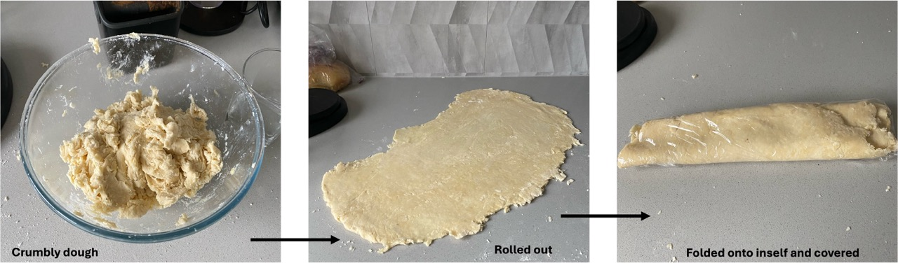

## Preparation of the pastry
From my [previous post](../May/spinach_cheese_triangles.md), I prepared puff pastry with flour, butter and water. The puff pastry was then used to make spinach and cheese triangles. They were very nice, but the pastry was very sweet. Therefore, I wanted to create a recipe that was less sweet and more to my tastes.

The ingredients were as follows: 

 400 g plain flour   1 tsp salt   53 g butter   1 tbsp olive oil   155 g water   

*Method:*
In a large mixing bowl, the flour and salt were combined. Butter was chopped into small squares and using my hands, the flour and butter were rubbed together creating a crumbly flour. Next, the oil was added and the flour/butter mixture and oil were gently rubbed together (now, the texture was more crumbly). Finally, I added 155 g water (Note, I weight out the water, but it would equate to 155 mL). and used my hands to mix. The mixture was crumbly, but good enough to roll out. With floured hands and a lightly floured surface, I rolled the dough out into a long, thin pastry (maybe 0.5 cm thick?). Next I folded it several times onto itself and covered in plastic wrap. The covered dough was placed in the fridge.

||
|:---:|
|*Img caption: From preparing the crumbling dough by rubbing ingredients together, to rolling out the dough and folding it into a plastic wrap* |

I think 2 hours is adequate enough to chill the pastry, however, I will leave it in the fridge for 24 hours and prepare some cheese triangles tomorrow! Stay tuned. 
