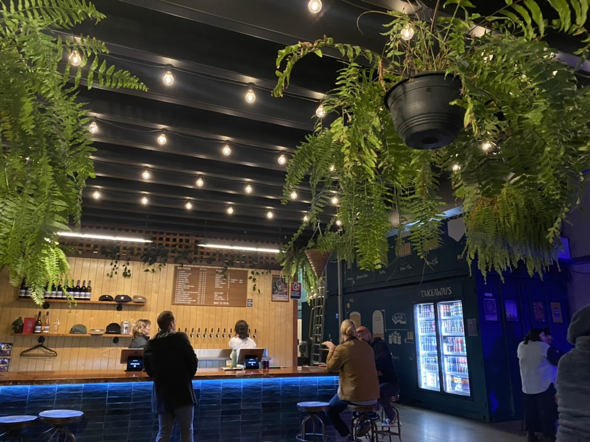

Service: ★★★★★  
Beers: ★★★★★ 
food: ★★☆☆☆☆ *  

*Due to the waiting time. 

We headed to Seeker Brewery on Saturday night for a night out. We read online that a band was playing from 6 pm and so we thought that we should head there early just in case it was too busy. 

We arrived at 5.40 pm to Seeker Brewery in the Industrial area in Unanderra. There was some parking available, which we reversed into. As we headed up the driveway, we walked up a set of 5-7 steps, walked past a food truck which was located ~10 m from a basketball hoop. The brewery itself was located in a factory, with the entrace parallel to the foodtruck. As we walked in, it did not look busy. There were a few tables and seating available. We sat down at Table #9, underneath the stairs. Yet, we could see everything around us quite well, including the stage, located 5 metres away at 275 degree angle from us. 

||
|:---:|
|*Img caption: My view of the bar from where we were sitting*|

We ordered a beer each, followed by a pizza. The staff then said that there was a 30 minute wait, which we agreed to. We drank a beer. Then another. Then the Jazz band came on. 1.5 hours past and we still hadn’t eaten. It was so upsetting that we had only ordered one. If we had known it was a 1.5 hour wait, then we would have ordered more. Anyway, 7.15 pm came and our buzzer finally rang to tell us the pizza was ready. 

Sure the pizza was pretty tasty - we ate the mushroom pizza. But it was definitely not large enough to satisfy us both! I was pretty cranky to be honest. I wanted to pull my phone out and give them a bad google review. 

Then… One of the workers walked up to us and gave us our money back for the pizza. I was shocked! I tried to tell her not to worry before she walked off. I was amazed at how attentive they were. It made me feel like they cared about their customers. While I felt a little bad for taking the money, afterwards, we drove straight to Hungry Jacks to further satisfy our bellies, to which we spent the pizza refund money. 

I am happy with my overall experience at Seeker. The beers were great! The vibe and music was great! The pizza was pretty amazing too. The only complaint was the speed of the pizzas. I am hoping that it is not always like that? But I suspect not because they refunded us for the wait. 

