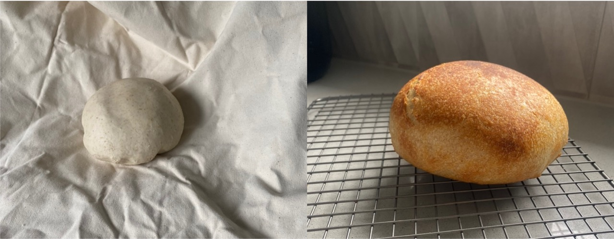

This morning at 7.30 am, I checked the sourdough starter and it appeared to have deflated. A float test also told me that I left it too long, because it sunk to the bottom of a jar of water. Therefore, I took 24 g of starter at 7.30 am and fed with 55 g flour and 94 g of water. I placed it in the oven which was 25-30 degrees (note: the oven was off, but it is a warm place to allow the sourdough to grow). At 10 am, there were no air bubbles present. I gave it a more vigorous stir and air bubbles began to form. At 12.30 pm, it grew about 1 cm. At 12.45 pm, it passed the float test (compared to the discard, which did not). I placed it in the oven for longer. Also note that I kept the discard and later in the day (4.30 pm), I fed it flour and water.   

At 1.30 pm, I combined 450 g of all purpose flour and 1 tsp salt. I added 350 g of hot water. I mixed the dough - it was very flaky. I let it cool down to 43 degrees before adding the entirety of the starter (!160 g +- 10 g). After I added the starter, the dough was very wet and hydrated. Note for next time, use less water (250 g). 

The mixture sat in the microwave for 1 hour (“autolyse” period). At 3 pm, I returned and performed 4 x stretch and folds. The dough was so wet that I had to add a small amount of flour. I allowed it to sit for 30 minutes, covered with a tea towel (Bulk fermentation phase). After 30 minutes ( 3 30 pm), I repeated a stretch and fold of the dough. It was very stretchy, but appears to be becoming smoother overtime. 

After 1 hour of bulk fermentation (4 pm), I performed another stretch and fold. It was still very sticky. At 4.30 pm, while it was still sticky, the dough was getting stronger and better holding its shape. I repeated the stretch and fold. At 4.30 pm, I placed the dough into the oven (warm area, not on) and left it until 9 pm. 

When we arrived home at 7.30 pm from seeker brewery, l checked the sourdough and it did not appear to rise too much. Therefore I decided leave it for a little longer. I was a little worried that I would leave it for too long over night. Therefore, I decided at 9pm, to mould the dough. 

I performed some shaping of the dough with my hands and the bread Moulder. I then wrapped the bread in a bread cloth and placed in a mixing bowl and in the fridge overnight. 

At 10 am, I pulled the bread out of the fridge and further shaped the dough on the bread cloth. By pulling the dough along the bench and inducing frictionous movement, the dough became less and less stretchy. I knew I was finished when it would not stretch anymore and it continued to reform its original shape. 

I preheated the oven to 220 °C, and then the Dutch oven for 30 minutes. Following, I placed the dough on baking paper and in the Dutch oven. The bread was baked for 20 minutes with the lid on and 25 minutes with the lid off. 

When I pulled the loaf from the oven, it was quite small. Yet, it did rise a significant amount, indicating that the yeast was active. I forgot to score the loaf. However, the loaf did not break during baking. My initial thoughts were that the loaf is going to be very dense. I let it sit for 20 mins to cool, before cutting into the loaf.

As I cut into the loaf, it was very soft and easy to cut. However, the bread was also very moist and damp. I think that the water content was too high and I didn’t bake it with the lid on for long enough. Next time, I should do 30 minutes on and 10 mins off. In addition, I definitely need to decrease the water content. As a result of the remaining water, it was more dense than I expected, which gave it a cake-like texture. 

In terms of smell and taste, it had a sourness to it - as expected. All in all, it was a good attempt at my first loaf of sourdough. 

||
|:---:|
|*Img caption: From dough to bread.*|