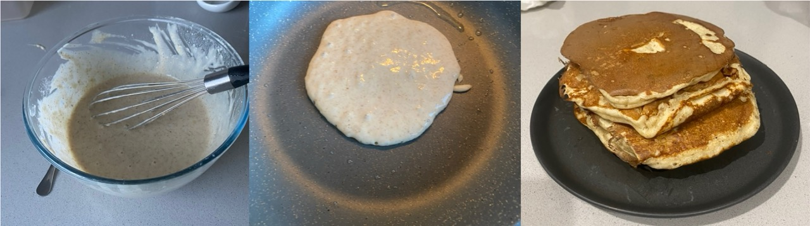

On 23.6.24, I used my sourdough discard for the first time. At this point it was 10 days old. Just before I was preparing to use it, I noticed that it had rose almost double its initial size. It was very gaseous and therefore, I thought it was active and ready. 

The first recipe I used was the following:
Makes 5 pancakes. Serving size is probably 1-2. 

**Ingredients:**
97 g starter (discard) 
112 g plain flour 
1 tsp sugar 
1/2 tsp salt 
2 tsp baking powder  
3/4 cup of milk (warmed) 
1/2 frozen banana 
1 egg.  

**Method:**
1. Combine dry ingredients
2. Add wet ingredients
3. Let it sit for 5 minutes (it will bubble a bit because of the sourdough discard)
4. Fry 30 sec each side. 
5. Serve with butter

The pancakes were indeed very fluffy and full! I enjoyed these pancakes so much that a few days later, on 25.6.24, I made more! 

The next time I made them, I changed the ingredients as follows (methods are the same): 

50-100 g starter 
112 g plain flour  
1 scoop of protein powder 
1/2 tsp salt 
2 tsp baking powder 
3/4 cup milk (warmed) 
1/2 frozen banana 
1 egg.  

These pancakes were delicious and I ate two for lunch the following day! 

||
|:---:|
|*Img caption: The batter (left image), pancakes cooking (middle image) and the final product (right image)*|
