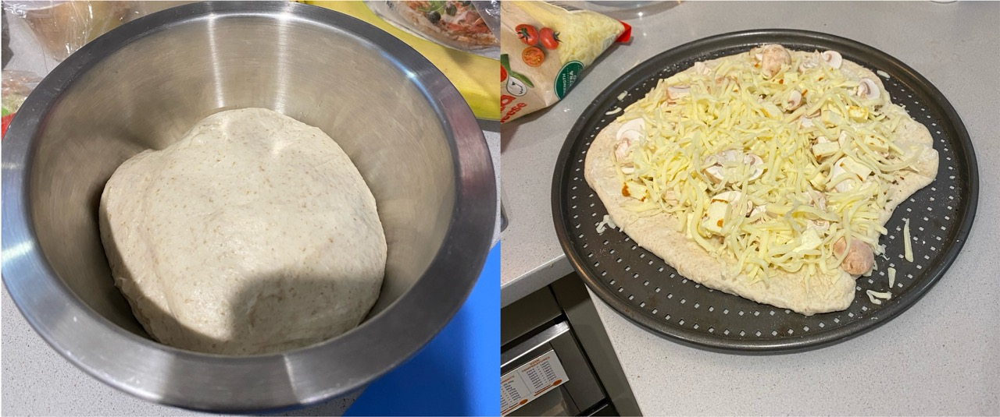

--- 
title: Sourdough Pizza Crust
date: 2024-06-30
tags: [my vegetarian cookbook, sourdough]
---
Note: this makes 1 x pizza dough. 

**Ingredients:**
143 g pizza flour 
1 tsp salt
2 tsp olive oil
71 g sourdough discard
93 g water
50 g extra plain flour 

**Methods:**
1. Combine dry ingredients and oil.
2. mix in the sourdough starter
3. Adjust the texture with water (we want flaky bread. It should come together but not be super sticky.) 
4. Let it sit for 30 minutes
5. Perform 5-8 cycles of stretch and fold. 
6. Let sit at room temperature for 24+ hours (or in fridge for longer), until doubles in size.
7. Roll out dough, using flour to prevent dough from sticking. 
8. Add toping as required
9. Bake for 30 minutes at 180 (fan forced).

The crust was so soft! I cannot wait to acquire a woodfired oven so we can make some next level pizzas!!! 

||
|:---:|
|*Img Caption: Preparation of garlic (+ mushroom and halloumi) pizza for a side dish with dinner tonight |

Note: I used the discard. I think it is okay to facilitate growth, as the extra flour is feeding the yeast, you just may need to leave it much longer. 