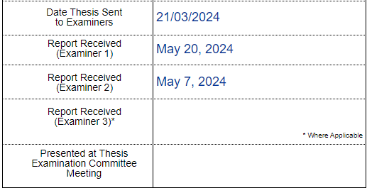

What's new in the life of Carly? Recently I started working as a laboratory technician for ANFF ([Australian National Fabrication Facility](https://anff.org.au)), back at the Innovation Campus in Wollongong. ANFF is a government funded organisation that is designed to support Research and Development. There are several nodes located around Australia, with several in each state. The ANFF Materials node is located here at the University of Wollongong as well as the University of Newcastle, specialising in polymers, bioinks, and electromaterials.

I have been here for 2 weeks so far. At the moment, the work is pretty slow, yet I am trying to keep busy. I have been trained on the [ICP](./icp_.md) and elemental analyser and am waiting for traiing by Greg on the digestor in order to further my training on the ICP. I hope to use it a few times in order to become more familiar since I am now the official trainer for it. While I wait for things to happen here, I have continued my learning with python. In fact, today I wrote a program with the following purposes: 

1. To create a new folder with the month, then a folder with the date
2. To take a file and convert it from txt to csv
3. To extract the X and Y values from the folder and normalise the Y column. 
4. To create a line graph of the X and normalised Y values. 
5. To export the image as a png with the date and activity as the file name. 

I feel as excited about programing as I did with the synthesis of my polymers. Both of these skills have different thresholds and I think they can complement each other very nicely. I just wish I could get a mixture of lab work and desk work... As I was told today "This place is very slow, as there are many changes happening.."

In addition, I have been learning a bi¬t of LaTeX. It was a large hurdle and a little traumatic installing it, only for Nick to point out to me later on that Typst (which I am more fluent with) is open access for offline use (something I did not realise before). Therefore, I looked through the extensions of VSCode and found the typst extension, which I immediately installed. I began to create a template for my publications, which is much nicer than using microsoft word!!!! If I could do one thing over again, it would be to use typst for my thesis. I will definitely be using this to create reports in the future. 

In other news, both of the examiners have returned my PhD thesis. I am yet to receive it, however, my supervisors have told me that there are mostly minor corrections (They didn't want to give me too much information, and later I learned that they are not allowed to tell me anything). I'm hoping that I can correct it soon, but I am very nervous about what it will say! 

 

||
|:---:|
|*Caption: The only information I can get about my thesis at this point*| 

