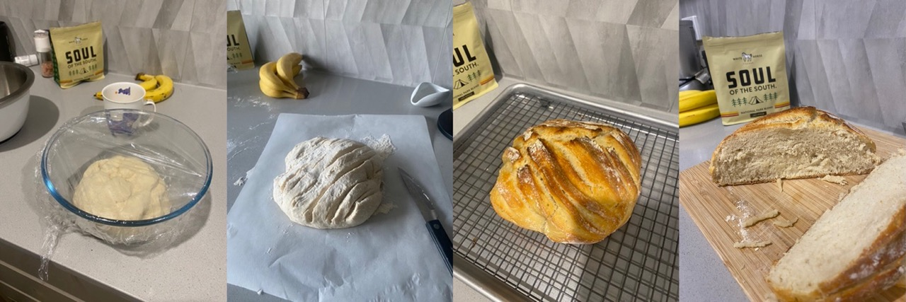
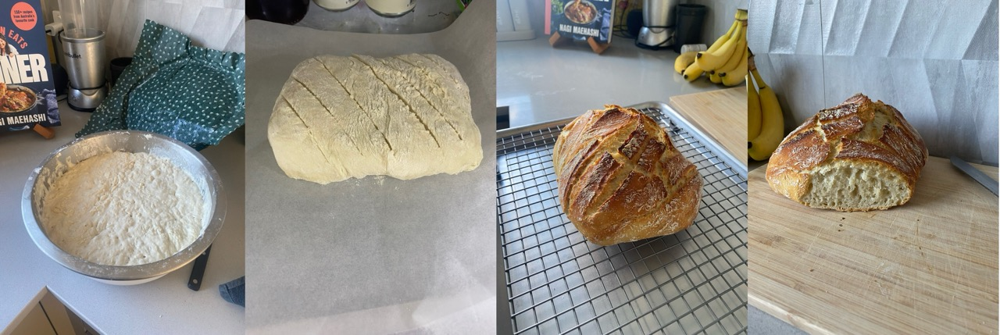
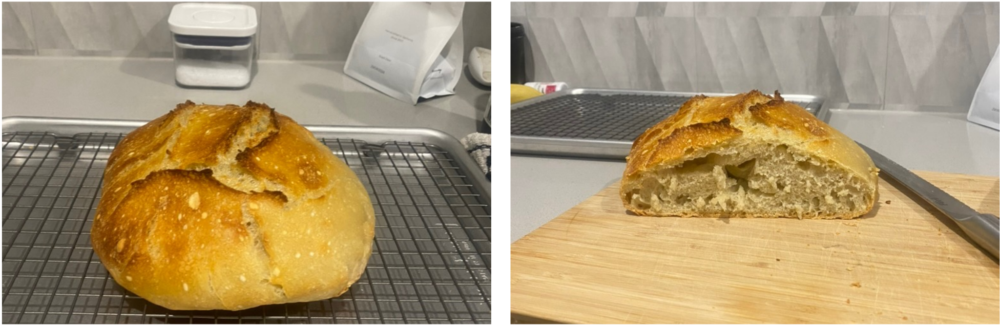

<!-- import Figure from '/Volumes/code/coolcarly.github.io/src/components/Figures/figures'; -->

*9.5.2024*  
Over the past few weeks, I have had the desire to improve my baking skills, so I have invested time into making a perfect loaf of bread. With every small tweak in a recipe, I realised that there are dramatic changes, which motivated me to write about the changes in bread quality in relation to the chemistry. 

Flour contains proteins glutenin and gliadin, which combine in the presence of water to form gluten (Fig 1). Prior to the addition of water, glutenin exists as a colloid. Upon addition of water to the flour, the chains are allowed to stretch, seperate, and form new disulfide linkages. These disulfide linkages create a network of glutenin polymer that produces the strength and elasticity of bread dough. At the same time, the smaller gliadin proteins will disperse through the glutenin polymer network, which allows the bread to "rise". It is the constituent that facilitates formation of the gluten network. Due to it's self-assembling properties (as it is highly hydrophobic), it will associate into spherical particles and absorb other nutrients such as vitamin E. Thus, the quality of the gluten network that forms is dependent on the type of flour that is used.

|  |
|:---:|
|*Fig 1. Schematic of gluten formation*|

Mixing and kneading of the flour/water mixture encourages the gluten network to further develop. During this process, carbon dioxide is incorporated, producing a more porous dough once it is baked. Yet, we dont want the gluten networks to be so strong that they become chewy and tough. This is the reason that people turn to a "no-knead" method. Sometimes, a high water content is enough to facilitate formation of strong gluten networks. 

Yet, there is one more ingredient that is required to create the gluten network... and that is salt. As mentioned in the ["salting-out"](/science/salt) post, salt helps to decrease the water content. In this instance, salt will remove water from the protein/polymer network to increase the strength and elasicity. 

--------- 

The initial recipe that I started with came from Nagi: [RecipeTinEats](https://www.recipetineats.com/easy-yeast-bread-recipe-no-knead/). The ingredients required were:

 450 g flour   2 tsp yeast   2 tsp salt   375 mL of warm watern (~40 °C) 

First, I started off with a "no kneading" approach to bread making. I was unsure of the measurements for the yeast. I had the large container of active yeast as well as the packets. I initially used the packets, and with a quick google search I saw that 7 g was an equivalent of 2 tsp of yeast. Therefore, in my first attempt to make this bread, I activated one packet of the yeast in warm water. The bread was left for a few hours in a warm-ish environment to rise, and then it was moulded into a round ball and baked using the dutch oven.

After baking, the bread was very tough to cut and very dense, but it was still quite tasty and full of flavour. These bread flavours arise from fermentation. The high density is possibly attributed to a low water content. Thus, for the subsequent loaves, I went for weighing out the ingredients using a scale instead of the "cups" measurement as a scale is more accurate. 

A few days later, I used the recommended amount of yeast (2 tsp), weighed out the flour (450 g to be exact) and the water. I saw that the dough was still a bit "doughy", so I added an extra 20 mL of water to the batch (395 mL in total). It was too sticky to be able to knead (Fig 2, img1), yet it felt very soft and after allowing it to rise for several hours, I baked it using the dutch oven. NOTE: I was sure that it had risen well, when the dough (before baking) was very bubbly on the surface and small movements of the bowl containing the dough resulted in a "jiggling" of the dough surface. This time, it rose more than the previous batch (likely due to the extra yeast) and was less dense than the last batch (owing to the excess water added).

|  |
|:---:|
|*Fig 2. Batch 2: (img 1) sticky dough, (img 2) moulded dough for baking, (img 3) final product.* |

Without a job at this point, I wanted to bake more and change the conditions to geet the best loaf. I wondered what is the impact of leaving the dough to sit for longer? What is the impact of kneading? Surely I can google this, but I wanted to experience the feeling and taste differences. Therefore, the next batch that I made, was using the same contents as above only, I allowed the dough to sit for 3 hours at room temperature, then 2 days in the fridge (covered). The day before cooking, I pulled out the dough, moulded it into a ball and allowed it to sit covered in plastic wrap in the fridge overnight. When I baked this loaf, it rose slightly more than the last batch, and was also more porous (Fig 3). From what I understand, it seems that when you put the dough in the fridge, fermentation is slowed down to allow the development of more complex flavours.

|  |
|:---:|
|*Fig 3. Batch 3: (img 1) moulded dough for baking, (img 2) final product and (img 3) a photo of the sliced bread, observing the porosity of the loaf.* |

*15.5.2024*  

The next parameter that I wanted to test is the impact of kneading on the dough. Therefore, a dough was prepared as previous, however, it was kneaded for 5 minutes of before allowing the dough to rise. Due to the better properties of the previous batch of bread, the dough was immediately placed in the fridge, in a covered bowel. The dough was left for close to 22 hours in the fridge. The dough appeared to have similar textures as the previous batch, however, was less soft upon touching it.

The dough was moulded and scored (using tips that I got from [vegpatchkitchen](https://vegpatchkitchen.co.uk/what-is-oven-spring/)) and baked from it's cold state. The idea behind scoring is that it allows the gases to uniformly escape, making bread the rise more uniform, instead of having that weird bubble in the middle of the loaf (as seen in img 2 of Fig 3).

While the final bread loaf in Fig 4 (img 3) appears to be more uniform, without the ugly bubble in the middle, it was less porous than batch 3 (Fig 3). This was attributed to the small additions of flour that I added in order to knead the bread. As small amounts of excess flour decreases the water content, the bread ultimately became more dense. I thought this bread was the tastiest and best looking so far. 

|  |
|:---:|
|*Fig 4. Batch 4: (img 1) dough after kneading and ready to be placed in the frige, (img 2) moulded dough for baking, (img 3) final product and (img 4) a photo of the sliced bread, observing the porosity of the loaf.* |

*20.5.2024*  

This time, I doubled the batch size using the following ingredients:

 900 g bread flour   656 g warm water (~ 40°C)   4 tsp salt   4 tsp of yeast

In this batch, the process was as follows. First, 4 tsp of dried yeast was added to 2 cups of warm water (equivalent to 427 g of water). The yeast was allowed to grow for 5 minutes and then added to the flour/salt mixture. The mixture was combined with a wooden spoon. As it appeared to be very flaky and floury, an extra 229 g of water was added. It appeared to be very slicky and slimy. It was too sticky to be kneaded, or even handled. This large batch was left in the mixing bowl, covered and put straight into the fridge for 22 hours. 

The oven was preheated to 220°C and the dutch oven was preheated for 30 minutes. During this time, half of the mixture was taken from the large mixing bowl, moulded and scored and put back in the fridge (covered) until it was ready to bake it. The dough (on the baking paper) was gently placed into the dutch oven and baked for 30 mins with the lid on, and a further 10 mins with the lid off. 

The bread was probably the best that I have made so far (I know I say this everytime... but is true). The defining features were the high porosity caused by the high water content, the uniform growth in the dough due to scoring of the loaf and the softness of the inside! 

|  |
|:---:|
| *Fig 5. Batch 5. (img 1) risen dough, (img 2) scored dough, (img 3) baked bread out of the oven and (img 4) image of the face of the bread, showing a higher level of porosity.* |

The second half of the mixture was left in the fridge for 2 more days. When I removed it from the fridge (22.5.24), the dough revealed bubbles which is indicative of gas being released. It was very sticky and very difficuit to pick up. I managed to mould it into a ball, with the aid of a small amount of flour. The dough was then wrapped in plastic wrap and placed in the freezer, where it sits until I am ready to bake again. Unfortunately due to my new working commitments, I get less time to bake! I will probably bake this loaf next week. Stay tuned!

*Date updated: 30.5.24*
Yesterday morning, I took the bread dough out of the freezer and placed it ontop of a plastic board, with the plastic wrap still covering it. I allowed it to sit in the fridge while it defrosted. The appearance was no different to when I put it in the freezer, however, it seemed to have less structural integrity (i.e. everytime I tried to mould it into a ball, overtime it would loss the shape). At 4.30pm, I begun preparing the oven to bake the dough. I popped it in for another half an hour bake, followed by 15 minutes without the lid.

When I pulled it out of the oven, it had a very large circumference which is consistent with the dough losing its shape. It rose a bit, but was not as inflated as previous. I suspect that some of the yeast died when it was frozen and to compensate for this, I shouldve added extra yeast to the batch. The bread was hard on the outside and soft on the inside, just like I like it. It was very porous and tasted good. I think this bread was great overall. 
||
|:---:|
|*Fig 6. Batch 6: after the dough was frozen for 1 week, it was defrosted for 2 days in the fridge and then baked as usual.|

### References
1. Cho, I.H. and D.G. Peterson, Chemistry of bread aroma: A review. Food Science and Biotechnology, 2010. 19(3): p. 575-582.
2. Sha, X., et al., The prolamins, fro structure, property, to the function in encapsulation and delivery of bioactive compounds. Food Hydrocolloids, 2024. 149: p. 109508.
