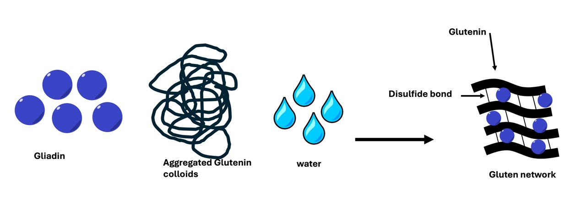
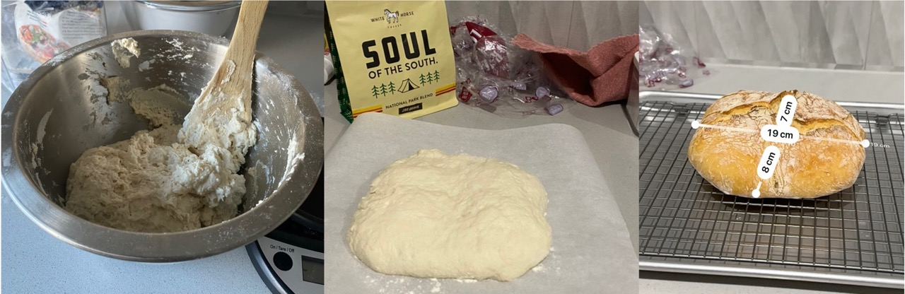
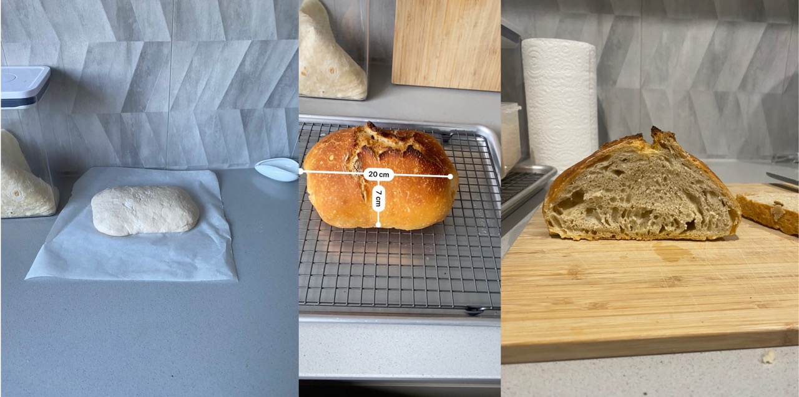

import bread1Pic from './img/bread1.jpeg';

Over the past few weeks, I have had the desire to improve my baking skills. You see, a few months prior, I made bread following a very simple recipe. However, it didn't taste good. I realised that there was a science to bread that made me so intrigued. 

Flour contains proteins glutenin and gliadin, which combine to form gluten. Prior to the addition of water, glutenin exists as a coiloid. Upon addition of water to the flour, the chains are allowed to stretch, seperate, and form new linkages as a disulfide. These disulfide linkages create a network of glutenin polymer that produces the strength and elasticity of bread dough. At the same time, the smaller gliadin proteins will disperse through the glutenin polymer network, which allows the bread to "rise". Thus, the gluten content in bread is attributed to the type of flour that is used to make the bread. 

Mixing and kneading of the flour/water mixture encourages the gluten network to further develop. During this process, carbon dioxide is incorporated, producing a more porous dough once it is baked. Yet, we dont want the gluten networks to be so strong that they become chewy and tough. This is the reason that people turn to a "no-knead" method. Sometimes, a high water content is enough to facilitate formation of strong gluten networks. 

Yet, there is one more ingredient that is required to create the gluten network... and that is salt. As mentioned in the ["salting-out"](/science/salt) post, salt helps to decrease the water content. In this instance, salt will remove water from the protein/polymer network to increase the strength and elasicity. 

--------- 

The initial recipe that I started with came from Nagi: [RecipeTinEats](https://www.recipetineats.com/easy-yeast-bread-recipe-no-knead/).

First, I started off with a "no kneading" approach to bread making. Following the recipe exactly. In my first attempt, I did activate the yeast in warm water, using only 1 packet mixture (7 g). In the end, the bread was very tough to cut and very and very dense. But it was still pretty tasty. 

A few days later, I used the recommended amount of yeast (2 tsp), weighed out the flour (450 g to be exact) and the water. I saw that the dough was still a bit doughy, so I added an extra 20 mL of water to the batch. It felt very soft and after allowing it to rise for several hours, I baked it according to the recipe instructions. NOTE: I was sure that it had risen well, when the dough was very bubbly on the surface and small movements of the bowl containing the dough resulted in a "jiggling" of the dough surface. This time, it grew or sprung more than the previous batch (likely due to the extra yeast) and was less dense than the last batch (owing to the excess water added).

There were other things I wanted to know. What is the impact of leaving the dough to sit for longer? What is the impact of kneading. Therefore, the next batch that I made, was using the same contents as above only, I allowed the dough to sit for 3 hours at room temperature, then 2 days in the fridge (covered). The day before cooking, I pulled out the dough, moulded it into a ball and allowed it to sit covered in the fridge overnight. When I baked this loaf, it rose slightly more than the last batch, but was more porous as well. From what I understand, it seems that when you put the dough in the fridge, fermentation is slowed down to allow the development of more complex the flavours.

The next step is to try 10 minutes of kneading before allowing the dough to rise. Other tips that I got from [vegpatchkitchen](https://vegpatchkitchen.co.uk/what-is-oven-spring/) is to *score* the loaf to make the rise more uniform. 

Stay tuned for the next batch. 

