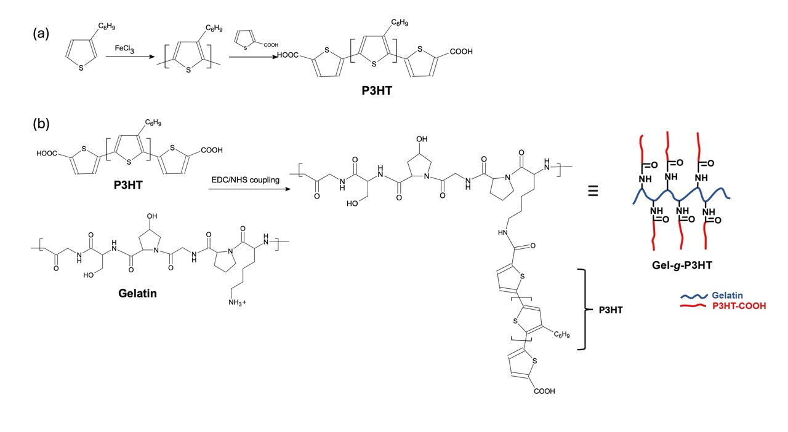

Jadranka Travas-Sejdic is a polymer scientist and professor over at the University of Auckland. As a condition of PhD submission, you needed to send through a form including five nominated examiners. Jadranka was one of them. At this point, I am not sure if she was my reviewer but I admire her a lot and if she was, I am hoping that she enjoyed reading my thesis.

Recently, Jadrank's group released a paper, where they synthesised a polymer brush or "*graft* copolymer. A polymer brush looks like a bottlebrush plant on the molecular level. In this work, 3-hexylthiophene was polymerised using chemical oxidation with  FeCl3. Following, 2-thiophene acetic acid was added to the reaction mixture to create a carboxylic acid terminated group. The carboxylic acid groups were then grafted to a gelatin polymer using EDC/NHS coupling. This method covalently cross-links a carboxylic acid with a terminal amine group, forming a peptide bond. The % of P3HT in the graft copolymer was determined to be 9.05% using UV-vis spectroscopy. A calibration curve of P3HT was generated, which allowed the mass to be determined and thus the overall wt % in the polymer. 

||
|:---:|
|*Fig 1. (a) Synthesis of P3HT from 3HT via chemical oxidation and then reaction with 2-thiopheneacetic acid, (b) covalent attachment of P3HT to gelatin to create a brush structure. |

Now, when I think of polymer brush, I think of good mechanical properties (see [Molecular Polymer Brushes](/science/polymer-science/structures/molecular-polymer-brushes))! Which means these types of materials could be used as potential pressure sensors.The conjugated nature of P3HT also means that it can be used as an electronic device.

Through a THF/H2O cosolvent, thin films (9.05 wt% P3HT) were dropcast on Au electrodes. The conductivity of this system was determined to be 1.64 ± 0.02 x 10-7 S/cm. In contrast, a second copolymer that contained 1.23% P3HT, exhibited "no appreciable conductivity" likely due to the poor network formation or intercalation of the alkyl chains of P3HT to prevent interchain charge transport. Exposure to a collagenase type II allowed for cleavage of the peptide bonds between the gelatin and P3HT. The hydrophobicity of P3HT meant that it would form spherical nanoparticles once the polymer brush degraded, with gelatin as the hydrophillic polymer, forming a corona around the particle and preventing toxicity from the P3HT. 

Now, this work is cool. I love groups that do little tricks to make new polymers from existing stuff. However, I see study after study that create new materials or do some neat chemistries and it ends up nowhere. We already know the importance of biofunctionalising conducting polymers to create better biocompatible materials for a biointerface. I'd like to see someone commercialise this stuff! or create a device with it. 

### Reference
[Sun, X.;  Chan, E. W. C.;  Chen, Q.;  Kirby, N.;  Yang, J.;  Mata, J. P.;  Kingston, R. L.;  Barker, D.;  Domigan, L.; Travas-Sejdic, J., Copolymers of Gelatin-graft-poly(3-hexylthiophene) for Transient Electronics. ACS Applied Materials & Interfaces 2024, 16 (18), 23872-23884.](https://pubs.acs.org/doi/10.1021/acsami.4c02174)