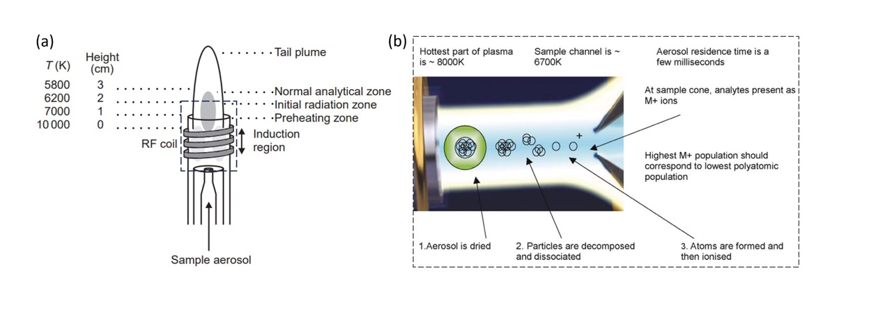

import fig1 from './img/fig1-icp.jpeg'

Recently I started a position as a lab technician with Australian National Fabrication Facility (ANFF). One of the requirements of this position is to maintain the ICP. Therefore, I decided to write a short post here about ICP, which I will update with the various things that I have learned along the way. 

## What is ICP?
Inductively coupled plasma (ICP) mass spectrometry (MS) or optical emission spectroscopy (OES) is a method of elemental analysis which utilises a plasma source. In ICP-MS, the ions are directly measured. In contract, ICP-OES uses an optical spectrometer to measure the photons emitted as they pass through the plasma. While both methods are extremely fast to use, cheap and straightforward, the ICP-OES has a higher sensitivity to detection. 

## How does ICP work?

| |
|:---:|
|*Figure 2. Schematic of ICP: (a) engineered setup and (b) behaviour of the sample inside the sample channel. Images taken from (Hou and Jones) and (McCurdy and Potter)* |

A schematic of an ICP is displayed in Fig 2. The liquid sample is injected into a spray chamber which is converted to an aerosol via a nebuliser. During this process, only the very fine particles are injected into the inductor. In the inductor, the sample aerosol is further dried and vapourised due to the high temperatures (10000 K) in the sample carrier. In this process, all chemical bonds are broken, allowing for the vapourisation of each individual atom (Fig 2b). The free atoms collide with plasma, allowing them to transition to an excited state. Upon relaxation to ground state, the ions/atoms will emit a photon of characteristic energies, which can be used to determine the elemental origin of the ions. The total number of photons emitted is proportional to the concentration.

The ionisation plasma is typically argon gas as it is chemically inert and contains a high proportion of cations and electrons with a high electron density. In the set up shown in Fig 1a, radiofrequency (RF) is applied to a coil which produces “seed” electrons which are accelerated and collide with argon gas to form argon plasma and electrons:
                        Ar(g) → Ar+ + e-

## About sample preparation
Solubilised solutions (aqueous or organic) are required to perform ICP analysis. Therefore, samples (<0.2 %>) are typically treated with nitric acid (HNO3) or HCl, in a process referred to as "acid digestion".  Sample concentrations of <0.2% are crucial to avoid any matrix effects.

## Matrix effects
Matrix effects are interferences in the analysis due ton signal dift caused by the deposition of solids on the sample apertures or signal suppression caused by salt ions. The typical salt interference is caused by oxide formation, which seems to reduce the ion flow and promotes clogging at the sample cone (the interface that analyses ion extraction). With years of research, matrix effects have typically solved through the use of OES compared to MS. ICP-OES relies on photon emission rather than ion acceleration, which makes it less susceptible to interferences. 

## Advantages of ICP compared to other elemental analyses
As ICP heats to very high temperatures, samples undergo more efficient vaporisation, atomisation and excitation. This allows for a wider range of elements to be analysed by ICP. In addition, the high temperature means that there is less water vapour present, in turn reducing the concentration of oxygen species and thus a lower level of matrix interferences caused by oxide formation. 

## References
1.	Ammann, A.A., Inductively coupled plasma mass spectrometry (ICP MS): a versatile tool. Journal of Mass Spectrometry, 2007. 42(4): p. 419-427. 
2.	Hou, X. and B.T. Jones, Inductively Coupled Plasma Optical Emission Spectrometry, in Encyclopedia of Analytical Chemistry. 2000, John Wiley & Sons Ltd: Chichester. p. 9468-6485. 
3. McCurdy, E. and D. Potter, Optimising ICP-MS for the determination of trace metals in high matrix samples. Spectroscopy Europe, 2001. 13: p. 14+16-20. 
4. Kopru, S. and M. Soylak, Inductively coupled plasma-mass spectrometry (ICP-MS) detection of trace metal contents of children cosmetics. Optical and Quantum Electronics, 2024. 56(3): p. 399.

