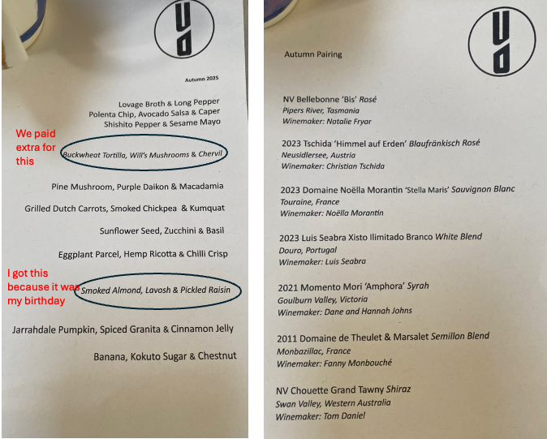

It was early evening on Saturday 10th May when Nick and I caught the train from Jannali to Kings Cross. After a short 10 minute stroll down Darlinghurst road, which leads onto Macleay St, we arrived at Yellow. Yellow is a fine-dining vegan restaurant. They change their menu seasonally and try to develop meals based on what foods are available - therefore taking a more sustainable approach to dining. 

Upon arrival, the waiter took my coat (how fancy) and sat us at a table next to a window. The atmosphere was pretty dark with low lights - giving an almost romantic vibe.It was also rather large, with two areas seperated by a narrow wall - seperating the dining from the bar. 

From the minute we sat down, the waiters paid a lot of attention to us and our "needs". I say it like this, because it is not really a need, but more a want but I'm sure that you get the gist of what I am saying. 

This dining experience consisted of a tasting menu with a wine pairing. Yes, you heard (read) it right, a tasting menu. We were served 11 (each) small bites of food which resulted in us leaving with full bellies (not too full, but just right). I've put the menu here: 

||
|:---:|
|*Image caption:* The menu at Yellow: Food (left) and wine pairing (right). We were not given the menu until the end of our sitting. | 

Everything on this menu was amazing. I found that it was so artistic and creative. The cool thing was we were in there "blind". We did not know what we were going to eat until it was handed to us. After we paid and were ready to leave, the waiter gave us a take home copy of the menu. 

In between the sunflower seed "risotto", and eggplant parcel, we were handed some sourdough bread with oil. This sourdough bread was very impressive. It was so fluffy and aerated, but the crust was also really crusty - easy to eat but not too hard. For sure the best sourdough bread I've ever had. 

This was a pretty cool experience. But yes, it was expensive. Dining alone was $110 pp (not including the mushroom tacos circled in the menu above - an extra $9 pp for a bite size, think of a Captain's Table cracker). The wine pairing was also an additional $145 pp. I wont be going back anytime soon because of this reason. Yet, it was really amazing as I felt like I was apart of something spectacular. 