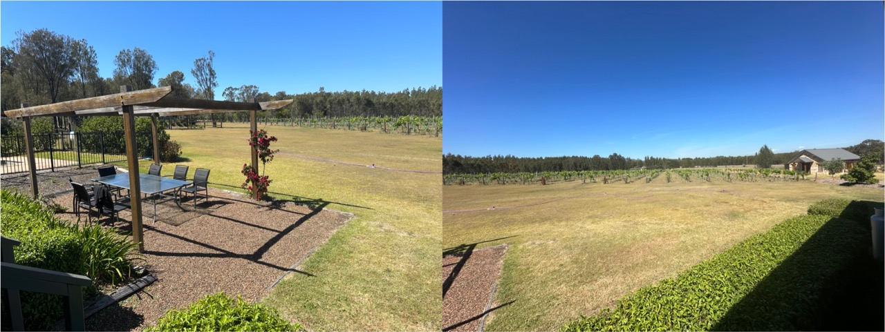
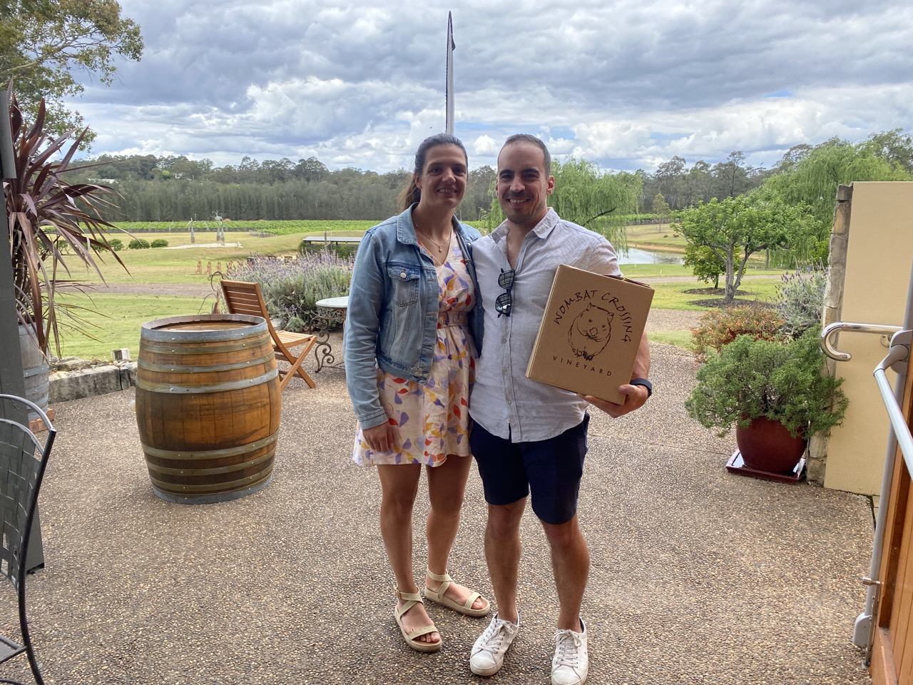
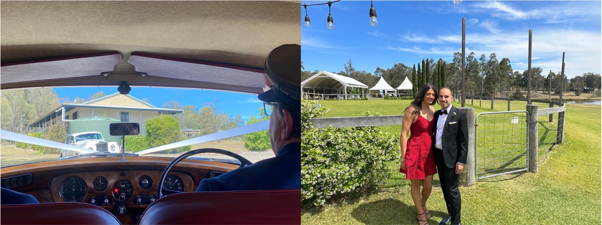
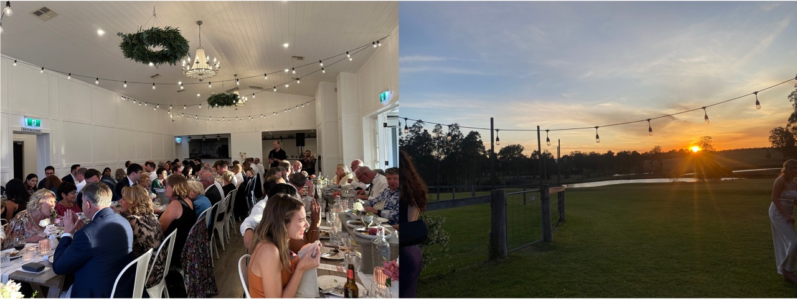

The last weekend in October, we headed to the Hunter Valley for Matt and Lauren's Wedding. We drove up on Friday night, 27 October so that we could spend the whole Saturday exploring and visiting wineries. We left home at 5.30 pm, dropped Chip off at Michelle and Katie's and then stopped off at Hungry Jacks for a bite before setting on route to La Vigna Estate. 

The drive was pretty bad. It was raining most of the way. I was so exhausted that I fell asleep in the car (Sorry Nick). We arrived at the house in La Vigna Estate at 9.30 pm, where Matt came to greet us and we went to the Bridal house for a drink, before deciding that it was best to go to sleep for the night. 

*A few notes about the place we stayed: * La Vigna is located 375 Hermitage Rd, Pokolbin NSW 2320. It is a huge estate with at least 5 houses, each with their own pool/spa. On the property there is also a vineyard (we saw many many kangaroos) and a small but very pretty Brick Chapel. The house itself was a nice place, but less modern than somewhere you would typically stay. This place was pretty far from any shops or cafes, BUT it is close to wineries on Hermatage Rd. Each morning, Nick and I (and sometimes the guys) would go for breakfast and coffee in Huntley, at a small cafe called MeltDown. I rated it a lot, it had pretty good food and coffee. 

||
|:----------------------------:|
|*Img caption. La Vigna Wine Estate*|

The wedding was on Sunday 29 October and we were planning to leave on Monday which left us only with one day to visit vineyards and have some alone time. Here is a breakdown of our Saturday based on the places that we visited:

### Briar Ridge
- 593 Mount View Rd, Mount View NSW 2325

At first, we weren't planning to go here because I had been previously. However, Lauren's mum is a member and convinced us that we should go there because she "LOVES IT". Therefore, this was our first stop. We were one of two parties that were there, probably because it was 10.30 am. All the wines were pretty good, but we highly rated the Stockhausen 2023 Semillon and the 2022 Limited Release BDX. The BDX was a really heavy but tasty red! It was a blend of all different wines. We also tried some of the other cheaper varieties such as the Old Vines, which I had purchased in 2016. However, this wine was very flat compared to the others, with not a lot of flavour. I suppose my wine taste has developed since then! (Note, that we drank the 2016 Old Vine wine on our trip to Foster and it tasted amazing, I'm sure that age really helps it!)

### Peterson Winery
- 552 Mount View Rd, Mount View NSW 2325

Not far away from BriarRidge, is Peterson Winery or "The Big Reds". Peterson Winery is one of several wineries that belong to the Peterson family. Since the Wedding in January, I couldn't stop thinking about the wine that I drank. Therefore, I said that we MUST go here. We spent about 1 hour here, trying the wines. 
The wines we drank were amazing. The lady who was teaching us about the wines served us a lot more than was prescribed. She gave us a few of the different Shiraz to try as a comparison. She was very knowledgeable and I think this is one of my favourite vineyards to date. We settled on three wines: 
1. Block one: 2018 Shiraz
2. The HUnter Valley Shiraz 2019
3. Mudgee Region Cabernet Savignon 2022 Vintage. 

However, there was one other wine that was pretty amazing but we talked ourselves out of buying; the sparking shiraz. It was so different, but oh so good. Too bad that bubbles hurt my tummy. 

### Wombat Crossing
- 530 Hermitage Rd, Pokolbin NSW 2320

This vineyard is very small but very beautiful. It was located literally down the road from La Vigna. When we first arrived, I was amazed with how green it was here. At the time that we arrived, there was only one other couple there, so we were in and out within 45 minutes. This vineyard is one of the only single-grape vineyard - where they use the grapes that they grow only. They also donate a small portion of the wine tasting fee to Wombat recovery. 

The wines were pretty amazing as well. The owner was also very knowledgable and answered all of my questions very well. We bought three more bottles: 
1. The Creak Flat Semillon 2016
2. Vigneron's Reserve Sparkling Shiraz 2018
3. Hermit's Block Shiraz 2021. 

Note: in the previous post, I did say that I can't drink sparkling... but this wine was just too good to pass up!

||
|:---:|
|*Img caption. Leaving Wombat Crossing Vineyard with a box of wine* |

### Bimbadgen
After Wombat Crossing Vineyard, we really were kind of overloaded with wines, so we headed back to the house, put the wines in our room and then went with Matt's mum and dad to Binbadgen for lunch, where we had a delicious woodfired pizza and a few beers. We socialised until about 6 pm, then headed back to La Vigna. I had a very large headache. Til this day, I don't know if it was because I only drank 1xcoffee or whether it was from the wine. The days following, I made sure to have at least 2 coffees per day; and the headache did not come back. 

In the evening, we went over to the bridal house for a bbq and then headed to bed around 10 pm. 

### The wedding at Squires Vineyard
- 62 Squire Cl, Belford NSW 2335

On 29 October 2023, Matt and Lauren got married at Squires Vineyard. It is a very small homestead like place that is not so much a winery but just a venue. I expect that they sell their grapes to local wineries but do not make wine themselves. 

The morning of the wedding was very relaxed. We had breakfast, 2xcoffees and maybe around 11am, I started to get ready. By 1 pm, the groomsmen (incl. Nick) were taking photos by the Chapel. Following, we rode in the wedding cars to the venue. I felt so lucky that I got to ride with them to the venue! 

||
|:---:|
|*Img caption. In the wedding car (left) & at the venue before the ceremony (right).* |

We waited around for half hour before the service started at 3 pm. It was a hot day, but the outside area was shaded by the trees. It was actually so amazing and everything turned out so perfect for them. A family of kangaroos even showed up and watched from a distance!

The "cocktail" hour was literally a cocktail hour, where they served aperol spritz and lemon spritz. The photos and bridal party were close by so I got to hang out with Nick and friends for a while. The bridal photos only went for about half an hour. 

When we sat down, the tables were shaped in an E. They sat me right next to Nick, which I liked because I didn't really know anyone. Once we sat down, two speeches were read and then we ate. It was a shared foot platter - which was so amazing and different. Not long after, everyone vacated the room. The venue folded all the tables up, and then the room turned into a dance floor! Such a great use of space. I think it forced people to socialise, dance and not sit at the table all night. When we were allowed back inside, they switched the glasses for plastic cups so that everyone could drink on the dance floor (so smart!!).

||
|:---:|
|*Img caption. Table layout (left) & outside for the sunset (right).*|

While we were outside, the rest of the speeches were said. What I loved most about the speeches was that both Matt and Lauren said a speech together.Following, the cake was cut. The cake was 3-tiers & 3-flavours; and they served the mudcake. It was great mudcake!! 

The night flew by so quickly and before we knew it, it was 11 pm and time to go home. I have a funny story about that night which may be a little inappropriate to post so I will try to write very subtle. There was an incident involving projectile red wine all over our bed, which smelt pretty bad. We moved beds for the night and spent Monday morning cleaning it up. 

By 11am, we were on the road back to Wollongong with a pit-stop to pick up Chip. I missed that boy. 
