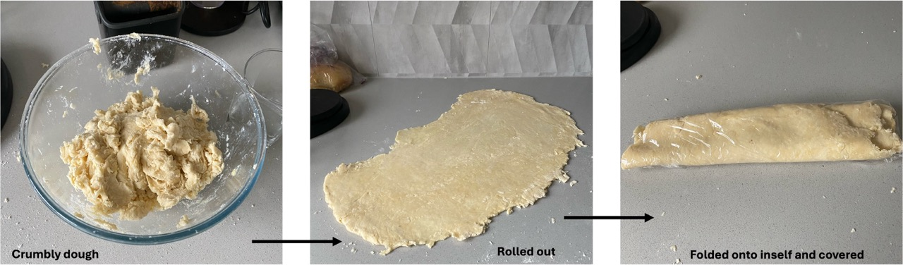
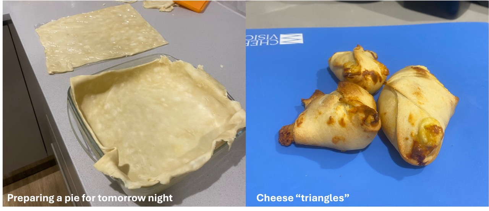
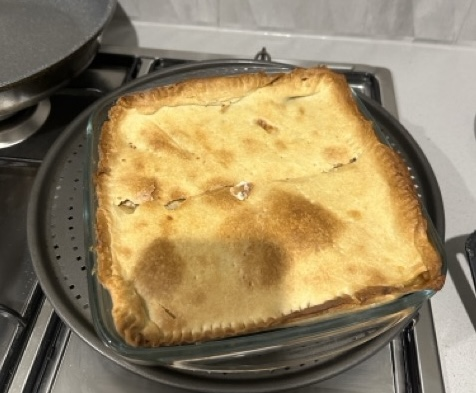

## Preparation of the pastry
*1.6.24* 
From my [previous post](./spinach_cheese_triangles.md), I prepared puff pastry with flour, butter and water. The puff pastry was then used to make spinach and cheese triangles. They were very nice, but the pastry was very sweet. Therefore, I wanted to create a recipe that was less sweet and more to my tastes. To achieve this, I decreased the amount of butter and added oil and extra salt. 

The ingredients were as follows: 

 400 g plain flour   1 tsp salt   53 g butter   1 tbsp olive oil   155 g water   

*Method:*
In a large mixing bowl, the flour and salt were combined. Butter was chopped into small squares and using my hands, the flour and butter were rubbed together creating a crumbly flour. Next, the oil was added and the flour/butter mixture and oil were gently rubbed together (now, the texture was more crumbly). Finally, I added 155 g water (Note, I weight out the water, but it would equate to 155 mL). and used my hands to mix. The mixture was crumbly, but good enough to roll out. With floured hands and a lightly floured surface, I rolled the dough out into a long, thin pastry (maybe 0.5 cm thick?). Next I folded it several times onto itself and covered in plastic wrap. The covered dough was placed in the fridge.

||
|:---:|
|*Img caption: From preparing the crumbling dough by rubbing ingredients together, to rolling out the dough and folding it into a plastic wrap* |

I think 2 hours is adequate enough to chill the pastry, however, I left it in the fridge until I wanted to use it. 

## Further preparation
*2.6.24* 
I pulled the dough out of the fridge and unwrapped it. There were folding marks present, however once I rolled it out with a rolling pin, the dough became smooth again. I tried to roll it out as thin as I could and then cut it into three sections. One filled the inside of a pan, and the other is to act as a pie top (for dinner tomorrow night, see image 1 below). Both were covered and placed in the fridge again. 

|  |
|:---:|
|*Img caption: Preparation of a pie (left) and the cheese triangles after baking (right)*|

### Cheese trianges
With the third section, I divided it into five small triangles. 1 tsp of filling was placed in the centre of each triangle and then it was folded onto itself several times to make a triangle like shape. The triangles were placed in the oven to bake for 30 minutes.  

The filling consisted of: 

 1/4 cup ricotta   1/4 cup crumbled feta    pinch of nutmeg + pepper   1/4 cup tasty cheese  sprinkle of bread crumbs   1 egg  
 

I have to say, I enjoyed this pastry! It tasted very savoury, and you could not pick up any sweetness, only from that of the cheese. 

### Spinach and ricotta pie 
*3.6.24*
**Ingredients list:**

 100 g ricotta  50 g crumbled feta  1/2 cup tasty cheese   2 eggs   hand full of spinach   1 cup of sliced mushroom   1 tbsp olive oil   1/2 brown onion  

When I arrived home from work, around 5 pm, I preheated the oven to 200 degrees. In a frypan, I cooked onion in ~1tbsp of olive oil until it was translucent. Next, the mushrooms were added and fried for about 7 minutes (until brown and sweating), finally I added 2 handfulls of fresh spinach and cooked until wittled. Mixture was cooled for a few minutes.

The mushroom mixture was added to a bowl filled with ricotta, feta, tasty cheese and egg. The mixture was stirred and then transferred to the baking dish containing the pastry. Next, the second sheet of pastry was placed on top and the edges were joined together using a fork. Holes were marked in the top of the pie using a fork and then the pie was briefly brushed with milk. 

The pie was baked for 40 minutes, and left to sit at room temperature for 10 minutes before eating. 

||
|:---:|
| *Img Caption: Tonights dinner, Mushroom & spinach pie. Sorry I cut it before I could take a pic..... I really need to get better at remembering to photograph what I do!*|

