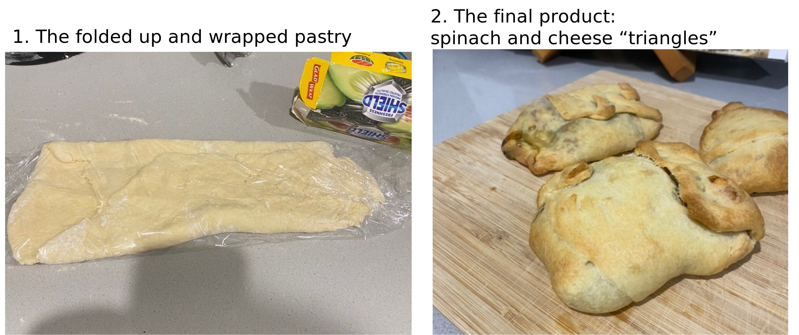

## Preparing the puff pastry 
*22.5.24*

It was Wednesday last week. I had just prepared a butter tofu and rice for dinner, but it was only 5 pm (we usually eat at 6 pm). As I was cleaning up, I had a desire to bake more bread. But I didn't want to make anymore bread, especially considering that I still had a dough in the freezer! Therefore, I decided I would make puff pastry for dinner the following night. The initial recipe that I went with wanted 250 g of butter! I cut it down to 170g and added a excess of water and refrigerated for a longer period of time:

 250 g flour 
1/4 tsp salt 
170 g butter 
2 cup water 

*extra flour for dusting* 

So basically, I blended the flour and butter to make a crumbly consistency and then the water to create a dough. It was meant to be very crumbly, but because I added too much water, it was very sticky. I needed to compensate by adding more flour. Once the dough was very crumbly, I rolled it out into a long rectangle and then folded several times. I covered it in plastic wrap and placed in the fridge. 

## Preparing and cooking the triangles
*23.5.24* 

Next, I pulled the dough out of the fridge, unwrapped it and rolled it to be a little thinner. I divided it into 6x rectangles. Note: this dough was so sticky that they definitely were not rectangles! I prepared the pastry filling as follows: 

1 Garlic 
1/2 onion 
handful of spinach 
1 tsp bread crumbs 
1/4 cup tasty cheese 
1/4 cup mozarella 
1 egg

Basically, in about 20 g of butter, I fried up garlic and onion and spinach. It was cooled slightly, then i added all the remaining ingredients and mixed well. 

I then added ~1 heaped table spoon to the pastries and folded as best as I could into triangles.... No they were not triangles, but triangle equivalent?

||
|:---:|
|*Img caption: Before and after the puff pastries were baked.*|

# What did I learn?
The triangles were tasty! However, I will do things differently next time. I will cut out more of the butter if possible and swap for a bit of olive oil oil, so that the flavour more closely resembles pizza dough, rather than biscuits. These pastries were very sweet and so I would have liked to add a bit more salt to make them go well with the savoury filling. 

