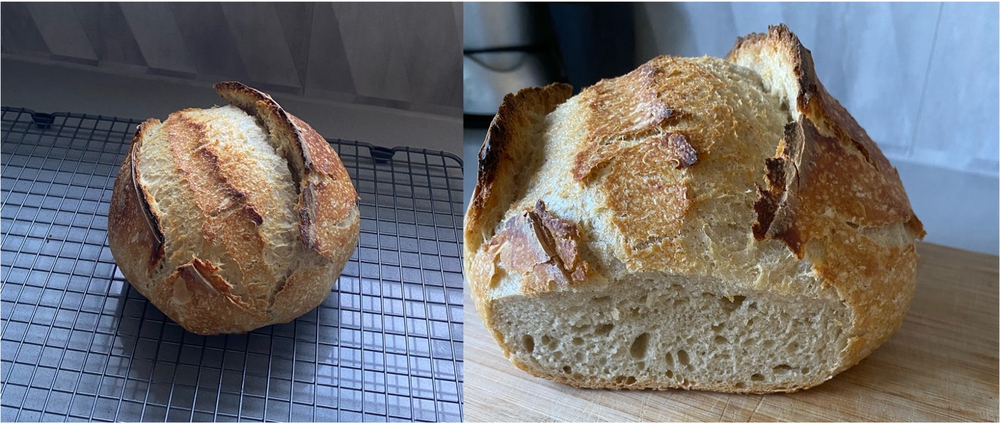

*Date created: 6.7.2024  *

On day 22 of my [sourdough starter](/life/cooking/bread-and-pastry/sourdough-bread), I fed the starter at 8 am. At 3 pm, I used the majority of the starter (81 g) to prepare another loaf of sourdough. This time, the loaf was not as dense as the previous one (see [my first attempt](/life/cooking/bread-and-pastry/sourdough-bread). It was also a great texture and rose a decent amount, despite the starter not passing a float test. 

My thoughts are that if we are feeding the starter more flour and water - as is the process of making a loaf of bread, it shouldn't matter whether or not the starter was at it's most functional. As long as it is left long enough for the yeast to do it's magic, I think we are fine. This recipe allows the dough to sit for 35 hours after the initial 4 hour resting period. 

**Ingredients:**
601 g flour  
320 g water  
1.5 tsp salt  
81 g starter  

**Methods:**
1. Combine flour, salt and starter. 
2. Slowly add the water (ensure that it is not very sticky, should be flaky).
3. Cover and let sit for 2 h hour at room temperature. 
4. Perform 8 x stretch and folds of the dough.* 
5. Let it sit, covered for 30 minutes.
6. Repeat steps 4 and 5, 2 more times.**
7. Let it sit covered at room temperature for 4 hours. 
8. Placed dough on surface. Performed several shape and pulls***
9. placed in a clean bowl, covered and refrigerated for 35 hours. 
10. Pull out of the fridge. Shape again and allow to proof on baking paper, covered with a towl for 30 minutes (while the dutch oven preheats).
11. Score the loaf in the middle.
12. Bake at 220 °C for 30 minutes in the dutch oven with the lid on and 10 minutes with the lid off. 
13. Let it sit for 30 minutes before cutting into it. 

||
|:---:|
|*Img caption: Second Sourdough loaf attempt. Rose signficantly, with a great porosity throughout and not as dense as the last loaf.*|

**Notes:**  
*In the container, grab the dough from one side and stretch it out, fold over. Turn the bowl by 90° and repeat. 

** With increasing time and cycles, the dough should be getting stickier, less flaky and harder to pull. The dough should also be reforming it's shape.  

***Cup the dough with your hands. Using the bench for friction, pull the dough towards you. If the dough is too sticky, lubricate the bench with a small amount of water or flour. 
  

