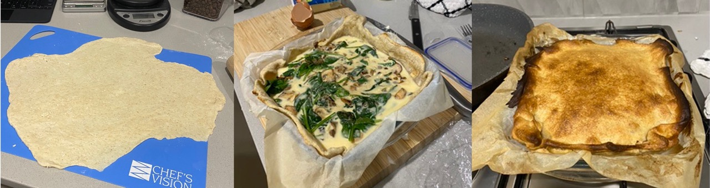

*Date created: 26.6.24; Date updated: 11.7.24*

What can we do with sourdough discard? I would hate to waste my sourdough discards, which is why I have been searching for different things to do with it. Did you know that discard lasts for a few days in the fridge? This recipe uses a 2 day old discard.

So today, I wanted to make some pastry with it. Beforehand, I did a quick search and found that pastry follows the same method as a regular pastry recipe, only that it uses less flour. I used my previously developed Pastry recipe as follows: 

**Makes 2-3 sheets of pastry**

**Ingredients:**
225 g flour  
50 g butter 
1 tbsp olive oil 
1/2 tsp salt 
1/2 tsp garlic powder 
35-50 g of sourdough starter* 
80 g water

**Method (pastry):** 
1. The butter was cut into small cubes (0.5 cmx0.5cm) 
2. The butter and flour wwere rubbed together to make a crumbled flour
3. The oil was added and mixed in, then the flour was rubbed further
4. salts were mixed in
5. Starter was mixed in. 
6. A small amount of water was added (just to make it come together)
7. Allow dough to sit for 30 minutes-1 hour.
8. Roll out dough so it is ~1 cm thick. 
9. Fold the sheet of pastry as you would a piece of paper: over itself several times and wrap in plastic with a small amount of room to breath (I use a bread bag for this - I keep the bags from bakers delight and reuse them).
10. Refrigerate until ready to use. I've refrigerated overnight or for 4-5 days. Keep in mind that the longer it is refrigerated, the tastier it becomes from the LABS in the dough. 
11. When ready for baking, pull out of fridge and roll the dough to make it as thin as possible. 
12. Moulded the pastry into a pie dish or baking dish of choice.

**Notes about this recipe:**
Note about the starter: This was a discard that I kept in the fridge for 2 days. I think it is safe to leave sourdough disguard for 3 days in the fridge, so I wanted to use it before I needed to throw it away. 

NOTE about the hydration: on the 26.06.24: before I added the starter, I added 1/2 cup of water (which I realised was a mistake therefore this recipe is tweaked). After I added the starter, it was very sticky! This was wrong, the consistency should be crumbly. Therefore, it is crucial to add the sourdough starter before extra water, so you correct the consistency. 

Note for step 8: Refrigeration is important for pastry. The colder it is, the better. You want the butter and oil to solidify to bring the crumbly consistency to your pastry. 

**Filling choice for a mushroom, spinach and ricotta pie:**
1/2 brown onion, diced   
1 garlic cloves 
1/4 cup cream 
60 g ricotta 
1/3 cup tasty cheese 
200 g button mushrooms, sliced 
2 handfulls of spinach 
1 tsp salt
1/2 tsp pepper

9. Over medium heat, melt butter and fry onion and garlic until onion is translucent. 
10. Add mushrooms and fry until they start to sweat. 
11. Add spinach.
12. In a seperate bowl, combine the cheese and cream. Add the mushroom mixture and salt and pepper. 
13. Pour mixture into the dish (pre-moulded with pastry)
14. Cover the top with the second layer of pastry. 
15. Bake at 200 °C (fan forced) for 30 minutes. 

|||
|:---:|
|*Img caption: The rolling out of one pastry (left), the filling of the pastry in the dish (middle) and the final product (right).*|

**Filling choice for a mushroom, potato and spinach pie:**
1/2 brown onion, diced
2 garlic cloves, minced
1/3 cup cream
1 cup vegetable stock
1/2 tsp smoked paprika
1 tsp nutmeg
1 tbsp mustard
300 g of potato
300 g mushroom, cut
2-3 handfulls of spinach

9. Fry garlic and onion until onion is translucent
10. Add mushrooms and fry until they are watering
11. Add stock, mustard, nutmeg and paprika, reduce slightly. 
12. Add cream and allow to cook on low heat until the cream thickens. 
13. Add spinach and cook until it has wittled. 
14. Pour contents into the pie dish. 
15. Bake at 200 °C for 30 minutes. 
16. Serve with broccoli and salad. 