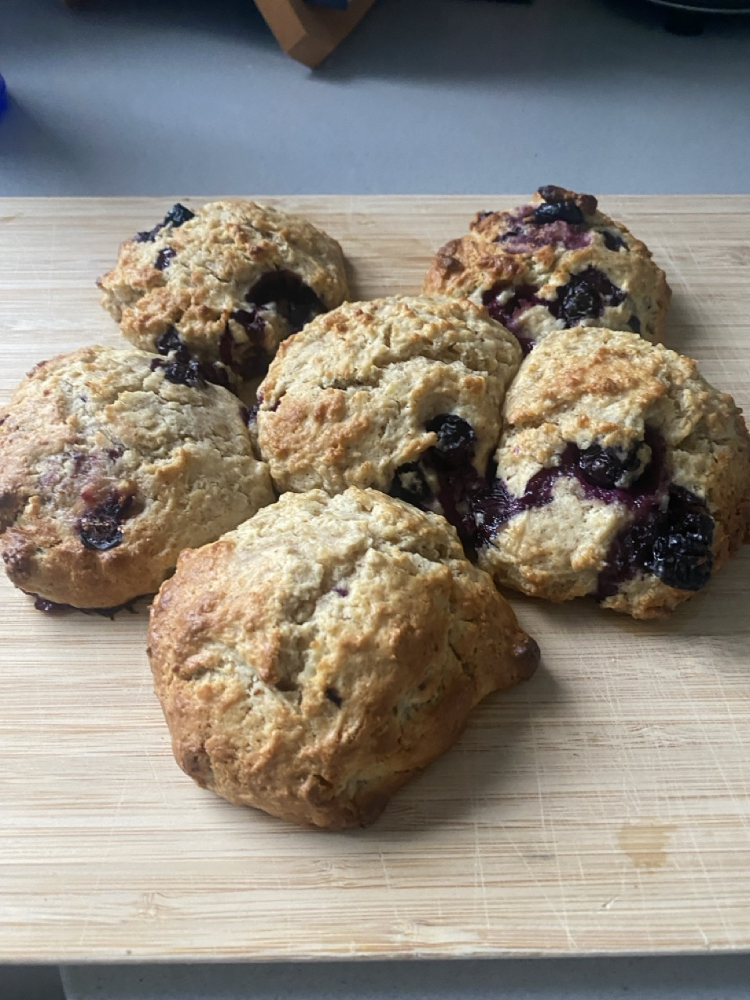

This used the entirety of the sourdough discards that were collected in the fridge (maybe 160 g or so?). 
This recipe is based on one I found [online](https://www.theclevercarrot.com/2023/10/easy-no-roll-sourdough-scones-overnight-option/).

**Ingredients:**  
250 g plain flour  
16 g baking powder  
1 tsp salt  
86 g sugar  
72 g butter  
1 egg  
Sourdough discard  
1 tsp vanilla extract  
2 tbsp thick cream  
1/2 tsp lemon juice  
1/2 punnet blueberries  

**Method:**
1. Combine dry ingredients
2. add butter in small cubes and rub it in (like you would with pastry), so the flour mixture is crumbly. 
3. Whisk together wet ingredients. 
4. Add wet ingredients to dry ingredients. 
5. Mix well and form a ball. 
6. Fold in blueberries. 
7. Cover and let sit in the fridge overnight. (Note: the mixture will be very sticky)
8. Preheat oven to 200 °C (fan forced)
9. Line a tray with baking paper. With 1-2 tsp of mixture, roll into ball and place on the tray. 
10. Bake for 20 minutes. 
11. Allow to cool down slightly before eating. 

||
|:---:|
|*Img caption: Baked blueberry scones* |