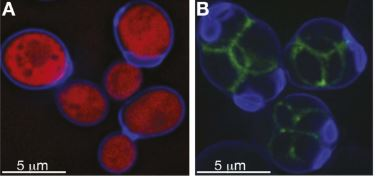
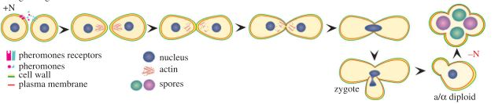
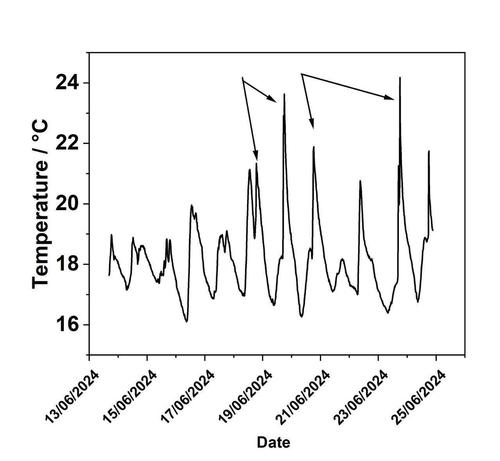

*Date created: 17.06.2024; Date modified: 11.07.2024*  

## Introduction to sourdough
Sourdough is a mixture of flour and water which is fermented with yeasts and lactic acid bacteria (LAB). As sourdough ages, the number of LABs present increases. The coolest thing is that each sourdough starter is different! The types of bacteria that are selected to grow will depend highly on your environment: including the temperature and humidity. 

The use of sourdough in baked goods generally improves the texture, flavour, nutritional value and shelf life. All of these are due to the presence of lactic acid. For instance, the lactic acid retards the starch bioavailability, decreases the glycemic index and improves our ability to metabolise the gluten. The lactic acid also improves the bioavailability of minerals present (solubilises magnesium and phosphorus for example), to make it better absorbed by our bodies, while also improving on the flavour. Furthermore, acidification prolongs spoilage of the bread (i.e. mould), making it last longer than your regular bread loaf. 

## Science of yeast replication
Harvesting wild yeast to create a sourdough starter is pretty straight forward and robust. The yeast that I harvested is actually known as *Saccharomyces cerevisiae*. Did you know that it is a eukaryotic unicellular organism? This means that it exhibits a membrane bound nucleus, as do plants and animals. As we are multicellular organisms, yeast provides opportunities to study the behaviour of eukaryotic cells and has solved many of our questions about life on Earth. 

Did you also know that yeast reproduce both sexually (with a mate) and asexually (through budding). Both processes are associated with meiosis and mitosis, respectively. Meiosis occurs only in germ cells (sex cells), which produces four non-identical daughter cells. In contrast, mitosis is a basic cell division that produces two identical daughter cells. The route that the yeast will follow depends on the environmental cues present. Yeast cells at the Growth stage of life can undergo cell differentiation. During this stage, they decide whether to divide into haploid cells (which allows them to mate with partner cells), asexually replicate (or bud) or form stationary cells (which can age). The images in Fig 1 are microscope images of meosis and mitosis processes, including (A) budding cells diving into mother and daughter yeast cells (asexual reproduction) and (B) Meosis of the haploid cells to form 2 copies of each chromosome. In (B), the cells still have not divided and are confined by the ascosphere (a sac-like spore that encombasses the gametes).

||
|:---:|
|*Fig 1. (A) Budding cells expressing red fluorescent protein and (B) sporulating cells stained with the green fluorescent protein, contained within an ascosphere (highlighted in blue) Taken from [1](https://doi.org/10.7554/eLife.05835)*|

Now you ask, why would they divide and mate when they can asexually reproduce? While asexual reproduction is the easiest form of replication, sexual reproduction produces diploids (2 copies of each chromosome), which are more stable and allow for an increase in genetic diversity, which is a driver for a strong population (As a chemist, think entropy). When there are many nutrients present, yeast will asexually reproduce by mitosis (basic cell division) which is very fast. When nutrients are scarce, yeast will enter meiosis in order to increase chances of survival. This is because meosis produces four novel genotypes. This process is much slower.

As previously stated, in order for yeast to sexually reproduce, it must divide into a haploid cell. A haploid cell is one copy of each chromosome and therefore is labelled as having a sex, MATa or MATά (which are named after the DNA sequences present in the yeast cells). Both types of haploids secrete pheromones to attract one another. The MATα secretes a soluble α-factor, while MATa seretes a fatty acid modified peptide, which is excreted from the cell via an ABC transporter (a protein on the cell membrane that facilitates active transport). The high lipophillicity of the peptide, causes it to remain in the plasma membrane, while the soluble factor travels through the media. The yeast cells can polarise (change shape) according to the direction of the pheromones secreted. Once the two opposite haploids come together, they mate to form a diploid zygote. Meosis (a process of sex cell replication) creates 4x replicates of the DNA to form four haploid cells, contained within the ascosphere walls. In the presence of nutrients, germination and gamete production occurs, forming a diploid cell (Shown in Fig 2).

||
|:---:|
|*Fig 2. Yeast sexual replication. We start with two haploid cells of opposite gender, which secrete pheromones and attract via the receptors. The haploids attracts to one another and combine to form a zygote diploid, which then further sporulates. Taken from [2](https://doi.org/10.1098/rsob.130008)* |

It should be obvious that with a high yeast cell density, there is a higher opportunity for sexual reproduction. But what happens when the number of MATa or MATά are not identical? Well this is natural selection at it's finest! Yeast that form MATa cells, have potential to swap genders if there are too many MATa cells compared to MATά! As previously mentioned, starvation induces meiosis and sporulation in an attempt to preseve the genetic diversity but, the cells will remain in a non-dividing state. Once nutrients are present, further germination and gamete production can occur. It is for this reason that meoitic spores are resistant to stresses and desication.

**What does all of this mean for breadmaking?**  
Sourdough starter added to a dough in preparation for bread will have a high metabolic activity initially. This is the initial resting period, where the yeast rises. Here, it consumes the flour and undergoes (most likely) sexual reproduction. Once we put it in the fridge for proofing, the yeast go into a stationary phase where they no longer replicate. The dough becomes more acidic as the LABs release more lactic acid. 

As yeast cells are prone to stress, we can also dry the sourdough starter. The yeast will descicate into powder. In this state, it can last indefinitely and is used as a supplement in cooking or by adding water and flour, you can restart the sourdough. 

## Starting equipment
I started with the following equipment/ingredients: 
- Rye flour*
- tap water**
- 2 x 500 g jars
- food scale
- Paper towel and rubber band (or breathable lid)
- (Later on) whole meal flour 

**Some general things to note:**
- I chose rye flour as the starting flour because it is meant to have a higher level of good bacteria and enzymes to aid in healthy fermentation.
- Some say that you should use bottled water for the initial week (because chlorine is present in tap water, which kills all bacteria). I filled a drink bottle with tap water and left it overnight. By doing this, the chlorine dissapates from the water. You could also use boiled water (cooled down of course).
- The ideal environment is 24–28 °C. As it is winter, sometimes I used warmer water (30°C) and wrapped it in a towel to warm it up.
- While the starter is on the bench at room temperature, you need to cover it with a breathable lid: such as paper towel and rubber band. Once you place it in the fridge (because you are not using it frequently), you can put a lid on (but very loosely). This is because the microorganisms in the starter are constantly converting the carbohydrates/sugars in the flour to carbon dioxide. If you do not let the gas out, then there will be a build up of pressure in the gar, leading to an explosion.
- The amount of water and flour you feed with doesn't matter. General rule of thumb: in the first week, you should be feeding roughly 1:1 sourdough starter: flour. Once the yeast has established itself, you can feed it more. The amount you feed will depend on how quickly you want to cook with it and how much starter you need for a recipe. By feeding less, the starter will be ready quicker.
- The consistency of the mixture: You should aim for a pancake batter - thick but not too thick. If you add too much water. Don't worry about it! Correct it the next day. 

Here I have listed the method that I used to create my sourdough starter. For the first month of life, I fed (and plan to feed) it everyday. This post therefore covers the first month with references to things I've baked with it (where appropriate).

## Cultivating wild yeast using flour and water
### *Day 1, Friday 14 June 2024*
First, I weighed out my jar. Next, I measured 20 g of rye flour and 30 g of water and combined. The mixture was as viscous as a "thick pancake batter." The jar was covered with a breathable lid (in my case, paper towl) and left to sit at room temperature for 24 hours. Note here that the temperature will determine the speed at which the bacteria will grow. At the moment, it is winter so the temperatures will be max 20 °C. 

### *Day 2, Saturday 15 June 2024*
I repeated the process. I added 20g of rye flour and 30 g of water, mixed to combine so it appeared as a "thick pancake batter", covered and let it sit at room temperature for 24 hours. 

### *Day 3, Sunday 16 June 2024*
I repeated the process: 20 g of rye flour and 30 g of water, mixed to combine so it appeared as a "thick pancake batter", covered and let it sit at room temperature for 24 hours. At this stage, the starter was beginning to smell very sour, almost like our food bin/compost bin. 

### *Day 4 Monday 17 June 2024*
When I lifted the paper towel from the container, I observed small bubbles which is indicative of gases forming and thus carbon dioxide. I emptied half of the contents into a new container and discarded the rest. Then I repeated the process from yesterday: 20 g of rye flour and 25 g of water. Note: I used less water this time, because that was enough to form a thick paste with consistency similar to yesterday. I made note of the temperature of the room, which was 18.5 °C. 

After covering the glass jar, again with a breathable cover - in this case paper towel, I then put a rubber band around the jar to mark the level of the yeast. This time, I left it to sit for 14 hours at room temperature. 

### *Day 5 Tuesday 18 June 2024*
At 6 am (when I woke up), I opened the jar and I could see that the bubbles were slightly larger than yesterday. The flour mixture was increasing it's sour odour. I stirred the flour mixture and allowed it to sit until I returned home from work. 

At 4.30 pm, I opened the jar ready to feed it. I could not really make out a difference from yesterday. I scooped half of the mixture out (47 g to be exact) and put it in a fresh container. For some reason, I added the 20 g flour and 30 g water to the old container. I guess I was in autopilot mode. Nontheless, I mixed it and then covered again. I observed that some bubbles began to form once I left it for a few hours. 

### *Day 6 Wednesday 19 June 2024*
I checked the sourdough again this morning. The temperature was 16.7 °C. There were no bubbles present. I gave it a stir once again and left it to sit for the rest of the day. 

It is unusual that there was no activity. There could be many reasons for this. Perhaps that the temperature is so cold. Therefore, I wrapped the container in a tea towel to assist in warming up the jar. 

At the usual time of 4.30 pm, I halved the starter (31 g) and fed the starter more flour (30 g) and water (53 g). 

### *Day 7 Thursday 20 June 2024*
The starter appeared to grow slightly when I checked it this morning. As the last few days, I gave it a stir and added a little bit of water (10 g). In the afternoon, I halved the mixture (33 g starter) and fed it with 30 g rye flour and 54 g of water.

### *Day 8 Friday 21 June 2024*
At this point, I was convinced that the yeast was alive. Just before I was going to feed the starter, I did a "float test" of the dough to show that gases were present. In a float test, a small amount of starter is placed into water and if it floats, it means that it the starter is active (but does not necessarily mean that it is ready). 

Now, I decided to increase the feed content of the starter. I took 22 g of the starter and fed it with 40 g of flour and 99 g of water. 

### *Day 9 Saturday 22 June 2024*
Again, when I checked the sourdough starter (at 7 am), it was very foamy but did not appear to rise. However, while we were out during the day, I placed the starter into the warm-ish oven (it was no hotter than 30 degrees). When I returned home, the starter was more bubbly than before and it grew by about 60%. I suspect that 4 hours in a warm oven helped the bacteria to grow.

At 4.30 pm, I weighed 22 g of the mixture into a fresh jar and fed it with 45 g of rye flour and 75 g water.

## Sourdough starter ready for baking
### *Day 10 Sunday 23 June 2024*
When I checked the starter at 8 am, I saw that the starter grew almost to double it's size. How exciting! By 4 pm, the starter appeared more active and grew a little more. 

In a fresh jar, I weighed 20 g of starter, added 40 g of rye flour and 84 g water. With the left over discard, I made banana pancakes ! They were very tasty and fluffy too. 

### *Day 11 Monday 24 June 2024*
I checked the starter at 6 am and I saw that the starter grew slightly but it seemed to collapse by 4 pm. It looks like it is ready to bake. I just need to get my timing right. Once again, in a fresh jarr, I weighed 16 g of starter, 47 g flour and 99 g water. It was more watery than usual (I wanted to know if it wasn't rising because of the water content). The discard was placed in a fresh container and left in the fridge for 2 days (I made pastry with it later on).

### *Day 12 Tuesday 25 June 2024*
In the morning, the starter appeared to rise (not double it's size, but by 50%), but once again by 4 pm - it shrunk. 

I repeated the procedure. I weighed 16 g of starter in a fresh jar, and fed it with 50 g of flour and 82 g of water. With this discard, I made [pancakes](./sourdough-pancakes.md).

### *Day 13 Wednesday 26 June 2024*
By 8 am, it grew as per yesterday. This time, I wanted to see if feeding it would sustain the yeast for a little longer. Therefore, at 8 am, I added 13 g of flour and 17 g of water. Over the day, it grew but not a lot. At 8 pm, I watched the starter and it looked like it was breathing with gas bubbles popping occasionally. I left the sourdough starter to sit overnight. 

### *Day 14 Thursday 27 June 2024*
At 6 am, I saw that the sourdough starter had deflated since last night. There's no wonder considering that I did not feed it yesterday. As usual, I weighed out 22 g of starter and fed it with 40 g of flour and 64 g of water. The reason for using more starter this time, is that I am worried that the yeast is not strong enough yet. 

At 5 pm, I observed that the sourdough did not grow a lot. Maybe 20%? I know it is alive and well, I am not sure what is wrong. Therefore, just before I went to bed, I placed it in the warm-ish oven. I suspect that when I did that on Saturday, it grew a lot. 

### *Day 15 Friday 28 June 2024*
I suspected right, because at 5.55 am I observed that the starter deflated (based on the marks on the jar). In a seperate jar, I fed 24 g of starter with 50 g of flour and 80 g of water. On this day, I came home from work at 2 pm. I saw that the starter had risen and as I watched it over the rest of the day, I saw that it began to deflate at 3 pm. So I've figured out that it is 9 hours. 

At 8.10 pm, I went to feed the starter to get my timing right. However, I did not have a clean jar present. Therefore, I emptied half of my starter (I put it in the fridge) and fed with 45 g of flour and 88 g of water. I placed the covered jar in the oven over night. 

### *Day 16 Saturday 29 June 2024*
At 7.30 am, I checked the starter and I saw once again that it deflated. No suprise since I left it for 11 hours. In addition, I did a float test and observed that the starter sunk to the bottom of the cup. Now, it was 7.30 am and I wanted to try baking today! Therefore, once again, in a clean jar, I took 24 g of starter and fed with 55 g of water. I placed in the oven (30 degrees). The discard was kept in the same jar (which I planned to feed later in the day to keep). At 10am, I checked the sourdough starter and no bubbles were forming. I gave it a vigorous mix which produced air bubbles, and more began to form. At 12.45 pm, the starter passed the float test. 

At 1.30 pm, I used the entirety of the sourdough (that was fed in the morning) to prepare a loaf of sourdough bread.At 4.30 pm, I fed the sourdough discard (25 g) with 42 g flour and 78 g of water. After adding water, the temperature of the starter was 31 °C, and it immediately began bubbling. It was left for 24 hours at room temperature. 

### *Day 17 Sunday 30 June 2024*
I did not check the starter at all today. At 4 pm, it appeared to have risen substantially. I used 80 g of the starter to make [sourdough pizza crust](./sourdough-pizza.md) and with the remaining sourdough starter in the jar, I added 37 g of rye and 58 g of water. I allowed it to sit on the bench at room temperature for another 24 hours. 

### *Day 18 Monday 1 July 2024*
At 5 pm, I weighed 32 g of sourdough starter into a fresh jar and fed with 30 g rye flour and 47 g of water. It sat on the bench at room temperature overnight. With the discard, I prepared another pizza dough. I think I am addicted to baking now and I need to stop before my waist grows too large (ha ha!)

### *Day 19 Tuesday 2 July 2024*
Just before I headed off to work (8 am), I checked the starter and it is very close to doubling its size. When I returned home, it deflated but was still larger than it was after the original feeding. 

After preparing dinner (5.30 pm), I fed the starter. As I am thinking to bake less for the next few days, I halved the mixture. In a fresh jar, I weighed 11 g of starter. I fed it with 20 g of flour and 41 g of water. The addition of this much water was a mistake (I tipped the water bottle too heavily). It was not too much of an issue though, all I observed was that it became more porous. The starter was left to sit at room temperature for 24 hours. 

### *Day 20 Wednesday 3 July 2024*
When I checked the starter in the morning, it grew by 50%. By 5 pm, it deflated back to the original level. At 6.30 pm, I fed 12 g of the starter (in a fresh jar) with 18 g of flour and 25 g of water. I combined the remaining starter with the discard in the fridge. 

### *Day 21 Thursday 4 July 2024*
At 8 pm, I fed the sourdough starter. I did not discard any of the starter (~30 g in total), instead I added 16 g of flour and 28 g of water. 

The following morning (8 am), on *Day 22 Friday 5 July 2024*, I fed the entirety of the starter 15 g of flour and 25 g of water. 

At 4 pm on Day 22, I used most of the starter (81 g) to prepare dough for bread. The mixture consisted of 81 g starter; 601 g bread flour; 1.5 tsp salt and 320 g of water. 

As I was preparing the dough, the starter formed a shape, revealing ~20 g of starter in the jar. It smelt slightly alcoholic. I realised that I probably didn't feed it enough this morning and I will need to leave the dough much longer to rise than previously. Nontheless, with the scrapings of starter remaining in the jar, I added 20 g of flour and 29 g of water. 

## Changing the flour from rye to wholemeal 
Note: After each feed, I keep the discard in the fridge in case I contaminate the mother yeast. 

### *Day 23 Saturday 6 July 2024*
Rye flour is hard to find. It is also very expensive ($20 for 1 kg, compared to $3/kg for wholemeal). Therefore, I've decided to swap flour. Using the majority of starter (35 g), I prepared some pastry. With the remaining scrapings (~45 g, at 3 pm), I added 15 g of rye flour, 2 g of wholemeal flour and 38 g of water. The mixture was covered and left to sit at room temperature (with a breathable lid) for 24 hours. 

### *Day 24 Sunday 7 July 2024*
In a fresh jar, 14 g of starter was fed with 14 g rye flour, 6 g wholemeal and 27 g of water. 

### *Day 25 Monday 8 July 2024*
In a fresh jar, 20 g of starter was fed with 13 g of rye, 8 g of wholemeal and 37 g of water. 

### *Day 26 Tuesday 9 July 2024*
In a fresh jar, 20 g of starter was fed with 11 g of rye flour, 10 g wholemeal and 42 g of water. (Note it was very thin. I fed too much water) On this day I also increased the feeding amount as I would like to make bagels with it.

### *Day 27 Wednesday 10 July 2024*
At 4 pm, I did not remove any of the starter. Instead, I fed the starter with 16 g of rye flour, 19 g of wholemeal flour and 37 g of water. By 8.30 pm, the starter had almost doubled in size and it passed the "float test" - where a small portion of the starter was dropped into a cup of water and it floated to the top. I used the entirety of the starter to make bagels. 

With small scrapings remaining in the jar, I added 7 g of rye flour, 12 g of wholemeal flour and 34 g of water. Without thinking, I used the water from the bottle that I often feed from. However, I had put hot water in it a few hours prior (in a heat retaining bottle). The water was still hot! (50 °C or so).  Oops!! It didn't seem to matter because it was bubbling as usual. 

### *Day 28 Thursday 11 July 2024*
The hot water didn't seem to matter as the yeast behaved as normal. I noticed in the morning that the yeast had already rose and fell, which was expected considering that it only took 4.5 hours to rise yesterday. 

## Outlook:
- Since Day 1, the temperature has been average of 18.2 ± 1.2 (see Figure 1 below), with some days the dough being placed in a warmish area than room temperature. I believe that temperature has a large role in the activity of the yeast as in colder environments, it takes longer to grow. 
  
| |
|:---:|
|*Figure 1. Temperature fluctuation over 7 days in the kitchen. The arrows indicate times where I was using the stove.*|

## Notes for this post/future directions
- I am updating this for the first month of life. Afterwards, I would hope that it is healthy enough to keep in the fridge and maintain once a week. 
- I plan to move the starter to a different type of flour - because rye flour is so expensive. 
- I will prepare a video to show the appearances of my starter overtime. I also will include photos. 

<!-- Things to note: 
Your starter is healthy and vigorous — in other words, good for baking — when it doubles in size within 6 to 8 hours. A helpful blog post: [here](https://www.kingarthurbaking.com/blog/2020/06/10/10-tips-for-new-sourdough-bakers#I-read) -->

## References
1. Elife **2015**, *4*, e05835. DOI: 10.7554/eLife.05835 
2. Open Biology **2013**, *3 (3)*, 130008. DOI: 10.1098/rsob.130008
3. C. R. Biologies **2011**, *334 (8)*, 599-606. DOI: 10.1016/j.crvi.2011.05.007
4. Foods. **2020**, *9(9)*, 1231. DOI: 10.3390/foods9091231.
5. Chapter 12 - Sourdough/lactic acid bacteria. *In Gluten-Free Cereal Products and Beverages*, Arendt, E. K.; Dal Bello, F., Eds. Academic Press: San Diego,**2008**; pp 267-288. DOI: 10.1016/B978-012373739-7.50014-9
6. Microbiol. Spectr. **2015**, *3 (2)*, Mdna3-0013-2014. DOI: 10.1128/microbiolspec.mdna3-0013-2014

