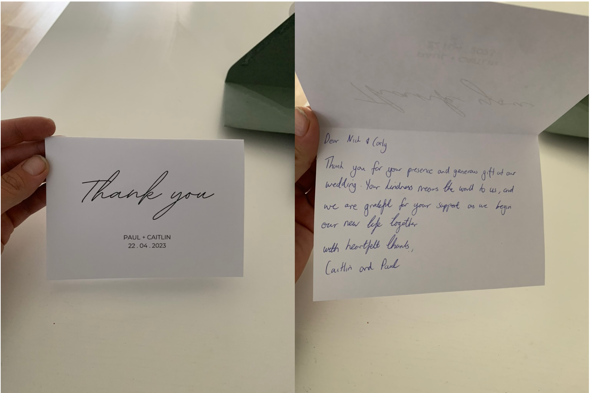

# Paul's surprise wedding

###### 22.5.23
Today was Paul's wedding. A few weeks ago, Nick received a message from his friend Paul asking if he wanted to come to his wedding because some of his family members were unable to attend. This invite was sent via a group chat to a few of Nick's gaming buddies too. We all attended. 

It was located at Gledswood Homstead and Winery, 900 Camden Valley Way, Catherine Field NSW 2557. 

Everything about it was really cute. It had a farm vibe to it, it was outdoors in the sunshine and in between the service and reception, they served canopes/drinks out of a small barn. The service was short and to the point, starting at 3 pm. By 5 pm, everyone was seated in the reception hall. 

There were a maximum of 7 tables there, about 30-50 people. The table we were sitting at was closest to the DJ and served last (probably because we were the least important people). 

The food was delicious but the wine was average. It served wine that wasn't as good as other wineries we've been to. I think they make their own wine but buy the grapes elsewhere. As it is not a highly trafficked area, I suspect that the grapes they buy are relatively cheap. 

By 9.30 pm, the bridal party had disappeared and everyone started to go home. I love that we were home by 10.30 pm. This wedding was very minimal effort, I honestly felt like I was overdressed. It was great to have the reception and ceremony all at the same place, with the photos not taking too long. 

###### 3.6.23
On Saturday night, we headed to Paul and Caitlin's house with some of Nick's gaming buddies for some pizza, drinks and card games. I think the wedding resulted in all the guys wanting to reconnect (outside of the computer screen). When we were there, Paul handed us a thankyou note from the wedding. I thought it was so thoughtful to receive something like this. 

