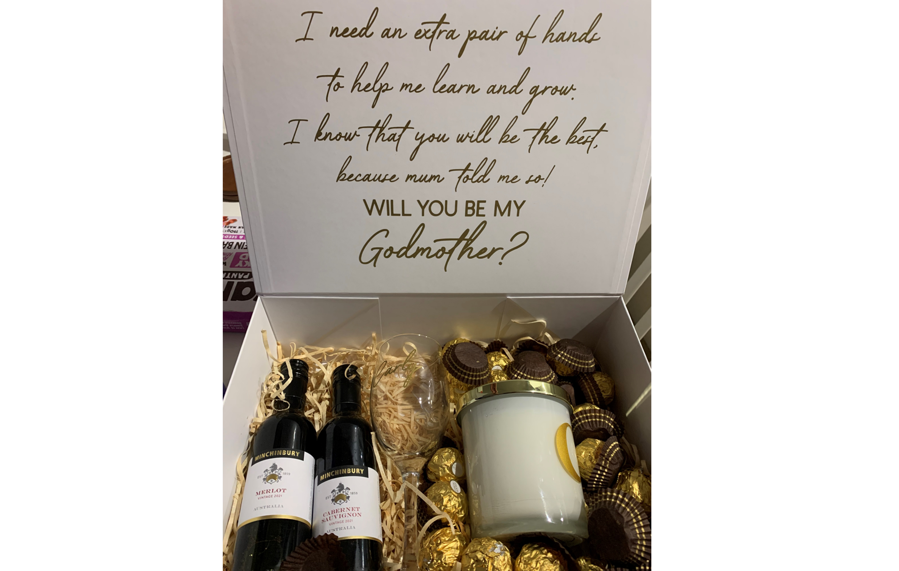
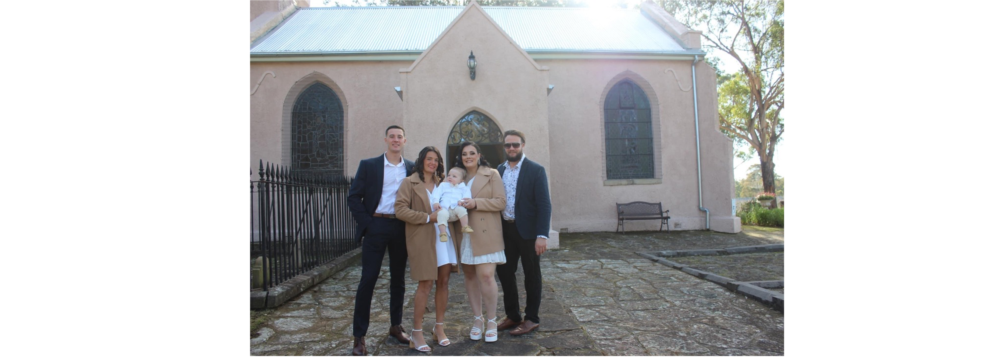
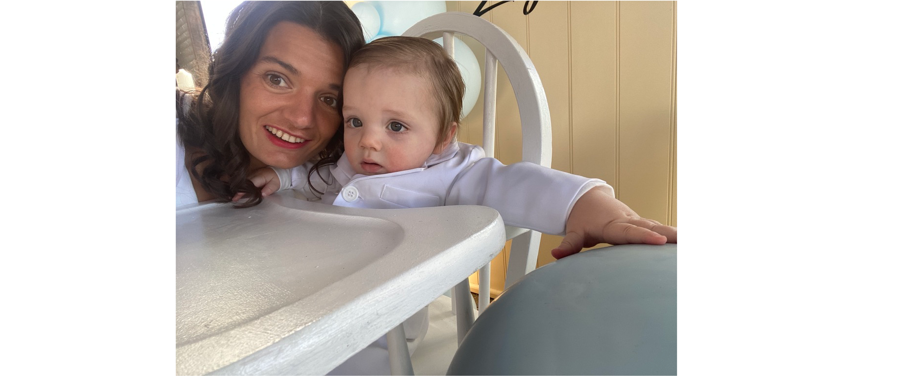

# Zayne's first birthday & baptism
**24.6.23**
**Prologue**
Previously, my sister asked Nathan, Luke and I to be the god parents of Zayne. She asked us to come over for dinner and then asked us through a nice gift: 

Of course I said yes! I love that little boy so much. 

Little did I realise that a god parent is meant to teach the child about god and religion. I said yes because I thought it was about helping the child to grow and become a good person. 

I am not a religious person. To be honest, I do not believe in god nor do I believe that there is a higher power out there. When mum asked why I do not believe, I couldn't quite gather a way to explain it. I think that believing in god and a higher power makes you less accountable for your actions. I find that people who are believers will often say things like "it was meant to be."

I do not like the idea that things happen for a reason. It may bring peace to some people, but not believing means that I can enjoy my life as best as I can and not rely on anyone else to bring me happiness, nor blame anyone for the things that go wrong in my life. When life gets bad, shit happens and it should be up to oneself to recover - no-one else. 

I am not saying that it is not real, because no-one knows for sure. I am just saying that following a religion or faith is not for me. I prefer to believe in myself, family and friends. I believe in being kind because life is hard, I believe that the vibe you give off is the one that you will receive. And finally, I believe in the power of positivity (even though I sometimes fail to show it). Yet, my family believe and have faith, so I will not judge them and I respect whatever they believe. 

-----------------------------------------------------------------------

On 24 June 2023, I landed in Sydney after 3 weeks in the U.S. for travel ([[USA 2023]]) and a work conference [[Fpi15 conference]]. Straight from the airport, Nick and I headed to mum's house to get ready for Zayne's baptism at Denim Court Anglican Church. We arrived at mum's by 8.30 am and I was ready to go within the hour. 

*Img caption.* My siblings and I with Baby Zayne. 

The baptism began at 10.30 am. It was a very quick service, unlike some other Orthodox baptisms that I have been to. I respected the minister at this church, as he was all about teaching the works of religion to Children. He shared a video with us and then said a few things while using his finger to mark a cross across Zayne's forehead with "holy water."

Afterwards, everyone headed to Moorebank Sports Club for the reception and first birthday celebrations. It was a very nice set-up and Nicole did really well to organise it. I was a bit upset that particular people couldn't make it, when Nicole and the rest of my immediate family puts a lot of effort to attend their events. Like the delayed flights I experienced during my trip, I realised that it was out of my control. 

Nontheless, It was a really nice day and one that hopefully we will all remember, so we can tell Zayne about it when he is older. Surprisingly, Zayne did not cry at all! He was a really good boy. When I arrived back to mum's house, I gave little Zayney a bath and he was still smiling. 

*Img caption.* Pics with the birthday boy.

I do not believe in god, but I think our family are really blessed that Zayne is here with us. Throughout my life, I never really felt like I belonged to the family. As a result, I always wanted to be somewhere else. Now, I want to be close. Zayne has made me feel more connected to the family than ever - especially my siblings and I want to be there for this little boy. 

-----------------------------------------------------------------------