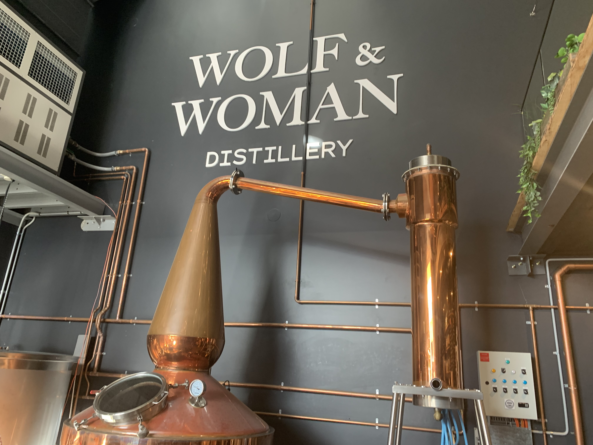

- Located: 14/6 Bellambi Ln, Bellambi NSW 2518

### 2023-02-24
Nick read an article in the Illawarra Mercury about a new distillery located in a warehouse on Bellambi Lane, Wolf & Woma We decided to go and check it out as it is walking distance for us.

When you walk there, it is almost like a corporate feeling you get, surrounded by offices and with barriers around the entrance to prevent it from being an open space. Apart from this, it had a very nice vibe to it. The layout was similar to [[Illawarra Brewing Co.]] in North Wollongong, just significantly smaller. 

It was super busy there, with limited seating and we couldn't get a table. I suspect that perhaps a lot of people were there as they had the same idea as we did: they may have read the article and went to check it out. Perhaps in a few months, it will die down and become less busy. 

Happy hour is from 5-7 pm on Fridays. We had one Gin cocktail each (Happy hour 5-7 pm) for $10 (but only for the very basic gin cocktails). They had a bbq going, offering either hotdogs or wedges. We decided that we preferred something else for dinner and left within 10 mins. 

I suspect it would be a good vibe if it were less busy and we had somewhere to sit. I would go back, but I think I will give it more time as it wasn't too enjoyable when we went. And I don't believe they allow dogs and like [[The Barrel Shephard]], they are only open for a select few days: Thursday 12-5 pm, Friday 12-7 pm and Saturday 12-8 pm. 