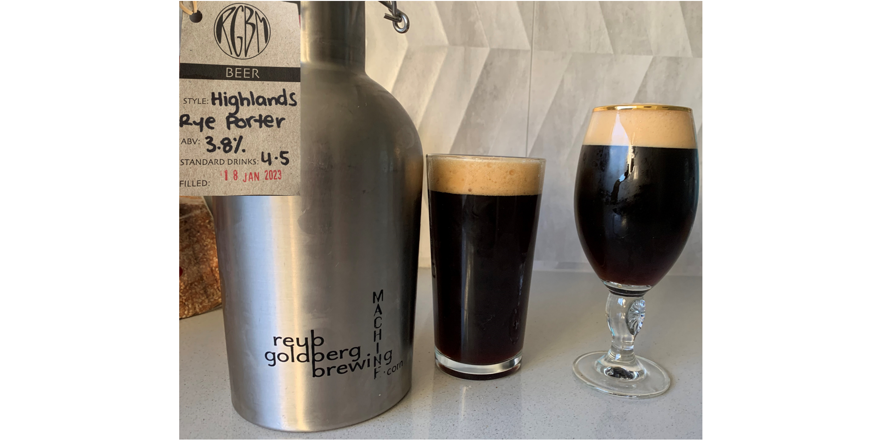
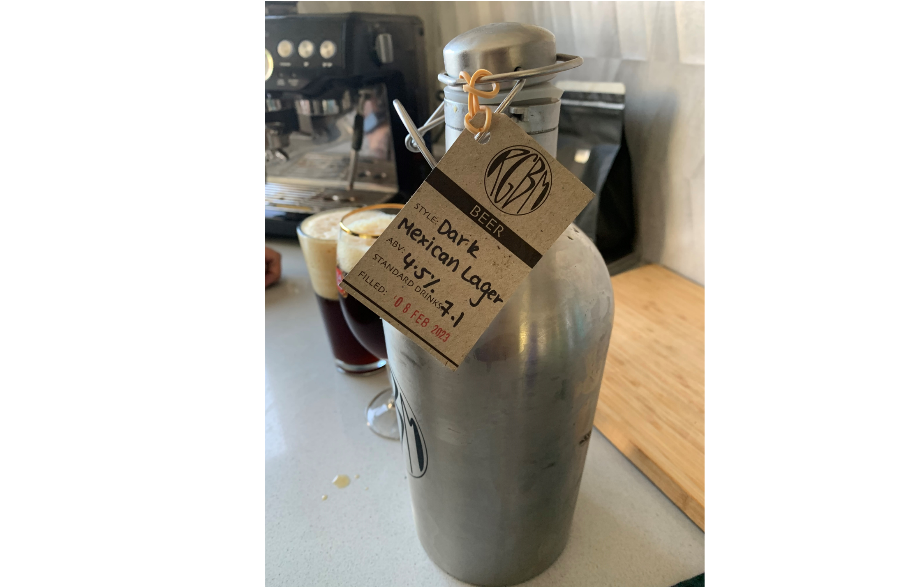
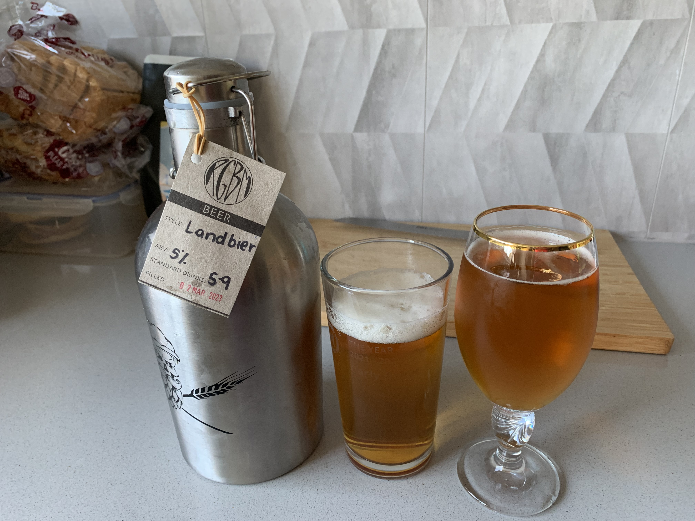
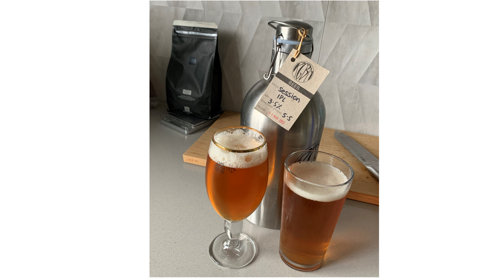

### About: 
- Location: Tarrawanna
- Specialise in Lagers
### 2023-02-13 
On my way home from work on Saturday afternoon, I planned to pick up beers from Dan Murphys but I had a crazy idea to go and get a growler instead. Well actually it wasn't crazy because I had been thinking about it for a long time - I could not justify spending that much money to buy the growler: finally I had the courage to buy one. My initial thought was to go to illawarra brewing co. on Montague Street in North Wollongong, but they were closed for renovations. Next, I thought Principle brewery located in Fairy Meadow but I went the wrong way and was too lazy to turn around. Therefore, I ended up at Reub Gouldberg Brewing. Here, I bought the Highlands Rye #Porter

It was pretty light for a porter. It was super delicious though, not bitter like many other porters. I rate this beer:  ★★★★★★★★★☆ 

### 2023-02-17
Heading home from the lab, I stopped in at RGBM brewery to fill up my growler. At this particular brewery, they have pre-filled growlers which means you swap out your growler for a different one. It costs $25 to get a 1.5L or $30 for a 2L. Today, I swapped my 1.5L for 2L. I decided to go with a Dark Mexican #Lager, as I preferred it over the pale ales that I tried while I was there. (Sorry not sorry)

This beer is stronger than the porter: 4.5% but it tastes lighter. It's something that I can drink really fast, however, Nick said that he could tell it was more alcoholic than the porter. I don't think I can taste it more. 

I do like this beer a lot, but I also liked the porter. I would rate them the same for several reasons: 
- the porter has a more full flavour, almost like it's satisfying my belly 
- The Mexican lager was light and more floral 
- Both are dark beers
- Both are less bitter than pale ales but have more flavour. 
- They make me equally as happy. 

Carly's rating: ★★★★★★★★★☆ 

### 2023-03-04
On my way home from my Saturday job, I stopped in at RGBM brewery. Most of the growlers were sold out. I was keen to try a pale ale or IPA, but they didn't have many options this time. (It seems each time I go there, they have different beer options).

The worker guy was really good and gave me a taste of a few different ones that might resemble an IPA. Two options were really tasty: the landbier (A fresh & golden #lager, with a bready malt character featuring Belphegor Helles Yeast and neomex hops adding pithy citrus & an earthy bitterness. ABV 5%) or the NZ rice lager (Crisp base and bright NZ hops. Sav Blanc, lychee and honeydew melon. ABV 4.9%). Both were so good, but I went with the 1.5 L of Landbier. 

The beer was quite tasty for a #lager. Personally, I would never get a lager because they are usually flat tasting. This one, was very hoppy and full of a citrus flavour with some bitterness to it. The first sip resembled an IPA, but the after-taste was more like a lager. 

I didn't enjoy this beer as much as the dark beers, but it was still quite tasty and definitely a well crafted beer for a lager! 

Carly's rating: ★★★★★★★☆☆ ☆

### 2023-03-17
Heading home from a Friday afternoon paddle, I picked up another growler. This time I got the Indian Pale Lager. This is probably the hoppiest beer that they had. Upon first taste, you think "yep its an IPA", but once you've swallowed it, the after taste resembles a lager. It was a pretty tasty beer. 

*About:* 
"A hybrid style that we're calling a session IPL with a festbier grist, American hops & a Czech lager yeast. A dank aroma with hints of sweet fruit & citrus. Followed by a dry biscuity malt character, balanced by berries & piney bitterness. ABV 3.4%"

This time, I went for the 2 L which only costed $25 and was about 6 drinks in total. Another thing that I also loved about this beer is that I could drink it without feeling any of the bad alcohol symptoms (being tipsy). After drinking three beers before, during and after our dinner, I continued working on my thesis. 

Carly's rating ★★★★★★★☆☆ ☆

