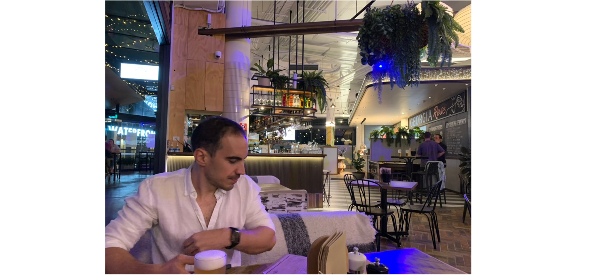

##### 2.6.23
For the last few weeks (corresponding with the VIVID light show in Sydney), Shell Harbour had it's own VIVID in the BlackButt Forest Reserve. Nick had bought tickets for us, Sarah, Jacob and baby Florence (Nick's sister and partner + baby). Whe we arrived, we had to walk about 10 minutes through grassland to reach the park ground where they were holding the event: #TheEnchantedForest.

While we waited for the others to arrive, Nick and I took a seat on a park bench. It was super busy in the park with a lot of kids. I felt really out of place without any kids. As Sarah + Jacob were running 30 mins late, I ordered a hot chocolate and some doughnuts. 

At 7 pm, we all entered the *Enchanted Forest.* It was a trail that was decorated with lights. There were sheets that had recordings of dear and trees that were decorated with fairy lights. It was quite spectacular. The trail ended with an alley filled with lazer lights. It was pretty overwhelming to walk through, but also pretty cool!

*Img caption.* Lights from the *Enchanted Forest.*

The only bad thing is that it was really short. The price for admission was $15/adult (children are free), and it only took 45 mins. Afterwards, Sarah and Jacob drove home to the Shire (about an hour drive), while Nick and I headed out to dinner. It seemed kind of wasteful to come all this way just for a 45 minute light show.

Nick and I took the opportunity to go somewhere in Shellharbour. We went to the Shellharbour Marina and found a cocktail bar, *Georgia Rose.* It wasn't busy at all, and there were many tables free. I suspect that it is because Shell Harbour is still growing in population. I suppose at some point in the future it will be a busy place. 

We both ordered a beer from the tap and food for dinner. Nick ordered a pizza, while I ordered a burger. My burger was just average, while Nick said that his pizza was pretty good - and it was huge! One pizza could have been enough for two of us. Too bad that he wanted a meat pizza. 

After about an hour, we had finished our beers and food and then headed home to watch the remainder of the football. 

*Img caption.* Enjoying a well-deserved Friday beer at Georgia Rose. 

It was a cool place I think. The food was not too expensive and the serving sizes were huge. The beers, however, were pretty expensive - $10-$12 for a schooner. 

I probably wouldn't go back here. Not because it was bad or anything, everything was great. However, there are a lot of similar places in Wollongong. Nothing really made this place any different. 