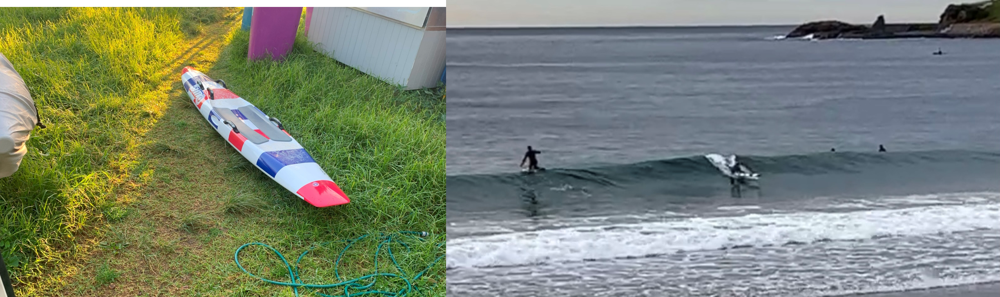
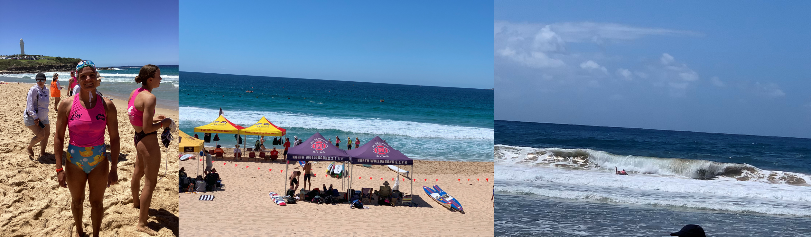

# My introduction to SLSA

## Finding the surf club
I didn't grow up on the beach. I've only been living in a coastal location since 2020. I grew up in South-West Sydney, in a Suburb called Carnes Hill. The drive from where I grew up to the beach was 40 mins to 1 hour. The closest beach to me was Maroubra - using the M5 on a good day, it would take a minimum of 40 minutes travel. Thus, besides the family vacations that we took (1-2 times per year), I would hardly ever see the beach. 

I always knew how much I loved the beach. When I lived in Redfern for a brief period of time during my undergraduate degree, I would frequently take trips to the beach and do a lot of ocean swimming. At one point, I took up surfing as a hobby but it never eventuated anywhere because learning to surf requires constant practice and even travelling from redfern to coogee was about 40 min trip via public transport. 

In March 2020 (the beginning of COVID-lockdowns), I moved to North Wollongong. I spent most of the lockdown swimming and running. I would often swim from Wollongong harbour to North Wollongong beach and return. Other times, I would swim at the continental pools (a free outdoor ocean pool run by the government). 

*Img caption.* Early riser reward. 

In April 2021, a coworker asked if I would be interested in rowing with them at Port Kembla Surf Club. I was so excited to do this, but I didn''t have a Bronze medallion. I was keen to start the following season, but my coworker had left and was travelling by September 2021, so I did nothing. 

One day at the Continental pools, I mentioned to one of the lifeguards how it would be cool to join a surfclub. Immediately, I was pushed into doing my Bronze with North Wollongong Surf Club. 

*Img caption.* Snapshots of patrol in 2021

By Christmas 2021, I had completed my Bronze medallion and was patrolling with NW Patrol 3. I met so many awesome people through the surf-club and have learned new skills as well. I feel my life is a lot better because I am a part of this community. 

*Img caption.* New friendships.

## Learning to paddle
As for paddling, this is one of my favourite sports. I can't imagine life without it. But, I've only been doing it for 2 seasons now. When I first joined the surf club and was training for my Bronze, I often went paddling with a few people. Pat was the MVP who taught me a lot of the initial skills. By the time I had passed my Bronze, I felt confident on the paddle board. My first rescue was just a few weeks later, on Australia Day 2022 where I went in with the big yellow surf rescue board to assist in a rescue.

In February 2022, I entered the Illawarra Branch SLS carnival in Thirroul. At the time, I was not confident in big surf, so I did all the running events - flags, sprints, and the 2km beach run. I did well in the 2km beach run, placing 2nd in the Females open. I did terrible in the Sand sprints and I never want to compete in these events again. The last event of the day was the swim. It was <800 m but I couldn't finish because I couldn't get past the break! I was so scared because the waves were really strong and I kept getting hit. Thus, I pulled out of this event. 

I was so embarrassed for pulling out of the swim. I went home afterwards and had a cry because I was so disapppointed in myself. Now that I look back, this was an important moment because after that day, I put all my energy into improving my surf skills. 

*Img caption.* Improving my paddle skills 

It started with every second day, as I was training for a marathon. Sometimes I would head out for a run at 6 am and then paddle afterwards. After the marathon, I stopped running and swimming and put all my energy into learning how to catch waves and better get out past the break. 

I tried so hard. Kel gave me a piece of advice at the start of the 2022-2023 season. He said to go out in all conditions: High tide, low tide, choppyy, calm, dumping and not. I did. I practiced and practiced. It didn't feel like I was improving, but every morning, guys from the surf club would always give me advice and feedback and I kept persisting. 

I can't even count the amount of times that I've been hit by big sets - I still do. I used to nose dive a lot. I often would take large tumbles in the waves and I have had a lot of minor injuries, cuts and bruises. That's the fastest way to learn. Now, I can say that I rarely nose-dive and I can make calculated risks. It was a matter of *persistence.*

In February 2023, I competed in the Illawarra Branch SLS carnival again. This time, I did not compete in any running events - only the swim and the board. Turns out I had improved a lot since 2022, as I won the swim! In the board paddle, I made so many errors and in the end, someone crashed into me which caused me to come last. 

*Img caption.* Illawarra Branch carnival 2023. 

The goal heading into 2023/24 is to practice competing. In the 2023/24 season, I will enter more carnivals to improve my race skills. 

**17.4.23**: Here is a snippet of me trying to get out in big surf:

<iframe width="100%" height="400" src="https://player.vimeo.com/video/818319769?h=3403dc9b53&amp;badge=0&amp;autopause=0&amp;player_id=0&amp;app_id=58479" frameborder="0" allow="autoplay; fullscreen; picture-in-picture" allowfullscreen title="17.4.23 surf"></iframe>
