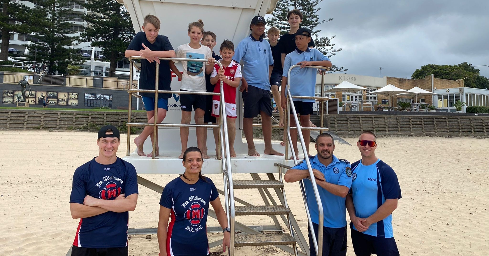

# PCYC community program & NWSLSC
The PCYC is a non-charitable organisation that run activities for kids of all abillities. They run a Fit For Life Program on Thursday mornings from 7:00am sharp to 8:15am throughout the school term. 

*Taken from their website:* 
" This program is available to young people of high school age. The session begins with a warm-up, followed by a 30min physical activity determined on the day to suit ability levels of participants. The group is then cooled down with light stretching before cleaning up and participating in a healthy breakfast. Participants then make their way to school. There is a bus service offered to the northern suburbs however seats are limited so we encourage participants to try to arrange their own transport if possible."

As part of the fit-for-life program, a few cops from Wollongong wanted to start up a program with surf lifesaving. Every fortnight, they come down to north gong beach and we do beach activities. I am volunteering fortnightly alongside some police to provide some surf-knowledge and games to youngsters and teens from 3.30-4.30 pm. 

It is so amazing that these cops get paid to run these programs. Talking to one of them, Jye, he insighted me on his career in the police force: from drug cases to abuse. He said that high risk kids often have negative opinions of cops. The program is a way to show them a more positive side of the police. The program is a **positive** engagement for police with the community. It also helps to provide more structure and a positive exampe to their day: showing them what it is like to get up and go to work, how it feels to be active. This is really lovely.  

**Journal of the program:**

The first week was on **21.2.23**. This day was quite windy, but we did some flags, beach sprints and wades. The kids loved it! 

The second week was **7.3.23**, the day was perfect for water activities, but I was told that we need a risk assessment for this. After a few wades, the kids were tired and didn't want to do much else. I got some rackets out and we played with them. Then we did a walk to the rocks on the southern end of NW beach. Pretty chilled time and very positive! 

On **16.3.23** the program was changed to Thursday mornings from 7-8am. Dave Merro (the president) came down to help out this week as well, but unfortunetly I forgot about it and did not show up. When I messaged Merro to ask him about the program, he said it was successful with about 15 people showing up compared to 5 on previous occasions. Therefore, they decided to keep it on Thursday mornings. 

The following week, **23.3.23**, it was a PR day for the program. When I showed up at the beach around 6.50 am, the NWSLSC tent was set up and they were preparing benches for the breakfast. We did about 40 mins of touch-football and relay races - even some members of the U20s St George rugby league team showed up. It was a great morning! Afterwards, I grabbed a board from the surf club and did 40 mins of paddling before heading to work. 100% Thursday mornings worked really well. 

