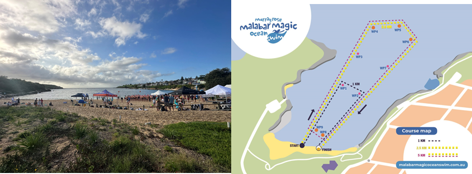

### 2023-02-19

**Sunday Funday.** 😄☀️ 

Today was the [Malabar magic](https://www.malabarmagicoceanswim.com.au/) oceanswim. They had options for 1km, 2.5km and 5km. As I do, I decided to enter the 5km. I was dreading it, as I barely trained for this swim. Mind you, I spend a lot of time in the ocean, but most of the time I just have fun paddling and haven't been focusing on long endurance swimming. 

The swim itself was okay. Malabar is a flat bay so for outside observers, it seems like it should be easy. The course was two laps of a 2.5km course (in the image above). On the way out, it wasn't too bad, I felt comfortable the whole first lap. Heading into the second lap, my legs were starting to cramp up - not sure of the muscle, but I was feeling it in the one just under the hip bone.

The swell was bigger with more chop on the second lap and I injested a lot of water. As I write this post, the water is still dripping out of my nose. I'm pretty sure my lips were a tinge of purple for a few hours afterwards. There were also schools of jelly fish that were blown into the course. I was trapped for about 10 mins trying to navigate through without being stung. I touched a lot of slimy bodies🤢 

The good thing about it was that on the way back back to shore, the tide basically took me in and made the last 1km quite easy. 

Once it was shallow enough for me to stand up, I tried to exit the water and immediately face planted at the finish line, how embarrassing 😳 

I did not swim as fast as I would have liked - with an average of 1'59" per 100m, which is terrible (my usual average is 1'35"-1'45"). I'm just glad that I finished. 

After the swim, Nick, chip and I went to Nick's parents house. I had a shower and coffee and we headed to [The Pines, Cronulla] for lunch, to celebrate the birthday of Nick's sister. It was an awesome Sunday. 

My stomach was bloated for a long time and I had a lot of gas from ingesting so much sea water.... Totally worth it. 
