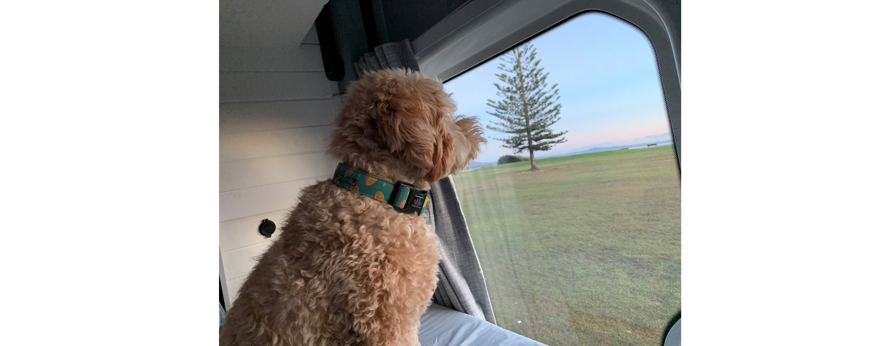

# Easter 2023 trip to Forster

## Overview
I always said that my ideal spot for vacation is at the beach. The thing is though that I live near the beach. I am at the beach every day. I'm starting to realise that what I needed before is not necessarily what I need now. When I lived in the West, I needed the beach for a vacation. Now that I live near the beach, I think I need something a little different. That thing was the campervan. 

Nick and I rented a campervan and travelled on the Mid-North Coast of NSW from Good Friday until Easter Monday 2023. We also brought our child/furry friend, Chip along with us. Having a dog on the trip really limited the things that we could do. We couldn't do super long walks; we couldn't eat in restaurants or go to National Parks; and some of the beaches that we visited were quite limited. I think it would have been amazing to do a trip to the mountains or do longer bushwalks. Nontheless, we enjoyed our trip and the main thing was that we were in a campervan. It was quite fun! 

I don't think we got the full campervan experience though, because we mostly ate out or ordered takeaway. Although, I do suspect that in the future, trips to the National Parks will require us to be 100% self-sufficient. The campervan that we rented for this trip would've allowed us to be fully self-sufficient. From this trip, I think we can both say that we would do this again.

Here is a video summary of our trip and see the full blog below.
<iframe width="100%" height="400" src="https://player.vimeo.com/video/816445421?h=6190bd2d71&amp;badge=0&amp;autopause=0&amp;player_id=0&amp;app_id=58479" frameborder="0" allow="autoplay; fullscreen; picture-in-picture" allowfullscreen title="Forster 2023 in a campervan.mp4"></iframe>

## Things to do in Forster:
- Visit some amazing beaches
- Bicentennial walk 
- Visit the Coastal Brewery
- Walk along the wharf
- Visit the national parks: Booti Booti or Wollombi (we couldn't do this because of Chip)
- Take a trip to Old Bar (a small town 30 min North)

## Blog of the trip
### 2.4.23: Prologue
Last night, Nick and I were joking around about going away for the easter weekend (7-10 April 2023). I cannot remember specifically how we ended up at the decision we came up with. I think it started when I made a joke about renting a campervan (I talk about this so much). Nick went straight on the camplify website and booked us a campervan for the weekend. 

I called mum to let her know that we won't be going for Good Friday lunch. I was a bit worried that she would get upset with us, because Good Friday lunch is a big deal for my family --- not so much the religious side, but more for getting together. She wasn't upset at all but she was so excited about the idea and thought it would be really fun for us. 

We've been putting together a list of things that we want to do including walks, lookouts and of course breweries. I'm so excited! We decided that we would head down the South Coast, and end up in Eden. The South Coast of NSW is so beautiful and neither of us have visited Eden before. 

### 7.4.23: Good Friday
Looking at the weather all week, it seemed that Eden was going to be cold and miserable. Therefore, we changed our plans from the South Coast to the North Coast. On Good Friday (7/4/23), Nick, Chip and I woke at 5.30 am. We had a coffee (not Chip though) and breakfast, packed the car and headed to Shell Harbour to pick up the rental van that we booked on campify: The rental was called AJ. The owners Jennie and Bernie spent a few years building up this campervan[@jb.vanjourney](https://www.instagram.com/jb.vanjourney/) They were super friendly and so excited about the #VanLife (My life goals). Due to life getting in the way, they don't get to use the van too often and wanted other people to get use out of it. They were so lovely. 

*Img caption:* Setting off on a Long weekend adventure!

The campervan was 3 m tall and 7 m long! A huge vehicle!! Lucky that I am not driving because I would not have been able to manuvere it. Nick was therefor our designated driver. We set off around 8 am. We went a slightly longer way and avoided tolls. Our first stop was Panania McDonalds for coffee and then we did not stop until we reached Forster for fear of being stuck in more traffic. It was brutal, I was getting so frustrated and I wasn't even driving!

The traffic was quite bad. Instead of it taking 4 hours, it ended up being close to 6.5 hours. When we arrived, we went straight to [[The Coastal Brewery]] and had a beer paddle tasting each. Chip was really unsettled so we didn't get to enjoy it for too long. After we finished the paddle, we headed to nine-mile beach to let Chip burn off some energy. 

Nine-mile beach is located in Tuncarry. This beach allows dogs off-leash and also allows 4WDs. It is not a beach that you would want to swim at  as it is full of rips; open to the sea, and on this day, the water was filthy --- probably from the heavy storms over the week. 

After the 4 km beach walk, we went to check out Forster and find somewhere to sleep for the night (since it was approaching sunset). We found a nice spot near Pebble beach, we enjoyed the sunset and then went to grab some dinner. 

*Img caption:* Sunset in Forster

Unfortunately due to the religous holiday, nothing was really open. We settled for a burger foodtruck and enjoyed some burgers and loaded fries --- that were just average. Finally, settling down in the van for the evening, we drank a couple of dark beers (White Rabbit - our favourite), played a few games and then fell asleep. 
### 8.4.23: Easter Saturday 

*Img caption:* Enjoying the sunrise. 

We woke up at 5.30 am and opened the back doors of the van to see a spectacular morning sky. Chip was really enjoying watching people pass us - Even giving a few barks out. 

We rolled out of bed by 6 am and then went for a walk to Forster main beach to get coffee and a small breakfast treat: Nick an almond croissant, and a banana bread for myself. We drank our coffee and ate our food on a park bench in front of the main beach and then continued our walk along the bicentenial pathway. We went to a few really nice lookouts showing Forsters amazing cliff faces. The walk ended up being about 4.5 km before we headed back to the van. 

*Img caption.* Morning bicentenial walk. 

By 8 am, we packed up and headed North to Old Bar village. Really, there wasn't much there but the beach was quite nice and they have a Surf-lifesaving club too. There were markets on this day at the park, so we had a look, ate lunch and then took a nap in the van. On the drive, we opened the window for Chip. He was having a lot of fun sticking his head in and out of the window. It was so funny! 

*Img caption.* Heading off to Old Bar. 

At 3 pm, we headed back to Forster. We stopped in at the brewry again and I had one of the beers that I really enjoyed yesterday - The hearts Pale Ale.  I must emphasise how good this brewery is: Every beer was really amazing. The great thing about this brewery is they let us bring in our own food. We took some cheese (The cranberry cheese from Woolies) and crackers with us.

*Img caption:* Spending time at Old Bar village. 

After the brewery, we headed to the wharf and walked around for a while before stopping in at Bella Bellisimo to order a pizza. This is an italian restaurant that was really busy. It seems like they couldn't really handle it though. For one pizza, it took them about an hour! After we got the pizza, we took the it to our campervan and parked in the same spot as yesterday, in the car park near Pebble Beach.

We poured ourselves a glass of 2016 old vines Shiraz from Briar Ridge Estate in the Hunter Valley. Unfortunately, we had no glasses available and had to drink the wine out of plastic cups. I was kicking myself that we didn't bring our glass coffee mugs (as I told myself to pack them prior to leaving). Supprisingly the wine was really nice and it was a shame that we drank this wine in plastic cups. 

We ate pizza with the wine. The pizza was nice, but I think our local pizzeria in Bellambi is better value. Afterwards, Nick turned on the Raiders vs. Broncos NRL game and we watched the Raiders win. Nick was very happy. 

Tonight, several other vans were parked in the same car-park as us! It seems that this is a very popular spot, which is no suprise as there are bins and toilets close by. 

### 9.4.23: Easter Sunday

*Img caption:* Sunday morning chilling in bed. 

We woke to an Easter (church) service in the park. I was supprised that there are so many people who are religious. With all the people around, Chip was very annoying and kept barking at the people, wanting to greet them. His little bark/growl is super cute though, so it cancels out the annoying-ness.

When we were sick of Chip's complaining, we rolled out of bed and then walked to a cafe, *Tartt*, on Wharf Street to get a couple of coffees. By 7.30 am, we were back in the van, eating a couple of hot-cross buns and easter egg bunnies (chocolate for breakfast, sorry not sorry) gifted to us by Jen and Bernie (so kind). 

Forster is a lovely town, but there is not a lot to do aside from beaches and national parks. The former we have at home and the latter was unavailable to us because of Chip, so we decided to drive South towards Newcastle to get a head-start for tomorrow. 

Nick was a bit worried about going somewhere else  --- due to the uncertainty. We won't know where to eat or where to park. I find the uncertainty so exciting! 

A 2.5 hour drive south landed us in Budgewoi. Aside from the Budgewoi hotel, nothing else was really open. We went to the beach where we ate some chips and dip and our little Chip had a run around. The water seemed to have very strong currents, many rips and a big swell with  small period which is not safe for swimming. Neither Nick nor I went for a swim. After less than an hour, we decided to move on. 

*Img caption:* Hanging out at Budgewoi Beach. 

Next, we headed to Nora Heads and did a short walk to the lighthouse (Founded in 1903). Near the lighthouse, was a very large, old house that was the light-house keepers grounds and available to rent for vacation. It was pretty cool but I would not like to stay there due to the high foot traffic  --- this walk was super busy, maybe because that was one of the only things to do/see in this area. Nontheless, it was a very lovely walk and the place is a good spot for families on vacation.

*Img caption:* Short walk to Nora Heads light house. 

In search of food, we ended up at a Mexican restaurant in Toukley, *Mexicoast Cantina.* We ordered a margarita each, tacos and jalapeno poppers. We sat and ate for a while. Looking at Google Maps, The Entrance was only 15 minutes away, so we decided to head there and settle in for the night. 

To be honest, there is nothing spectacular to see here, and we probably would've been better off sleeping in Nora Heads. There were a lot of tourists that made it quite uncomfortable. Therefore, we decided to park the van by the Lakeside as it was quieter than the beach. 

*Img caption:* Pic 1. The Entrace where the lake meets the sea; Pic 2: Chip and I ready for bed and Pic 3: Sunset over the lag in Long Getty, where we spend the night. 

I do prefer the vibe of Forster more than the central coast. I love that it is more quiet, there are a lot of runners and cyclists out and there are so many national parks around! ....but being here now saves us some time tomorrow and hopefully we can avoid most of the traffic. 

### 10.4.23: Easter Monday
This morning, we woke up to Chip complaining that he needed to go to the toilet. Nick took him out while I completed my wordle, as usual. We got changed, went to the public toilets nearby and then walked onto the main strip in Long Jetty, The Entrance. We sat down at a cafe, *The Morning Coffee Society*, at 6.50 am for a breakfast. We ordered ourselves a coffee and I ordered a mushroom dish with poached eggs, while Nick ordered a bacon and eggs with smashed avo. It was a great breakfast and we were the only people at the cafe for a while. 

*Img caption:* Our final vacation breakfast on the road. 

After Nick gave his remaining bacon to Chip, we walked 800 m back to the campervan, packed up (ensured everything was put away so it wouldn't fly around as we drove home) and headed off. Our trip home was 2.5 hours and based on the maps, it seemed like it would be an easy trip home without hectic traffic that we experienced on the way to Forster. 

By 11.30 am, we were at home and enjoying a second morning coffee. The washing done, van cleaned and ready to return. Just like that the weekend is over and it's back to reality: Solving issues with organic synthesis for me and regular DevOpps problems for Nick. Ehhh I want to go again. 

