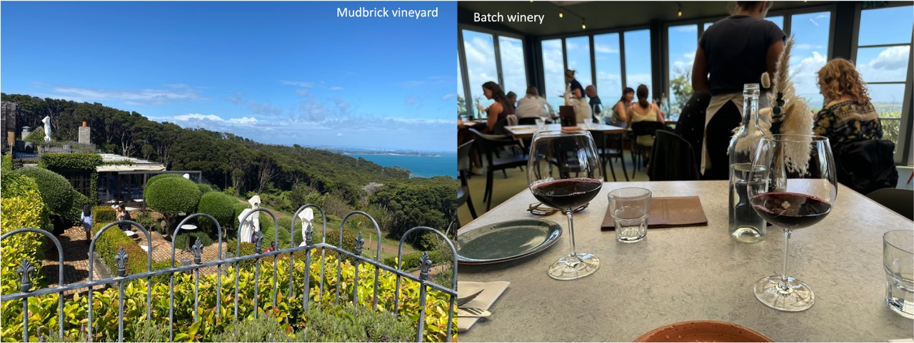
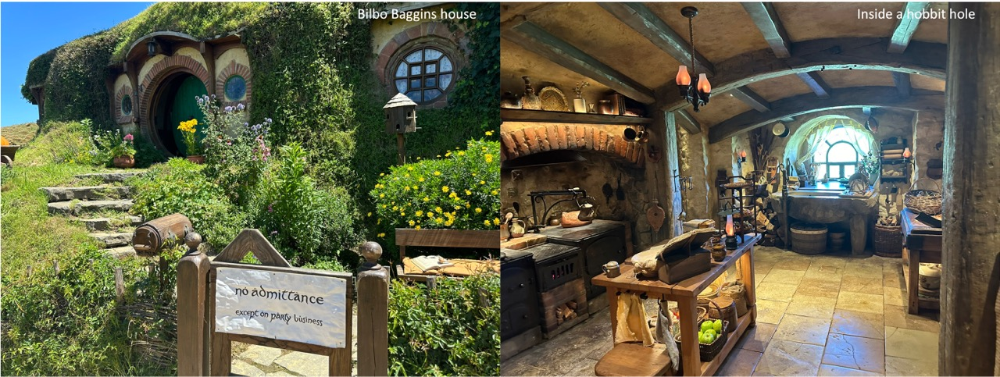
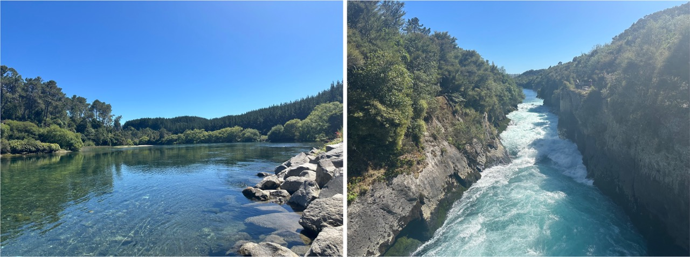
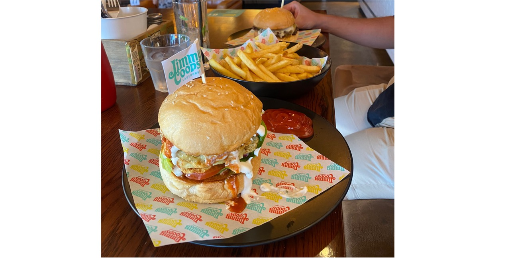
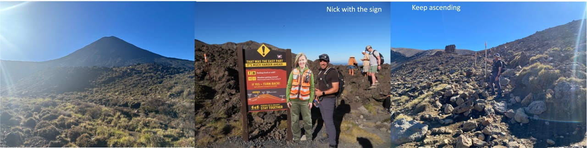
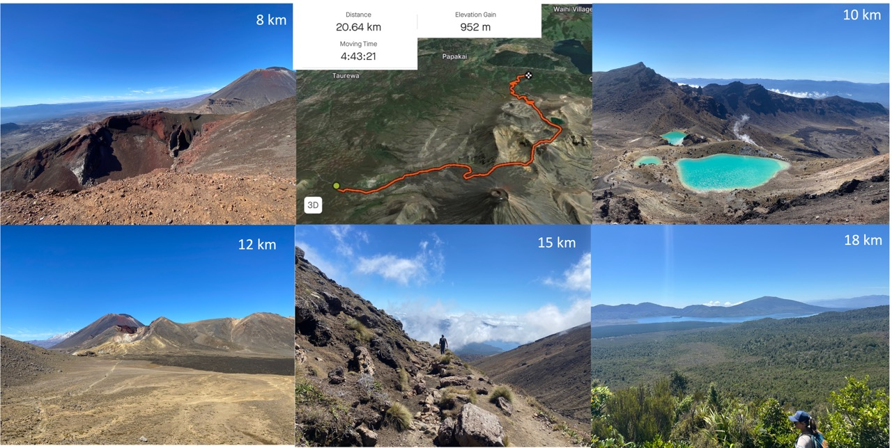

Welcome to my post about the trip that Nick and I took to New Zealand. I'm still working on this to add photos/videos, so stay tuned. :) 

## Summary
From 2-23 February 2024, Nick and I travelled around New Zealand. We organised all our activities, accomodation and even car hire prior to departing on Friday 2nd February. It was the most organised trip that I had ever taken! Usually, I go somewhere without planning or thinking and just asking fellow travellers for tips. When I compare the two styles of travel, the organised route definitely saved time and made the trip more relaxing.

There were a few things that I observed over this trip. First, New Zealand love their orange cones! They were on almost every road that we drove on…. Yes there was also a lot of road works! I guess because New Zealand have a population of 5 million (compared to 8.3 million people in NSW alone), it means that things are much slower. It also explains the more laid back vibes that I felt travelling around NZ. 

Another observation is that NZ love their birds! I already knew this before travelling to NZLD, but they love them more than I thought. Although, I do understand why … Their birds are pretty and very cute! Even their ducks are nice to look at. It also felt like the NZLD people were very connected to nature and set to protect the land. The vibes that I got from New Zealand were of very environmental and respecting the culture of the Maori people. I thought this was the most amazing thing of New Zealand - that the Maori people were well represented and respected in NZ - unlike the Aboriginal people in Australia. 

The Maori population are fairly young. They migrated from Polynesia in 1300-1400’s and were aware of European voyages and discoveries of Australia and NZ. I find it remarkable that the Maori tribes came together to fight the British settlers, resulting in a treaty that protected Maoris but also allowed Settlers to create towns and cities. 
During this trip, we drove from Auckland down to Queenstown. As we drove down the highways, we often passed through small towns. The small towns were unlike New South Wales, they seemed to have a lot of shops and everything you could need to survive. It made me question how do they make money?? It must be from tourism and damn it must of hurt these small towns during COVID pandemic. 

Also unlike Australia, PayWave and Credit were not commonly accepted forms of payment. There was often a 2.5% surcharge on PayWave or Credit payments. New Zealand travel was expensive, but the surcharge of the PayWave made it very expensive. For example, a small coffee would cost $5 (compared to $4 in Australia). A cheap burger in NZLD would be $20-25 (while a cheaper burger would be $15-18 in Australia). Finally, even the price of fuel per litre was $1 more expensive. I assume that maybe there is a larger tax on Fuel compared to Australia. This also explains why taxis were so expensive. On arrival, it cost us over $120 NZD to be transported from Auckland airport to the city. Later on in the trip, we learned that Uber was at least half the price. 

Regardless of the price, New Zealand is a beautiful country! The only thing that I would say that I missed was our coffee. While the coffee was 10000x better than the USA, the coffee that we have at home was at least 50x better. In addition, while the beers were great, there were large differences between pale ales in NZLD vs. Australia. For example, Hazy Pale ales are more tropical with less hoppy taste.

Food-wise though, it was pretty cool that everywhere we went, savoury scones were offered. In almost every cafe we entered, a common food was a cheese scone. We tried it for the first time in Rotorua and it was very nice!  

I’m not sure exactly what New Zealand is like in the winter, as I have never been. This trip however, has shown that New Zealand is very heavy on tourists. I think over 50% of the population in Queenstown are tourists. This was a key theme in all the places that we visited. 
Would I come back? Yes for sure. 

## ✈️ Sydney to Auckland  
*1.2.24*

It was a Thursday afternoon, we had finished up work and I submitted chapter 6 to my supervisors. We went next door to drop off our boy, Chip to the neighbors to mind, then we packed the car with our suitcases and set off to Nicks parents house for the night. We stayed there because it was easier to get to the airport tin the morning. 
We arrived at 6pm and we ate Thai and drank a glass of wine before packing my suitcase. Yes you heard it right, I didn’t have a suitcase, so I had to put my stuff in random shopping bags and pack at Nicks parents house (they lent me a suitcase for the trip). 

*2.2.24*

At 6am the next morning, Nicks dad dropped us off at the airport. He also gave us a couple of tickets to the Qantas lounge, where we had breakfast and several coffees before departing to Wellington. 

The plane left at 9.10am, and landed in New Zealand at 2.15 pm. Although it was a 3 h flight, new Zealand is 3 hours ahead. We passed through customs, which was very nerve racking due to their strict bio security – although I didn’t have anything to worry about as my hiking boots were brand new and never worn. 
Once we passed customs and exited the airport, we jumped in a taxi to the Viaduct area of the CBD, which costed roughly $110 AUD. We stayed at the M social hotel. It was very nice with a view of the wharf. It gave a similar vibe to circular quay in Sydney, just less busy. 

After dropping off our luggage, we headed for a walk around the area to look at the bars around. We ended up stopping for a drink at Headquarters. Following, we went back to the hotel to shower and then went out for dinner. When we were searching for a place to eat, we saw a sign saying “happy hour, $10 margarita”. We decided to go to the sign but ended up in the wrong restaurant ! Instead of Mexican, we went to an Italian restaurant called Portofino, the food here was okay, but it was very overpriced. We instantly regretted sitting down but felt too bad to leave. Two dinners and $180 NZD later, we escaped and went back to the hotel where we watched James Bond – Quantum of Sollace. 

*3.2.24* 

We woke around 7am and packed our bags for the day, showered and headed out for breakfast and coffee. I can’t tell you where we went for coffee because it was mediocre at best. At 9am, we got the ferry to Waiheke island. My oh my were the tickets expensive! $55 NZD return each. The ferry was a nice ride. There was a lot of resemblance to areas of Sydney. Once we docked at Waiheke island, we joined a wine tour. There were many things that we could’ve done though. There were many places to rent a car or a bike, even kayaks. However, the weather was not great when we were there and so the wine tour seemed like a great idea. Our guide was a South African woman named Nala, who migrated to NZD with her sister and family 20 or so years ago and retired on the island. We were with a group of 10 or so people. 

We visited four places:
1. Mudbrick: This was the first Vineyard that we visited. It was a good wine tasting, but seemed less personal than other places that I’ve visited. 
2. Postage Stamp: This was more personal than mud brick. The red wine was my favourite here… It was chilled but as it warmed to R.T.,, the taste changed a lot. 
3. Stony Ridge: The last winery that we visited before catching the ferry back to Auckland. Here, we tried many nice wines with a South American Wine Sales woman. She was very enthusiastic about the wines and told us some stories of their struggles during COVID. 
4. Batch winery: This is where we ate lunch. Nick spoilt me and we ate a 3 course meal with some very tasty wine. The food was great. 

On this trip, we did not buy any wine. While it was good, the tour was pretty rushed and we didn’t really have a chance to buy wines. It was probably best that we didn’t buy wines here, because the wines we drank in Hawke’s Bay were much nicer and more our style (bold reds). Around 4pm, we were dropped off at the ferry wharf and we got the ferry back to Auckland. That night, we went out for Mexican food, which we enjoyed with a cocktail each before heading back to the hotel to prepare for our travels the following day. 

## 🚘 Auckland —> Taupō 🏔️
*4.2.24 *

This morning we woke at 7.30am, went downstairs for a breakfast at our hotel and then walked to the car rental shop. We rented a Toyota Corolla Sedan through a budget rental company. We then drove back to the hotel to get our luggage, which was packed in the boot. At 10am, we were on the road towards Hamilton. I’m Hamilton, we grabbed a coffee and sandwich – which was very gross and after two bites I had to throw it out. But the coffee was very soothing after the long-ish drive. 

We drove from Hamilton to Hobbiton, located on the Alexander farm. As we drove on the winding roads, we saw marvelous sites of the rolling hills. Apparently, when Peter Jackson flew with a helicopter over this area, he wasn't sure if this is where he wanted to create the set. However, once he landed, he was convinced that it should be there. 

We arrived 20 minutes before our alotted time, in case we got lost. It was very hard to miss though because there were tourist buses everywhere. Neighbouring houses had signs at their fences saying "no tourists please." This tells me that many people made the mistake of going to the wrong place, not sure why or how though... While we waited for the tour to start, we slapped on sunscreen and lined up in the appointed time section. At 1.20pm, we hopped on the Hobbiton set shuttle bus, which drove us through Alexanders farm to the start of the movie set. 

On this tour, we had a guide named Ellie who walked as through the set which took approximately 2.5 hours. The hobbiton movie set, or "the Shire" was something very special. The Shire looked exactly as seen in the movies!! Fun fact: When they first filmed The Lord of The Rings, they made it all from polystyrene and plastics, which allowed them to destroy it afterwards. When they wanted to come back to film The Hobbit, the family asked if they could make "Hobbiton" permanent so they could benefit from tourism. We learned all about Sir Peter Jackson and all the nitty gritty details of creating the set. I found it so amazing how much effort they put into the set, and how they keep putting effort into maintaining it. It gives me more respect for the Lord of the Rings trilogy and makes me keen to watch it again. 

The tour ended at the Green inn, where we had a complementary beer before heading back to the reception area. A small kid said to his mum on tour "Are they free?" Nick looked at me and said "not free, but included in the price of the ticket." I laughed. 

In Taupo, we stayed at the Lakeside Thermal Lodge. It gave a motel-like vibe. We had a parking spot on site. Here, we stayed for the next 4 nights. At first we were a bit unimpressed, but over the days we were here, it became a really cosy place. We had a “thermal pool” in the yard of our room. I say it in quotations because it was like a small bath in the outside area. It was very relaxing though, and everyday we would come home and sit in the warm pool. 

On the first night, we drank wine in the pool and ate pizza from Hells pizza. The pizza was interesting – we had a vegetarian and a Mexican one. We also watched the sunset by the lake, which was something special. Although, the wind picked up as it got darker which made it colder. The cool was very welcome at the hotel because the spa was more enjoyable to sit in.  It was a great first night. 

*5.2.24*

At 7am, we woke and prepared our bags for the day. We walked to Café Baku – which was ~1.5km from our lodge. We ate breakfast and had coffee and then walked to the Pack N Save, 100 m away. Here, we bought some snacks and sunscreen, then embarked on a 15km walk – to and from Huka falls. 

The walk was enjoyable with wonderful views of the Waikato River. It started out very calm, however, a further 3 km into the huka falls track, the river began to roar. The area at which the water flows down the stream is very narrow, and therefore as the water passes through shallow regions of volcanic rock, the current increases and the water begins to rumble through the rapids. 

When we arrived at the Huka falls bridge, I was shocked to see that it wasn’t really a waterfall, but more of a region of very high water flow. I could not make out the shape of the waterfall, regardless of the position that I stood, or how far along the rapid that we walked. It is suppose to be an 11 m drop, however, the roaring rapids disguise the drop, making the photos seem only of a river and not a waterfall. Nonetheless, it was very cool! Apprently 1000 By this time, I had blisters on my feet because the socks that I wore were not the best! Why did I pack crappy socks?! 

7km later, my heals were very sore but we were back at the lodge where we could rest for a while. In the early afternoon, we got a few groceries to make sandwiches and snacks for tomorrow. In the early evening, we went to Jimmy Coops Burger bar. I ordered a Herbivore burger, which was very nice and one of the best I’ve ever had! (even better than Fergburger!) Ever! They also brew their own beer but unfortunately we did not try as we wanted to have an alcohol-free day. Therefore, we ordered a virgin cocktail each and then went home and soaked in the tub. 

*6.2.24*

It was an early start this morning, 5.15am! We were up and out the door by 5.30am to grab coffee from a cafeteria on the highway. We drove 1 hour to 21 Carol St, where we had organised a Shuttle to the start of the Tongariro crossing track. The shuttle was required because the walk was 20 km long and we did not have enough time to do a return walk. The shuttle was $55 pp. but totally worth it. 

We were dropped off at 1100 m elevation, at the bottom of Mt Tongariro. It was a relatively hot day, with temperatures reaching 25-27 degrees at tree level. The first 5 km of the walk was a steady ascent. It was very easy. We then reached a sign saying “It will get much harder now”…. Which is what I was expecting. The next 5 km was steep incline up the mountain side. It was hard but it was do-able and the views upon ascent were stunning! I was shocked that some people were doing this hike in vans!!! I would have died.

When we reached the highest point in the hike (1800 m), there were beautiful views of blue sulfur lakes, the red crater and rocky formations of the volcano. We stopped for a picture and then began a 200 m descent to a larger blue lake. The descent involved sliding down the steep mountain side. It was very gravelly/sand like which made the sliding kind of fun. When we were at the bottom of this 200 m decline, we admired the sulfur lakes and then hiked 1 km further to the large blue lake where we ate lunch. On one side was a very blue lake with mountains in the background and on the other were three mountains lined up: with views of the red crater, Mt Tongariro and a glacier on the far left side. This was one of my favourite views of the whole walk! By now, it was ~12 km and 2.5 hours into the walk. 

The rest of the walk here in, was mostly decline. It was painful on the knees, but even so, the views were so amazing. At some points, we had spectacular views of Lake Taupo. The coolest thing about this hike was that every 5 km, there was a change of scenery. We passed through deserted areas of just rock and mud, past lakes that smelt really bad of rotten egg (the smell of sulphur), through areas of greenery and forest. 

The last 2 km were a killer! We were done and ready to go home. The feet were aching and the knees in pain. It was such a relief when we reached the end. We took a selfie with the end sign. We waited only 10 mins and then took the shuttle bus back to 21 Carol St. At the time we got on the shuttle, it was 1.30 pm. Therefore, the total walk took us ~5 hours.

Once we reached 21 Carol St, we drove back to Taupo. We needed a long rest before heading out to dinner. First, we went back to Jimmy Coops to enjoy two beers and toast to the successful and amazing walk that we did. Afterwards, we went to Vine for Tapas and a cocktail. The food and drink was pretty good, but not as good as the burgers we had the night before. 

*7.2.24 *

We had a little sleep in this morning. The legs and body were aching from the hike yesterday. At 7.30am, we went back to Cafe Baku for breakfast and coffee. We made sure to park close to avoid walking long distances. 

After breakfast, we headed to Wai-O-Taki Geothermal Wonderland in Rotorua. It was a 40 minute drive. We arrived at 9.35 am and lined up to get tickets. It was $42 entry pp. We were happy to pay this as it seemed to partly go to the tribes of the region. At 10.15 am, there was a demonstration of the hot springs called Lady Geyser. In this demonstration, they poured a soap into the rocky formation, which caused an eruption of hot water. It was very cool. 

Next, we went back to the park and walked the track. It was a 3 km loop around the park. We marvelled at the large thermal baths and hot springs. It was amazing. On our way out of the geothermal park, we went to the mud pools which were basically pools of mud that were reacting with the atmosphere, causing vigorous bubbling at the surface. It was very cool!

In total, we were at the park for 3 hours. Next, we headed 15 minutes to Rotorua City to have lunch and look around. We walked through a free city park that contained similar thermal pools to the geothermal park. I think that I would advise people on a budget or lacking time to just visit these free parks, as they were also really cool. In addition, the geothermal activity with the city in the background made this park even cooler! 

Back to Taupo, we went out for dinner at Plateau Bar and Eatery to celebrate our last night in Taupo. 

## 🚘Taupo —> Hawke’s bay 🍷
*8.2.24*

We checked out at 7.30 am and went for breakfast in the industrial area of Taupo. It was them best coffee so far. After drinking coffee and eating breakfast, we ordered one more coffee to go and drank in the car on the drive to Hawke’s Bay. 

We drove straight to Haverlock North. This destination was selected as we saw on the map that there was a small town with many vineyards closeby. We parked in an unlimited parking area and rented bikes. 

After sun screening, we cycled from the bike store to Craggy Range vineyard. It was a very nice place but very expensive, costing $35 for a tasting each and it was only waived if you purchase 3 bottles. The best wines were priced at $170. While Nick was tempted, it seemed very expensive in total. Therefore, we passed on the wines and it was probably the best decision that we made on this day because other, smaller vineyards had wines that were very similar and much cheaper. 

From Craggy Range, we cycled to Askerne winery. It was ~7 km cycle on the road. When we arrived, we were seated and we tried about 8 wines between the two of us. They had a great soft sparking rose called Fleur.Along with many delicious red wines. The wine tasting was only $5 pp, which was waived upon purchase of a bottle. We bought two! 
Nick cycled with the wines in his backpack. We cycled to the final winery of the day, Te Mata Estate. The wines here were great too. The lady who was serving us, gave us so much wine to drink that by the end of the tasting, we had drank ~3 glasses of wine each! I felt drunk. 

After cycling back to the bike shop, returning the bikes, we drove to Napier to checkin to our hotel. We stayed at the Swiss-BelBotique. We relaxed for a while and then went out to explore and eat. I felt a bit hung over?? From drinking all day. We ate at Matisse, a wine bar in the city. The food was only okay. In the evening, we watched half of James Bond. 

*9.2.24*

This morning it was raining. We went to a small cafe for breakfast called Rafael st café but they didn’t accept international travel cards. Because it was pouring we quickly went to get cash out and come back. We got coffee and eggs on toast but it was just okay. Supprisingly, many places throughout NZ do not accept payWave or credit cards. 

After breakfast, we went back to hotel and got ready, then headed out to our first winery for the day: Brookfields, a small vineyard that is family owned.. When we arrived, a pug greeted us. He was so friendly and cute. We immediately began a tasting and It was so nice!  We bought another we bought a Cab Merlot from here for $65.

Next: we tried to go to elephant hill. It was closed. “Staff sickness.” We went to Te Ama estate. It was less personal compared to the Brookfields estate. Here, we bought 1 bottle of Syrah. But the tasting fee wasn’t waived. It was $10 pp, which was not too bad.

For lunch, we tried to go to Abbey estate but it was closed. Therefore, we decided to call it a day and headed to Hastings for lunch. We had pizza from Spookys pizza and coffee from a French bakery. It looked amazing but it was still just average. At 2 pm, we returned to the hotel and watched the rest of James Bond. 

At 4.30 pm, we got ready and walked 2.7km uphill to Urban winery, located in an industrial area of Napier. It was the the best bar we’ve been to in Napier. It was so cool, filled with locals and happy vibes. Our first drink choice was the fat and sassy Chardonnay = great! We then had a glass of the Fleur rose that was from Askerne, followed by a Syrah. We wanted to eat here but they didn’t have an extensive menu for vegetarian food. Therefore, we left to find a place to eat. We decided to skip the hills and walked 5km back to Napier centre along the flat beach side. 

We made It back to the centre at 8.15 pm or so and were hungry. We ended up eating from a fodtruck that was serving at the Napier food festival in the park. At this point, I realised that I had lost my Visa card - typical me right!!!! I deactivated it after ordering food and once we returned home, I canceled it and got a new one in my Apple Wallet, making only PayWave accessible for me for the rest of the trip. In bed, we began watching a documentary about Alexander the Great. We continued this documentary for the next few days and finished it in Chistchurch. 

***A final note about Napier: It was lovely, but 2 days was enough for us. ***

## 🚘 Napier —> Wellington 
*10.2.24*

We had 7 bottles of wine at this point. We packed them into our socks and carefully organised them in our bags. We ate at an average cafe on Market St and Checked out of the hotel. Followin, we drove 2.5 h to Pukaha wildlife centre. It $24 pp entry. We planned to do a walk in the bush area but ended up exploring the wildlife. We saw a kiwi! It was so cute. The wildlife centre was small, but the entrance fee was justified as it helps to rehabilitate animals in the willd. 

We were at the Wildlife centre for 1.5 hours before setting off to Wellington. The drive here-on was scary but amazing. It was a windy road alongside a mountain. 

When we arrived In Wellington, we dropped off the car at an Apex car rental office and walked 100 m to the Sojourn Apartments on Ghuznee street. Our hotel was nice with views of the city. After dropping off our stuff, we went walking around the city, having a drink at The Little Beer bar, Joes Flammingos and then a burger place called Follow your fortune. It had some great burgers and beers. 

## ✈️Wellington —> Christchurch 
*11.2.24*

In the morning, we went immediately for coffee and then jumped in a taxi to the domestic airport. Surprisingly there was very little airport security and we checked our bags and went straight to the gate. Strange that we didn’t need to pass an airport security. It took less than 20 minutes. We therefore sat and waited for 2 hours. In the meantime I read my book, while Nick played games on his phone. At 10.15, we boarded the plane. It was a small one, with propellers and 68 seats. Everything was very efficient from Wellington to Christchurch, and upon landing, we were off and with our bags by 11.45pm. 

The Avis car rental company met us at the airport to take us to the car rental place. Here, we picked up a Hyundai (i30?) and drove into town. Christchurch gave a very « clean » feel? I’m not sure how to describe it but it felt very clean and proper. Once we were at Southwark appartments, we parked and went for lunch at a pizza restaurant called Winnie Bagoes. We had two pizzas and a beer each.

By 2pm, we checked in to our hotel. It was very small, with not a lot of room to put our stuff, so most of the time the floor space was occupied with our suitcases. We then set off for a walk around the city centre. We ventured over the bridge and towards the old university that was partially destroyed by the earthquakes. We went into an exhibition of Ernest Rutherford, a nuclear physicist who discovered the structure of an atom. 

We were walking around for a while, through the botanical gardens and surrounds. At 5pm, we headed back to our hotel and got ready to go out for dinner. We ate at a Mexican restuarant Muy Muy,, located 300 m from our hotel. This restaurant was just okay. The ensemble of the nachos was weird and difficult to eat. Our margaritas however, were pretty nice. We ate and drank and then headed 400 m down the road to a CountDown to get bread and snacks for tomorrows hike of Arthurs Pass. 

*12.2.24*

The Avalanche Peak trail was recommended to me prior to coming to NZ and this was our goal for today. We were up at 6 am and drove to Arthur’s Pass National park. The drive took almost 2 hours, but it was a very nice drive through large and vast mountain ranges. It was so stunning, which made me think “How much better can the walk really be if we are seeing this by car?” We arrived at the Arthurs pass cafe and parking at 8.40 am, where we prepared ourselves for a walk: went to the toilet and studied the map thoroughly. What we did not do however, was visit the visitors centre. If we had done this then they would’ve told us to take the Avalanche Peak trail up to the Avalanche peak and then Scotts trail back to the car. 

We started on Scotts trail and climbed 1100 m up to the Avalanche peak. The whole track was inclined and mostly scrambling over or around rocks. It took us 2.5 hours to climb to the peak, which was ~6.5 km from the car. That is a pace of 2-3 km per hour, and very slow! The views were stunning! We had magnificent views of the glacier and rocky surrounds, as well as a 360 degrees view of the National Park. 

At the summit, we ate lunch and spoke with some fellow hikers from the UK. It was pretty cold on the peak, <10 degrees. Lucky for us, we had a great day, so the visibility across the landscape was very good. We took a few photos and then headed back down Scotts trail for the descent. We wanted to do the Avalanche track on the way down to make a round trip, however, other hikers said that it was very steep in comparison to Scotts track. 

The descent was so painful! I hated most of it. My feet and knees were aching so much. It took about 2 hours to descend back down. Every km or so of the 5 km descent, we took a break to rest our knees. We were so tired when we reached the road, and thirsty for a beer. Surprisingly, we could not fid a pub that sold alcohol/beer. 
Back in Christchurch, we showered and ate the left over pizza from the following day to quench our hunger. We then walked into the city centre (750 m away) to the Farmers market that had a bar called the Kaiser Brews. We drank two beers and ate some more fried food. Note that the walk to and from the bar was very painful. 

## 🚘 Christchurch —> Lake Tekapo 
*13.2.24*

We had a good sleep in this morning. My legs were aching. I had pain in my knees and quads. As I wanted to get the 7 am standing hour (on the apple watch), I got up at 7.55 am. Afterward, I just lay in bed doing the NYT wordle and playing  on my phone. At 8.30 am, we went to Tom’s sandwich shop for coffee and breakfast sandwiches. It was a good sandwich and coffee. 

We packed up the car and then drove 3 hours to Lake Tekapo. The drive was similar to yesterday and so I was thinking it would’ve been better if we stayed in Arthurs Pass for one night before heading to Lake Tekapo and camped at Arthurs Pass. When we arrived in Lake Tekapo, it took my breath away. It was so pretty! The lake is a glacial lake, turquoise in colour, which is attributed to the suspended silt (small particles) that have formed overtime from the movement of tectonic plates.

At 12.20 pm, we parked at the village and got lunch and coffee from The Greedy Cow. The vegan wrap that I had was pretty nice and the small coffee was probably the best I’ve had because it was strong (Love strong coffees). After eating, we sunscreen-ed up and walked along the lake for 2 hours, visiting the Church of the Good Shepherd and surrounds. While we waited for 3 pm (checkin time), we drank a Monteith's dark beer from Mackenzies Bar and Restaurant. 

We headed to Scott’s Street apartments at 3 pm. The place was very cosy, and self contained. Nick put the wine in the freezer, while I put our laundry in the washing machine. For a few hours, we sat on the lounge and drank wine, hung our clothes out and relaxed in the air conditioning. Although it was a cool day outside, the sun was hot and we could not really deal with being under full sun. 

At 6pm, we walked down to the village. It is about a 5 minute walk, using the Cowan walkway that leads straight down to the main road. We went to Reflections cafe and Restaurant located next door to The Greedy Cow. They were fully booked but we were able to be seated at the bar. We ordered a soft drink each ($5 per glass, probably the equivalent of half a can), garlic bread and a burger each ($28 each). The food was not great and my stomach was a upset for the rest of the night. 

*14.2.24*

On valentines day, we had a 55 min helitour of Mt cook booked, with a land on the glacier. We set off on a 1 hour 10 min drive to Mt Cook airport, only to learn when we arrived that the Heli tour was cancelled due to the wind. We decided that we still wanted to do a heli tour but we settled for the 25 min one, landing on top of the mountain. 

The heli tour was awesome. We got to see some great views of the glacier and snow capped mountains, with the pilot telling us about a land slide that happened on Mt cook in 1995, resulting in a large portion of the top collapsing. 
 
In the valleys, there were large lakes that were caused by the melting of ice caps. Over thousands of years, the lakes have been growing larger, while the mountains have been decreasing in size. Still, the national park houses 19 peaks that are over 3000 m. 

From Mt cook airport, we headed to the village to have coffee and breakfast- how I survived the morning this far without coffee shocked me as well!!! In this village, there seems to be a large amount of places to stay but only 2 coffee shops and not much to do other that go hiking. Before booking at Lake Tekapo, we tried to find a place at Mt Cook, but everything was sold out apart from the hostel. Nonetheless, Lake Tekapo was a nice place to stay. 

Once we finished our breakfast, we headed to the hooker valley track. It is a 10km return walk to the hooker lake. This trail was so busy, and I understand why! It was a very easy track but also with amazing views. The trail was an out and back type, heading one way to the hooker valley and taking the return trail back to the car park. The lake was stunning. There was a view of mount cook, with large ice caps in the lake. The water was also freezing!

It took us 2 hours to complete the entirety of the walk, with only 300 m elevation gain. It was nice to take a break from the challenging hikes and do an easy one. On return to the car, we were planning to do the Red Tarn track (4km return trip), however it was very steep and our knees were very sore from Arthur’s pass. Therefore we decided to drive back to Lake Tekapo. 

The drive to and from Mt cook national park is very stunning! In particular Lake Pukaki. The blue complexion with snow capped Mt Cook in the background makes it a busy place for people to stop on the side of the road and take photos. While we didn’t do this, I do admit that it is the most beautiful landscape that I’ve seen. Furthermore, the whole drive was literally jaw dropping beautiful! 

On return, we put on our swim suits and went to Tekapo Springs - probably the only attraction in Lake Tekapo (aside from the lake). It was $37 pp for entry and it was literally to sit in a heated pool. We stayed for 2 hours and left thinking « I just wasted $37 for this? » I guess it would be good on a cold day when you have nothing to do, but it was really not worth the money. 

That evening, we went for dinner at the Blue Lake bar and eatery. We sat in the bar area of the restaurant and drank beers. They did not offer a lot on their menu. We started with fries, then an hour later, I ordered a Zucchini tempura ($26) and Nick ordered the salmon. This was literally the only thing on the menu that was Vegetarian. It was a good meal but I wouldn’t go back there. 

At this restaurant, they sell Burkes Brewing on tap. There was a selection of a pilsner, porter, Hazy Pale Ale or Lager. I drank 3 x Hazy Pale ales which were very tasty. Thats probably the only reason for going to this place!

*15.2.24*

We had a good sleep in, until 7.30 am. The wind was loud and wailing, dissuading us to get out of bed. Yet, we were longing for a good coffee. By 8 am, we were out and walking to The Greedy Cow cafe in the village. On the way down, small water droplets fell down which made me worry that it would rain. Not to worry though, because it was only spitting droplets and no rain ensued. For breakfast, we each ordered poached eggs on toast - mine with mushrooms and Nick’s with bacon - as well as a coffee. 

Both breakfast and coffee were great. We ordered an additional coffee to go and drank it as we headed back to Scott St Appartments. Nick spent half an hour or so completing a job for work, while I researched somethings to do today. I found a popular, easy walk on Mt John that we decided to do. 

We parked at a carpark next to Tekapo springs and started for the Mt John Walkway track in the clockwise direction. We decided to do it in this direction, as many people recommended it on AllTrails. We also realised that doing the walk in the anti-clockwise direction would result in worse views, with the mountains always behind you. When we did it, many people were walking in the anti-clockwise direction, perhaps because the 4 km climb to the summit is less intense than the 2 km steeper climb in the clockwise direction that we did. 

The first 2 km were uphill, which took us ~30 minutes to complete. The summit of Mt John was pretty nice, with 180 degree views of the lake and mountains, with greenery and more mountains behind, as you rotated 360 degrees. It was very very windy. I was worried that the wind would blow off my hat, so I took it off as we descended the mountain. 

From the summit, the remainder of the track was downhill, with a few short climbs. There was a lot of rocky terrain as the track began to flatten out, with few entrances to the lake. I suppose on a sunny day, it would be a nice spot to take a swim. There were also lots of horse faeces on the track, owing to the Alpine Horse Riding following this same route around the mountain. The total walk was 8.3 km, which took just under 2 hours to complete. 

From our parking spot, we drove to the small 4-Squares supermarket, where we bought food for lunch and dinner, as well as snacks. Considering that the food at the restaurants around the area were pretty bad and very expensive, we figured that it was probably worth making our own sandwiches and cheese platter. The sandwiches we made were the best thing I’ve eaten since Christchurch. 

**Thoughts of Lake Tekapo:** There are many things that I like about Lake Tekapo. For one thing, it is beautiful. Another is that there is a lot of hiking to do around. But I do not like how many tourists there are. I also do not like the quality of the food. If I were to do this trip again, I wouldn’t stay in Lake Tekapo accomodation as it is very expensive. I would just camp here and prepare my own food. Another alternative would be to rent a Campervan and stay for 1-2 days, then spend a few days around Mt Cook National Park. *

## 🚘 Lake Tekapo —> Queenstown
*16.2.24*

We were up at 4.30am to clean up the apartment, dispose of our rubbish and load the car. At 5.15 am, we were on the road to Wanaka. Perhaps due to the lack of coffee, or the darkness of early morning, I fell asleep as Nick drove us there, and later that day Nick told me that he was so jealous of me while I napped. I felt bad for falling asleep, although I did admit that I was trying so hard to stay awake…

We arrived at 7.30am to a coffee roasters cafe in Wanaka. We enjoyed a cup of coffee before setting off to Roy’s peak track in the Stack Conservation Area. When we arrived at the car park, we were shocked with how busy it was! But turns out there is an overflow car park that did not fill up throughout the day - I guess because as people finished the walk (in particular the sunrise hikers and joggers), others would replace their spot. 

At 8am, we set off on the track. It was an 8 km Ascent up the mountain. While I was charging ahead, Nick was walking at his own pace. It took us 2 hours to walk to the initial “instagram-worthy” view point, and a further half an hour to walk to the Peak, Roy’s peak. 

The view point has spectacular views with clouds dispersed between the mountains. I think if we had come a bit later in the day, we would’ve seen more mountain views and less clouds. Nonetheless, it was beautiful! Another hiker offered to take our picture. We got a few shots but they were not very good shots. I was so excited to see these pictures (they were taken on Nicks phone and he didn’t look at them to make sure that they were okay.). She didn’t capture the whole scene!!! I was outraged when we looked at the photos later that day, and very disappointed that we didn’t get a good shot.

As we reached Roy’s peak, after a total of 1300 m climb, the 360 view of the lake and surrounding mountains was so beautiful. Definitely one of the best views of my life and worth the 2.5 hour hike. We had lunch on Roy’s peak - just some peanut butter sandwiches that we packed and then we started the descent back down the mountain. The decent was very quick compared to the ascent. It took 1.5 hours to descend, with a pace of 10-12 min/km. 

We arrived back at the car at 12.50pm and then drove 1 hour into Queenstown. As per all the other places in NZ, the drive was spectacular! Winding roads along side the mountain ranges. Only the mountains in Queenstown were on steroids! Literally the coolest views and nicest drive that I have ever taken. On the way to Queenstown, we drove through this very cute village called Cardrona Valley. They had tiny houses that looked very old school but also modern. There was also a beautiful distillery with the mountain backdrop.  It was later suggested to us by staff at the Kamana Lakehouse (where we stayed in Queenstown) to visit this distillery, but we didn’t have time. 

As we drove through Queenstown, it was very busy. It took 15 minutes to drive 3 km…. Yes, there was a lot of traffic, but also there was a lot of roadwork. As we got passed the traffic of central Queenstown, we turned left, and drove up a very steep hill, 2 km in length. We were both complaining to each other “Omg we will have to walk down this hill to get to the centre of Queenstown.” (Note: we did do this the following day and it wasn’t too bad). 

We arrived at our hotel, Kamana Lakehouse, at 2 pm. We checked in and showered. I put on my hotel robe and lay on the bed for a while, watching a few Game shows. It was so relaxing to be in the robe and I was having a lot of fun in it. 

At 4.30 pm we went to the hotel bar and ordered ourselves a couple of cocktails. The hotel bar is called Nest Bar and Restaurant. It consists of a bar area, which is a more casual dining, and a restaurant area that is more classy. Both areas are visible to one another and are only divided by three steps. At the edge of the restaurant, there are large glass windows which look out to Lake Wakatipu. It was such a beautiful view. 

The cocktails that we ordered were enshrouded in smoke and as the cover was removed, the smoke dispersed into the air and revealed two beautiful drinks that were carefully made. The cocktail that I drank consisted of Scotch, Mezcal and Malbec. It was very nice, and not too sweet (just how I like it). I sipped on this for about an hour. We also ordered a cheese platter that consisted of four cheeses: A camembert, havarti, cheddar and blue with different crackers, dates and apricots. It was delicious to say the least (but for $37, it should be great right?)

Following the cocktails, Nick ordered a Gin and I a Riesling, then we finished off with a glass of red. For dinner, I ordered the potatoes and Nick the Sliders. Unfortunately there was not a lot for vegetarians on the menu which limited what I could eat. The potatoes were also amazing and I finished the small plate with a satisfied belly. 

*17.2.23 *

It seemed almost natural to be awake at 5.30 am. I forced myself to sleep until 7 am. The sleep was fantastic! The bed was so comfortable and I did not wake up at all through the night. When we rolled out of bed at 7.30 am, we got ready for our day and drove to Arrow Town, a small, historic town 25 mins from Queenstown. The town was founded around 1880’s during the Gold Rush, when many Chinese flocked to NZ to mine gold. We initially had a wonderful coffee The Coffee Roasters. We went there because it was highly rated and I understand why! It was amazing coffee. We got a takeaway coffee each and walked around the historic town, while we drank the coffee. 

Next, we ate breakfast at Arrowtown Bakery and Cafe. It also had good coffee and a decent egg role, which I had for breakfast. Once we finished our breakfast, I was so full! But it was only 9.30 am, so we wandered around the Chinese Settlement restorations for half an hour. We saw many old huts that were built by the miners in this area during 1889. A Inside the little houses, it felt like a whole different breed of human. They didn’t have the comfort that we have now. It was very cool to imagine this small village back then. 

At 10 am we headed to Mora wines (3km from Chinese historic village but it was fully booked. We then decided to go to Amisfield wineries. We did a tasting with 5 wines each. Between Nick and I, we tried most of their wines (apart from the sparkling and the dessert wines). We highly rated the Sauv Blanc and Rose as well as the pricey Pinot Noirs. The 2021 reserve Pinot gave a smell of Sulfur and smoky taste. This was my favourite, but it was $90 per bottle. For me, I’ve had way too many nice wines on this trip to justify that price. We bought a bottle of the Sauvignon Blanc and Rose and then departed for Kin Ross. 

We had an 11.30 am booking at Kinross, a winery and restaurant located in the Gibston region of Central Otago. The winery is located at the bottom of Mount Rock (a rocky mountain). It is a large vineyard with n amazing outside seating area. Once seated, we ordered a baked Camembert, with the paired wine, Growers Series Matapauri vineyard fume Sauvignon Blanc 2023. This wine alone was amazing! If we didn’t buy wine at the last place, I definitely would’ve bought two bottles of this! It was dry but also not too tangy (like a typical Sauvignon blanc). Also, it went really well with the cheese. 

At 12.15 pm, we ordered a Funghi pizza with the paired wine, Kinross The Pioneer Central Otago Pinot Noir 2022. This pairing was also very nice. The pizza, OMG. One of the best that I have ever had. I’ll admit though, it was very expensive ($35). Therefore, we only had one pizza between the two of us. This seemed to be enough though, and satisfied my tummy for five hours following. 

The waiter was also very knowledgable with the wines. He bought out 4 additional glasses with a splash of different pinot noirs (just a small tasting) to compare and broadcast all the pinot noirs of the area. Note: Otago has a much colder climate compared to Hawke’s Bay and therefore they specialise in the pinot noirs and white wines. After finishing the pizza, he wanted to know what wines we were going to buy, and it broke my heart to tell him that we didn’t have the capacity to buy anymore wine. The bill was $115. A very expensive lunch.

After lunch, we headed back to the hotel, dropped our stuff and then walked to Queenstown. It was a nice walk through bush (to avoid the heavy descent and then along the lake side. We walked around the central area for about half an hour before heading back. The hills were not as bad as we had anticipated, although I felt it a lot in my calves due to soreness from yesterday. 

At 7.30 pm, we had a booking at Kamana Lakehouse restaurant called Nest Bar & Restaurant. As previously described, we were seated in the restaurant area. Unfortunately we did not get the window seat, but we still had a spectacular view of Lake Wakatipu. Our dinner was The Degustation menu which was $129 pp and consisted of seven courses: Amuse Bouche, appetiser, starter, palate cleanser, entree, main course and dessert. The first three courses were very small, with a scoop of apricot gelato as a palate cleanser. 

Following on from the first three courses, we were served an entree and main meal. The dishes served to me consisted of cauliflower and cabbage, while Nick was served some interesting fish and meat dishes. By this point my stomach was very full! For dessert, I ordered the apple pie and Nick, the dark chocolate and chilli parfait. I have to say that the meal we ate here was one of the best that I have ever had. 

We left the restaurant at 10 pm with full bellies. I was in so much pain that I could not sleep on my stomach all night. 

*18.2.24*

We left Kamana Lakehouse at 8.30 am and headed towards Shot Over Canyon. There was literally nowhere open to serve us coffee, so we just waited until 9 am for a small cafe to open.The coffee was okay. We met a Shot Over tour guide at the ShotOver Jet location, who drove us to the top of the canyon for a Canyon Swing. Nick and I had organised to do a tandem swing. Here, you sit over a canyon, and the swing drops with a 60 m freefall followed by a 200 m swing. The cool thing is that you get to choose how you want to drop. There were many ways that you could do it, but we chose the lucky dip. This is when you pull the lever and the swing drops but it depends on which lever you pull. 

As we were hanging over the edge of the Canyon, I was feeling very afraid. I feel that the hanging and anticipation before the fall is the scariest part of it. We decided to each pull a lever until we got the right one. However, Nick got it on the first try and we instantly fell. I screamed so loud! I was terrified. As we reached the bottom and hung over the canyon, the views were stunning. The rope that was holding us then pulled us up to the top. By this point, my feet were trembling and my underarms were sweating a lot. But it was over and we got a really funny video from it, which I watched over and over for the rest of the trip. 

After everyone in the group had their turn, we were driven back to Shot Over Jet, where we went on a jet boat around the Canyon, travelling up to 100 km/h around the narrow and rocky river. It was thrilling but in no way as terrifying as the Canyon. Actually, it was not terrifying at all. All the activities were finished by 1 pm. 

Our next appointment for the day was at Onsen hot pools and spa, located 2 minutes away from Shotover. Since our appointment was at 3.15 pm and we did not want to travel back to Kamana Lakehouse (as the traffic and road works through Queenstown was very bad), we drove 10 minutes to ArrowTown. As it was the middle of the day, it was very busy, but we managed to park our car and wander the streets. We stumbled upon a Sunday Markets, where we got two servings of dumplings from a Napalese food truck. The dumplings were very tasty. 

We then proceeded to walk back to the car, with a final stop at the Coffee Roasters (the yummy coffee from the previous day), where we enjoyed a coffee and a chocolate filled donut. Not wanting to do anything else, we drove to Onsen Hot Pools and spa, and waited for about half an hour. Before our appointed spa time, we were asked to choice an alcoholic beverage and snack. As we do, Nick and I both went for the Hazy pale ale and the dark chocolate ice cream, which was later served to us in the hot pool. 

The atmosphere in Onsen was incredible. It was so soothing that while we waited, I almost fell asleep on Nick’s shoulder. Right on 3.15 am, we were escorted to our private spa, where we were served our selected beer and snack. The hot pool soak was special. It overlooked the mountains and river where we did the jet boating. Everything about the soak was perfect. We were given 45 minutes in the spa, afterwards, an alarm would sound, to say that we had 10 minutes to get out, shower and put on the robes. 

Two masseuses met us at the spa, and escorted us upstairs to a room where we had a hot rocks massage. It was definitely a relaxing experience. Later that day Nick told me that everytime I giggled (because I was ticklish), he smiled. It’s true though, a lot of the massage was uncomfortable because I was so ticklish, that I had to keep telling the masseuse that I wanted more pressure. I think she got out a lot of the knots that were on my back and quads because those spots really hurt! 

Time flew and when the massage finished, I stepped outside feeling very drowsy (or maybe it is relaxation?). We were then given a final juice and small slice of cheese cake. 

By the time that we were in the car, it was 5 pm. We headed straight back to Kamana Lakehouse and got ready for the next event of the day: Queenstown Ice Bar, which was booked for 7 pm. It was a rush to leave the hotel and eat dinner and arrive 15 minutes prior. At 5.45 pm, we headed next door, to Lokal Kitchen and Bar where we had a beer each and we ordered two pizzas. We told the barman that we were in a bit of a rush and they were respective of that and prepared our pizzas within 15 minutes. 

At 6.30pm, we got an Uber to the ice bar (as walking would’ve taken much longer). Before booking the ice bar, we had preordered two premium cocktails each. When we arrived, we were given two drink tokens each and a jacket and pair of gloves. When we walked into the bar, it was very cold: -5 degrees. It was so cold that we only stuck around to drink two drinks. After we exhausted our tokens, we immediately left. The ice bar was a cool concept, but it was definitely not worth the $55 pp that we paid and I will not go back to an ice bar again. 

At 8 pm, we entered Little Mez, a tequila bar in the central of Queenstown where we enjoyed two more cocktails. It was a really cool little bar that Nick and I both loved. On our last evening in Queenstown, we would return here because we loved it so much. Two cocktails down, and I was a little drunk. We decided to walk back to Kamana Lakehouse, which was very fast and took about half an hour. 

## 🚘 Queenstown —> Te Anau 
*19.2.24*

On Monday, we left Queenstown and drove 2.5 hours to Te Anau. I often get the pronounciation of this place wrong, so I wrote down the phonetics: Tea-AreNo-u. All of the words flow like one word, with a soft u at the end. The traffic heading out of Queenstown was terrible. It added an extra half an hour or so to our total trip.

While we drove, it was drizzling with rain. As we weaved in and our of the roadside among the mountains, you could see a rainbow over Lake Wakatipu. It was very beautiful and not surprising that many people were pulling over in stopping bays to take photos. 

When we arrived in Te Anau, we went to a pie shop called Miles Better Pies. I ordered the vegetarian and Nick ordered the Steak and Cheese and we both ordered a milkshake. The pies here were very nice and I highly rate this shop. Considering how good the pies were, it was not overly busy either. Many cafes and food shops were highly overrated on Google reviews except this one. I believe this one was underrated!

From lunch, we went to our hotel to checkin. We stayed at the Fiordland Lakeview appartments. The first thing that we did was wash our clothes. It was free to use the washing machine, but we paid $2 for the dryer. Once the washing was complete, we headed to the 4 Square Supermarket where we bought a few groceries and drank a beer at The Moose Bar. 

We did not do a lot for the rest of the afternoon. We only finished off our white wine that we bought from Amisfield and ate same of the left over Havarti cheese that we had. For dinner, we wandered to the centre of town with plans to eat at La Toscana. When we showed up to the restaurant, it looked very busy. Without thought, we went next door to Mexican Tastz, which was the biggest mistake and disappointment of this trip. 

As we walked into Mexican Tastz, “it looks like the restaurant was set-up by a 16-year old” - said Nick. All the tables were numbered where we sat. However, it appeared like we needed to order at the counter, yet as we stood up, the cashier came over to take our order. I ate a vegetarian burrito and Nick a chicken quesadilla. It was okay food, not great. However, I was really upset with this place. The burrito did not resemble any Mexican dish. It was a basic vegetarian wrap. I rated this place very poorly on Google Reviews. Despite my 3 star rating, the total rating was 4.7. OUTRAGED! Now, how can we trust google reviews?

*20.2.24*

We were picked up at 5.45am from our hotel and joined the Day Safari with Rosco’s Milford Kayaks. The bus driver and our tour guide was Ollie who was very knowledgeable about the area, and the geology of Fiordlands national park. 

Milford sound is a special place within the Fiordland National Park. When the British settled in NZ, they named it a « sound » which is mountains overlooking a river. Milford sound is actually a fiord meaning mountains and cliffs overlooking a narrow patch of sea, with a submerged glacial valley. it was later corrected to be apart of Fiordland National Park, but too late to change the name. 

The drive to Milford sound was just over an hour. Italian was dark initially as we drove through the park, with some light coming through as we reached the Homer Tunnels. This is a pretty cool tunnel that took 20 years or so to construct (complete in 1954). It is a 1km tunnel that passes through a mountain. Early in the morning, there is not a lot of traffic so the tunnel is readily passable. However later in the day, there is more traffic and longer waiting as it is one way tunnel with traffic lights either side. 

Unfortunately for me, there was no place to go for coffee before kayaking. 

It was a cold drive, and the whole way my feet were frozen. I wore thermals under my hiking pants, a t-shirt, a down jacket and a final rain jacket over the top. I wore thick socks with running shoes and packed my bag with thongs, food, sunscreen, aero guard, a hat and sunnies and water. 

When we arrived at Deep Water Basin, we were handed « sea kayaking » outfits consisting of top and bottom thermals, a fleece jumper and a water resistant jacket, as well as a life jacket and the cover for the kayak. I only wore the top thermal and fleece and kept my thermals and hiking pants on. I also wore my thongs in the kayak. It was only my feet and some of my arms that got wet throughout the whole kayak. 

The kayaking trip was lovely. We were given a double kayak and surprisingly Nick and I paddled well together (the training really paid off). We paddled 13km around Milford sound, doing a loop. The water was very calm and flat and over the course of 3 hours, the sun heated up and I got pretty hot. 

I ended up removing all the top layers except for the water resistant jacket and life jacket. Occasionally, I would dip my hand in the water to cool down. The water was freezing and my hand instantly went numb. 

The mountains with glaciers were the most impressive, as well as the waterfall, Bowan Falls (168m high). This waterfall runs year round, as it is powered by the glacier. I suppose that overtime, the waterfall will run dry. I hope not for a very long time because it was remarkable! 

After the kayaks, we were dropped at the cafe 2 minutes away from Deep Water Basin, where we ordered coffees and ate out packed lunch (sandwiches with cheese and tomato). We ate outside as the cafe staff told us that we could not eat our own food inside. When we were outside, swarms of flies clouded us. We instantly put on sunscreen as these small flies bite! (Sand files). 

We then wandered back to the cafe and sat inside because the flies were very annoying. Then at 1 pm, we began our journey back to Te Anau. On the way home, we made stops at The Chasm (another waterfall), and Mirror Lakes. Mirror Lakes were very clear and beautiful … and cold. 

We were dropped back to our accomodation at 4 pm. Here, we showered and then headed out to The Ranch for a couple of beers. This pub had more selection of beers compared to  The Moose Bar and was recommended by Ollie when we asked of good places to eat. At 6 pm, we headed to Ditto, an Asian-fusion restaurant that Ollie also recommended. It was located only a few doors down from Mexican Tastz and we were devastated that we didn’t come here instead. The food here was very good (I gave them a 5-star google rating). We started with a Rose and loaded gravy fries, then a Merlot with Bao buns and a vegetarian sushi bowl. The Rose was great, but I didn’t love the red wine. Nonetheless, the food and meal was fulfilling and I left with a big smile and a full belly.

*21.2.24*

We had a sleep in, to 7.50 am. After getting up, we packed our suitcases and fitted them into the car before checking out. We parked the car alongside Lake Te Anau, and then went in search of a cafe. 

We walked around for a while and every cafe we went into, the line was as long as a line that you wait in to get off a plane! Very long! As it was closer to 9 am, I suppose that many of the people waiting to go for a Discovery Cruise was also wanting to get breakfast.We ended up settling for Sandfly Cafe, ~800 m west of the lake. It was still very busy, but less so than the others. Within 30 minutes, we had ordered and received coffees. The food and coffee was okay, not great. Thats probably expected in areas like this, where there are only 3 cafes available…. There is not much competition, so they can pretty much serve whatever they like. 

At 9.50 am, we headed to a WildBikes shop, where we hired two mountain bikes for 4 hours. We then proceeded to cycle 56 km return Lake2Lake track. It was a lovely cycle, a few hills up and down, which allowed my heart rate to rise and big hills to feel like we are being a little adventurous. Nick was a lot slower than me, so I had to keep stopping to wait for him. I’m pretty sure I could’ve averaged 20 km/h, but the stopping resulted in a pace of 17 km/h in the end. 

After the 30 km cycle to the end of the track, we stopped at a small, rural cafe where we ordered some coffee: Nick a flat white and me a cappuccino. It was terrible. First, they put chocolate powder only on Nicks plate! And none on the top of my coffee. Seems like they have no idea. 

By this point, it was 12.30 pm and we needed to return the bikes by 2 pm. Therefore, we decided to take the road most of the way back to the bike store. It was only 26 km on the way back, but much faster because it was a straight, flat road. We arrived at 2.05 pm to return the bikes. We were both a little bit sunburnt (Damn, forgot to apply sunscreen), and I had a few sandfly bites on my arms. 

We both ate a pie and milkshake from Miles Better Pies. This time, I had the Apple and Berry pie which was so amazing. This shop was not busy at all and we ordered and received our meal all within 2 minutes. We sat in the sun for 5 minutes to eat and drink, and then walked back to the car to drive to Queenstown. 

The drive back to Queenstown was much nicer than the drive out of Queenstown. It was a sunny day and we drove on the same mountainous roads that we saw on the way out. It was incredible. We drove all the way to Apex car rentals at the airport, said goodbye to our car and then got an Uber back to the city. 

On this night, we were staying at the Novotel. For $450 per night, it was not impressive. It was a basic room, no nicer than a stay in motel. We showered and then headed out for some drinks. First, we went to the Smiths Craft Beer House and drank two beers. This place was very cute and hidden from the hustle and bustle of Queenstown. From here, we lined up for a FergBurger. 

Waiting in line for Fergburger was pretty cool. The vibe was pretty nice and the staff were offering out menus and sunscreen (too late, we were already sunburnt). We got through the line within 15 minutes. We ordered a Tofu burger and the Ferg Deluxe, fries and a salted caramel shake. I have to say that the shake was the nicest I have ever had. As for the burger though, it was overrated and definitely not worth the hype. I have to admit, it was a nice burger, and the bun was very soft and delicious (they make the buns in house at Ferg Bakery) but I think I preferred the one that I had at Jimmy Coops in Taupo. As for the chips, they were very basic fries with nothing special to them, but perfectly tasty. 

After eating this burger, my stomach was very full and ready to absorb more alcohol. We first went to the Little Mez, where we had a margarita each. Next, we headed to a Whiskey bar called Bardeaux, a dark bar with jazz, 1950s vibes. We enjoyed a classic cocktail consisting of whiskey. Finally, we went to Upstairs at the Bunker. Here, we drank a red wine. This is the only place that Ive seen in NZ that offers wine from the Barossa Valley. I wanted to order the Shiraz but I decided to order a local wine instead, which I was wildly disappointed with. Not sure if it is because it was Pinot Noir, or the wine was old? After this, we headed back to the hotel and finished our final night in Queenstown. 

## ✈️ Queenstown —> Sydney
*22.2.24*

Breakfast this morning was at The Odd Saint, only 100 m away from our hotel. It was a bit pricey but the food was amazing. I ordered the last Eggs benny brekky for the trip, along with a flat white and Nick ordered the same. 

The rest of the morning was spent relaxing and we even went to the hotel Jacuzzi at 10.40 am. On the previous night, we booked to use it at 10 am, but the hotel gave our spot away. To say sorry, they gave us a later checkout, which worked out so perfectly. 

The rest of our day involved 1. Eating a burger at Yonder. The burger here was great! 2. Eating Gelato from Patagonia Chocolates and Icecream. We sat by the lake while we ate these delicious ice cream cones. Finally, at 1 pm, we got an Uber to the airport where we waited for our flight back to Sydney.

**Recommendations in Queenstown/surrounds:**
- Bars: Little Mex.
- Breakfast: The Odd Saint.
- Restaurants: Kin ross, Nest Bar and restaurant
- Coffee: Coffee Roasters in ArrowTown. 
- Activities: Swing, visit wineries, visit Wanaka. 