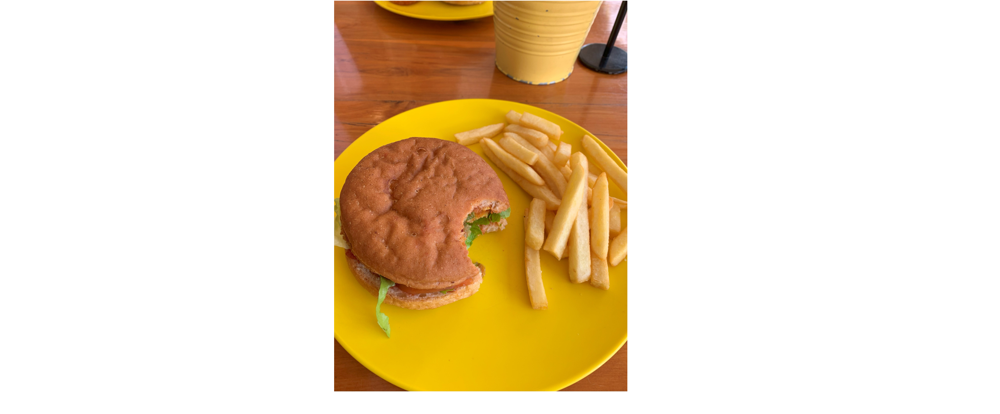

There are many things to do in the illawarra and after living here for a few years, I've realised that I have done quite a bit. I know a lot of people want to know what they can do and where they can explore or what is on offer in certain destinations. 

This is a blog about some of the random day trips that I have taken in the illawarra. 

### 23.5.23: A trip to  Stanwell Park & Helensburg
*Highlight:* Gelatoman Icecreamery. 

On this day, I was a little hungover from [Paul's surprise wedding](/life/events/2023/paul-surprise-wedding). After breakfast, we went for a walk and then decided to head to Helensburg to try gelato from a highly reviewed gelatoshop, Gelatoman. 

On the way, we stopped at Bald Hill in Stanwell Park. Here, we had a coffee (which was expensive, but alright) and then watched the paragliders for about 30-40 minutes while we drank our coffee on the hill. 

By 11.30 am, we were finished our coffees and then headed to Helensburg. Honestly, the vibe that I got from Helesburg was similar to any other Sydney Suburban town/city. Nick said that it reminded him of Panania. 

We had lunch at a cafe called Coffee Shack. It was really basic and the thing that was the biggest rip off is that I paid an extra $4 to get fries with my burger. I was expecting a bowl of fries (it was $7 on the menu). Instead, I literally got a handfull of fries. This made me really upset. On top of that the vege burger was just okay. Nothing special. Nick ordered a Double egg and bacon burger and said it was good. 

*Img caption.* My disappointing burger and $4 fries. 

Safe to say though, that I would never go back here. 

On the way back to the car, we went to #Gelatoman , a small icecream shop. They make their own icecream and sell it, with different specials each week.  

I ordered the Ferrero and Nick ordered the salted caramel. I have to say that they were the best Gelato that I've ever tasted. As we were walking away, the owner of the shop said that she gave me the wrong flavour (I had eaten the dark chocolate with honey - this weeks special). I told her it was delicious and it was no problem at all. But then she said she wanted to let me taste the ferrero flavour. Instead, she gave me a whole extra scoop of icecream. The ferrero flavour was really amazing. Nick and I shared this second scoop and went home with smiles on our face. 

The only reason I will go to Helensburg in the future, is for Gelatoman. It really is amazing. 

For something more adventurous though, back in September 2020, I visited #KellysFalls. It is a short walk (<1km), but you need to climb up and down a rock (there is a rope provided). It is a nice waterfall, but when I went, it was super polluted from the heavy rainfall. 

It would be cool in the future to visit the abandoned train tunnels in Helensburg. But I don't think it was appropriate today, considering that we had Chip with us. 
