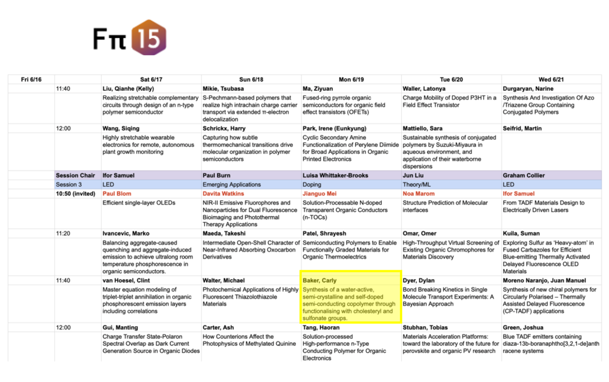
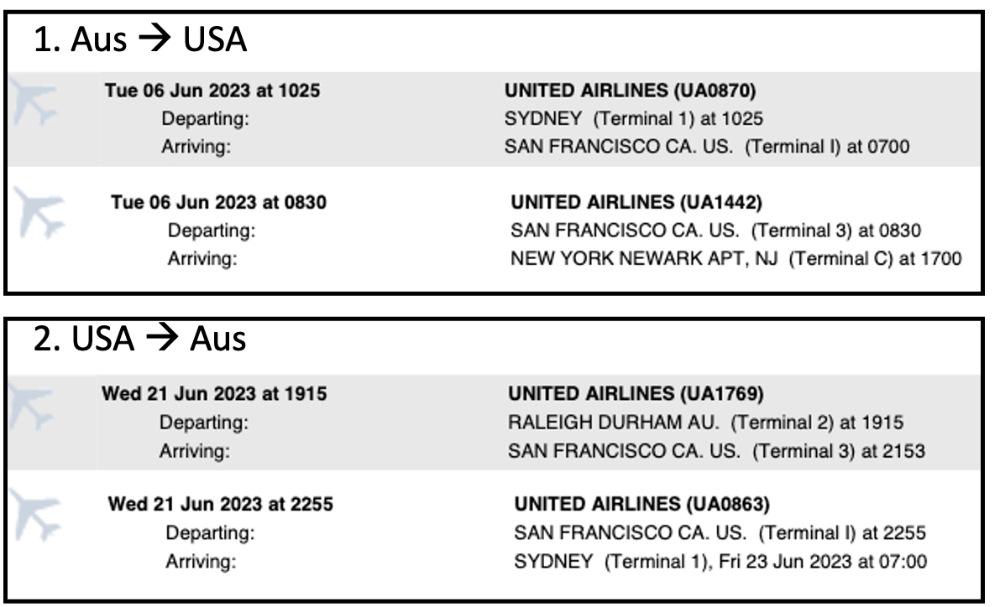
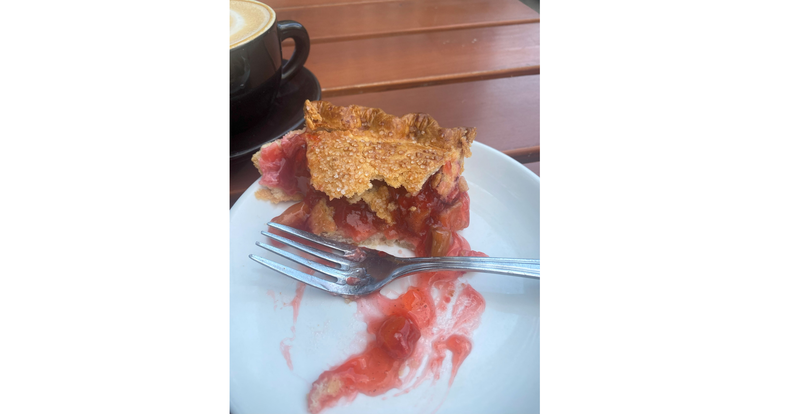
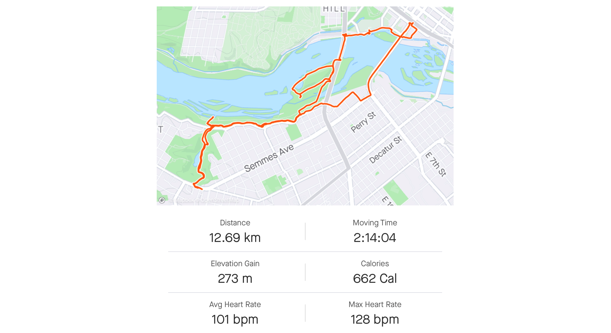
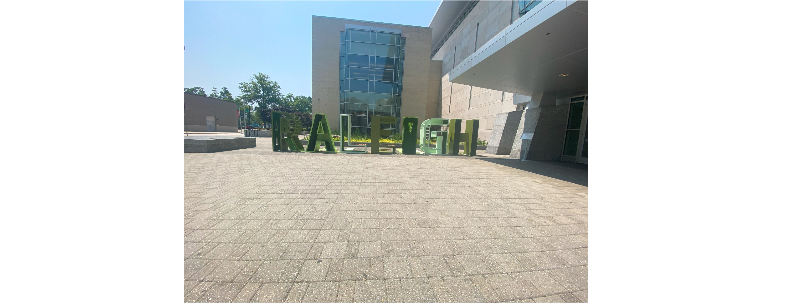

This page is about my 2023 Trip to the USA. Contents below include: 
1. A brief summary
2. Highlights & tips for each place that I visited 
3. A prologue of the trip
4. A blog of my trip 

Some summary notes of the conference are also included in [Fpi15 conference](/phd/conferences/fpi15-conference)

## 1. Summary
The purpose of this trip was to attend a conference in North Carolina (NC). I took the opportunity to travel beforehand, to see some places that I've always wanted to see but never had the chance. 

On 6 June 2023, I flew to New York, where I spend 4 days enjoying the city and the highlights. New York is amazing and one of my favourite cities! On 11 June, I caught a bus from New York to Washington D.C. I spent only 2 days in DC which was enough for me. The main attractions are the monuments and museums.

From DC, I took a bus to Richmond, Virginia (VA). Here, I spent 2 nights/1 full day looking around the area. There wasn't much to see or do, so I spent the day walking through trails in the James River Park. It was relaxing to be out of the hustle and bustle of the city. 

On Thursday 15 June at noon, I caught a Greyhound Bus to Raleigh, North Carolina (NC).  I was in Raleigh for the [Fpi15 conference](/phd/conferences/fpi15-conference) which finished at lunchtime on Wednesday 21 June. Initially I thought Raleigh was a cool place, however, the transport system really bothered me. The heat was almost unbearable, so a 2.5 km walk to and from the Airbnb was not viable. Despite struggling to get around and spending a lot of money on Uber, I enjoyed my time at the conference. Raleigh also had a really cool night-life with some amazing beers on tap. 

On the way home, I experienced a 14 hour plane delay from Raleigh to San Francisco, ultimately missing my connecting flight home to Sydney. It turned out to be a blessing because I got to spend 10 hours in San Francisco (after rebooking my flights). San Francisco was amazing! My time in this city changed my sour mood into a more optimistic and positive outlook on the trip. 

Watch the highlights here:

<iframe width ="100%" height = "400" src="https://player.vimeo.com/video/839571950?badge=0&amp;autopause=0&amp;player_id=0&amp;app_id=58479" frameborder="0" allow="autoplay; fullscreen; picture-in-picture" allowfullscreen title="Highlights of USA June 2023"></iframe>

## 2. Highlights & tips
### New York
*Recommended time to stay*: 4-5 days 

*Where to stay.* I stayed out of the centre - on the Upper Westside, ~6 km north of Time Square. I think the more downtown you are, the closer you are to everything. It doesn't matter where you stay though, because New York is a city that never sleeps. You can get whatever you want where-ever you are, whenever you want. That's one of the beauties of New York. Also, the Subway works really well to take you where-ever you want to go! You only wait a few minutes for a subway train (unless it's very early in the morning). I would advise to find a place that is in line with your budget - Unless it is in the Bronx. **Stay away from the Bronx.** 

🚇When you arrive in New York, I recommend to purchase a weekly metro card - I think you can also tap on and off with your credit card. Do not buy single tickets as the money you spend on the subway adds up. In 4 days I used the subway over 20 times! If I bought single use tickets, this would have costed me 20 x $3. Instead, I paid $33 USD for a weekly pass. 

*Uptown vs. Downtown.* The Subway platforms are arranged based on uptown/downtown. Going from 33 St to 125 St is uptown, while going from 33 St. to 14 St. is downtown. The platform is usually labelled with Uptown or Downtown. Be sure to get on the right platform!

*Museums in NYC?* I didn't go to any museums in NYC. The main reason was that I wanted to be in the city and experience the general vibe, not stuck in a museum. Museums in New York are also pretty expensive. Nick recommended the Museum of Natural History, but that was at least $40 USD to enter. Plus, I knew that I was going to DC where the main attractions are museums (and they are free!).

*Some things that I loved in NYC:*
- Window shopping. Special note: The Nike store is HUGE (3 stories). BUT the clothes are more expensive than in Australia. 
- Take a return trip on the Staten island ferry. Sit at the back to enjoy views of the NYC sky line & the Statue of Liberty. 
- Walk the Brooklyn bridge
- Eat bagels at Brooklyn Bagel & Coffee company. 
- Eat as many bagels as you can. My favourite is the blueberry bagel with cream cheese. 
- Walk around Time Square - during the day and at night. At night it is so cool! Everything lights up and it feels like it is still day-time. 
- See a Broadway show (You can get cheap tickets by lining up at the TKTS queue in Time Square - I didn't do this)
- Visit the World Trade Centre & site of the 9/11 attacks
- Explore central park. I enjoyed running through Central park. It was a big highlight. 
- Visit the Highline in Chelsea, and the Chelsea markets. 
- Walk from one side of Manhattan to the other to truly see the changing neighbourhoods. 
- Try some of the local beers: they are so good. 

### Washington D.C
*Recommended time to stay:* 2 days

*Note:* All museums are free!

*Where to stay.* I stayed on U Street. It is a cool area near all pubs and clubs. For D.C. though, it doesn't really matter where you stay as the subways are also really good (although less frequent than in NYC). 

*Metro/Subway:* The best thing to do is download the [SmarTrip](https://www.wmata.com/fares/MobilePay/SmarTrip-App.cfm) app before you arrive (saves you money on the fee for the card). Then you can use the Subway from your phone. I got the 3 day pass for $28 USD but I think it would have been cheaper to pay per trip. 

*Highlights of DC:*
- Holocaust Museum: Note you need to prebook tickets. 
- National art gallery: is one of my favourite museums. 
- Eat at the Founding Farmers & Distillers: and order a bourbon cocktail
- Walk around the city. View the monuments around the National Mall. 
- Visit the National African-American Museum & American History Museum. 

### Richmond, VA
*Recommended time to stay.* 1 day
*Notes:* all museums and public transport are free
*Things to do:*
- hiking trails in James River Park
- Go to belle island to see the Hollywood Rapids.
- Visit breweries

### Raleigh, NC
*Recommended time to stay.* 1-2 days (but I stayed longer due to the conference)
*Note:* all museums and public transport are free, but the public transport is terrible. 
*Things to do:* 
- Sip and stroll (the city allows outdoor alcohol consumption around a boundary in the city). 
- Lots of cool bars & pubs - cheaper than New York & DC
- Visit Breweries
- NC bbq - I didn't do this as I do not eat meat, but I heard it was really good. 

### San Francisco, CA
*Recommended time to stay.* 4 days (I was here only for 1 day, but I think I would like a similar amount of time as New York)
*Note:* Public transport is great around the city
*Things to do:*
- Explore the city
- Walk along the numerous trails leading to the Golden Gate bridge
- Explore fisherman's wharf

## 3. About this trip
**4.6.23**
The side-effects of COVID-19 were not only health focused. It had detrimental effects on the Research space in Australia. Universities lost billions of dollars from international students. This devastated the University ecosystem, and it meant that a lot of people would lose their jobs. This continues to impact research as the less money available, means that PhD students and early career academics have less opportunities to travel and network, ultimately leading to failed academic careers, and most people leaving the University for work in industry. 

This also means that for purposes of international travel, the University became more strict and stingy. For big international trips that are fully funded by the university/grand money, you need to show that you are presenting - either through an acceptance letter or inclusion in a conference program. 

Back in January 2023, I submitted an abstract to attend the [pi-electrons conference](https://conferences.coned.ncsu.edu/fpi15/) in Rayleigh in the middle of June. A few months ago, it was accepted for an oral presentation. That gave us some time to organise funds and travel dates.

*Img caption.* My presentation is highlighted. This program is just the third sessions of each day. For the full program, [click here](https://conferences.coned.ncsu.edu/fpi15/program/)

While we had submitted forms well in advance, it was not until last week that I heard anything about my travels. The university made us jump through many metaphorical hoops in order for my trip to be fully funded (there was no way that I could afford going without funding, as the flights alone were $2986 AUD).

The itinerary is as follows: 

Now, I know what you are thinking: 2.5 weeks is a long time for a conference. Well, I am going earlier for my own travels. I am planning to spend 4 days in New York, followed by a few days in Washington, before heading to North Carolina. 

This is the first time that I will be leaving the country, since I travelled to Europe back in June 2019! I am feeling really nervous but also very excited. 

# 4. Blog
### ✈️ Sydney to New York 
**06-06-2023**
As usual, I felt Chip jump up on the bed for cuddles around 3 am. Instead of telling him to go back to his bed, I let him stay. I wanted to enjoy the cuddles before heading off for 2.5 weeks. 

When the alarm sounded at 5.30am, I rolled over to Nick who motivated me to get out of bed and get ready. He prepared us a few coffees and then he drove me to the airport. We left home at 6.15 am and arrived at Sydney airport at 7.27 am. 

Unfortunately it was raining when he pulled over, so we didn't have much time to say goodbye. A quick kiss and cuddle and then he was off and I was on my way to check-in. I headed to Check-in counter J to collect my boarding pass and check in my luggage (Nick's suitcase that he leant me, as I sold my 70 L backpack after my trip to Europe in 2019). 

*Img caption.* Morning of the flight! Waking up with Chippy next to me and my flight tickets. 

I walked around for a bit - bought myself a bamboo travel pillow and a U.S. power adaptor and then took a seat in the food court. I ordered myself a coffee and croissant and then worked on my presentation for the conference. The coffee was not as good as Nick's was this morning, and the croissant was still cold, despite it being toasted for at least 5 mins. 

Time flew by as I worked on my presentation. Before I knew it, it was time to board my first flight to San Francisco. After waiting in a line for a while, I boarded the aircraft, only to be sitting for another 18 hours. I watched a few movies, did some writing and by 11 pm (Syd time), I was asleep. About 2 hours later, I was woken for breakfast because we were 1.5 hours from landing. After this point, I could not go back to sleep. 

*Img caption.* Excited for my USA adventure. 

We landed on time: 7 am. But it took me a while to get off the aircraft, and then I was standing in the customs line for 1.5 hours! They were so slow. I ended up missing the connecting flight. After waiting in a few more lines, they finally booked me on a new flight to Newark - departing at 1 pm. 

At 1 pm, the pilot announced that the flight would be delayed as there were large storms. We sat idle for a while, I thought it was 2 hours. I slept during this time and when I woke up it was 3 am. "WHY HAVEN'T WE LEFT YET?'' I was getting frustrated, when suddenly the plane started shaking like there was turbulance. I looked at the map and we were 1/4 of the way to New York! I had slept through take off. What is even more disappointing is that I missed the meal because I was sleeping. 

We landed in Newark at 9.45 pm. It look us a while to get off the plane and then my bags weren't at the carousel. I was about to freak out because I put my medication in my checked luggage. Not to worry though because it was in storage. Somehow it was sent to Newark before we arrived. 

Next followed a series of wrong steps that ultimately costed me 2 hours. Nick suggested that I get a taxi from the airport. He even told me that he would pay for it. I told him I would initially but the line for the taxi was so long. I saw a sign for an airport bus, so I walked over. There, I asked a local (in an orange vest) if he could tell me how to get to New York. He advised me to get on the bus to Pen station, then catch a train. He then gave me $2 for the bus. "It's finally working out for me" I thought. "Saving $70 on a taxi and going all the way to New York for $2!".  

Well, this was a mistake because it took me to a really seedy station in Newark, where I was very uncomfortable. An older guy, who claimed to be apart of a cult, was following me around the station, so I went to speak with the police (asking them how to get to New York) and the guy stopped harassing me. 

Next, I got on a train to Penn station (a different Penn station) in New York. From here, it was 6km to the hostel that I was staying, so I needed to get the subway to W 103 street. The subway is located underground and there is a station on almost every street. It smelt of burned rubber. 

After trying to figure out the subway, I got on the wrong train that took me to 125 street. I got on the wrong train because the lines 1,2,3 are red-train lines: Train 1 stops at W 103 St., while 2 and 3 do not. At least I got on a train that went uptown. At W 125 St., I swapped trains that took me downtown.

After 3 stops, I hopped off at W 103 street (across from central park). After carrying my suitcase up a set of stairs, I walked 800 m to the Hostel located on Amsterdam St. The streets were really scary to be honest. As I walked, I noticed that the paths were covered in fences and there were several cop cars around. It was labelled "New York City housing." I later realised that this is their public housing. The streets smelled of marijuana and throughout my stay in New York, this smell never really went away. 

The place I am staying is a renovated, 19th century building: HI New York City. When I walked in, it gave off a pretty cool vibe, but as soon as I spoke to the staff, they were not that welcoming. Come to think of it, no-one was open to chatting. This was very different to what I am used to. It must be the New York vibe rubbing off on everyone. 

*Img caption.* The lobby of HI New York Hostel. 

My room was located on the 3rd floor, and I was assigned to the 6th bed. The room itself was clean but it smelt pretty bad due to poor ventilation. I put my stuff down and went to have a shower. Surprisingly, despite my lack of sleep, I was barely tired as I was full of adrenaline and stress from the travel. I walked to a deli across the street and bought an egg and cheese sandwich, that I took back to the hostel. While eating this sandwich in a common space at the hostel, I was glad to speak with Nick over the phone. He always has a way of calming me down and making me feel better and safer. I was not keen at all for the next few weeks ahead. 

Once I finished eating and talking, I went to bed. During the night, it was very cold. As part of the hostel policy, they keep the air conditioning and air purifier on at all times. I'm feeling glad that I had packed a pair of tracksuit pants and a jumper - as it was a last minute decision to include them. I slept soundly 'til the morning.

### 📍New York, 7-11 June
**7.6.23**
It was a new day. I slept for as long as possible and rolled out of bed at 8.30 am. I went down to the café (the hostel has a café built into it) and ordered a tomato and cheese croissant and a cappuccino. Both were of pretty poor quality and I was very disappointed. 

After researching things to do for the week, I got ready and headed out for a run around central park. Central park was amazing! It is huge and full of green. There were trails, paths, rocks and road to run on! There were bubblers throughout. I even saw a waterfall! All of that with the city skyline visible in some places. I thought "man, New York is so cool."

*Img caption.* The North side of Central Park, observed during a run. 

After 10 minutes of stretching, I headed back to the hostel to have a shower, my second coffee and then I was off to explore the city. I walked from the Upper West Side to Times square. While I was walking, it was pretty foggy. I didn't think anything of it. 

By 1pm, I was hungry and so I went into a pub called Yard House. They had over 100 beer taps! It was so cool. I sat at the bar and ordered an IPA from Coney island and an avocado/feta on sourdough. It was a really cool place. The service was great, and the bartender was so friendly. I even had a chat to the person next to me, who seemed to be a local. While I was eating my lunch, I stumbled upon an article about the wild fires in Canada and warnings to the public in New York to "stay inside". 

*Img caption.* Hundreds of beer taps in the Yard House. 

I was thinking to myself "it's really not that bad and I've had worse (note the Australian bushfires in 2019). After I paid the bill, I walked outside to see that the sky was a tint of red. It also smelt of smoke. That ended my tour of New York City as I did not want to expose myself anymore to that horrible weather.

I was back at the hostel at 4 pm (I did a bit of shopping on my way back). I sat on my laptop for a while to organise the rest of my trip and then went to the supermarket to get something to eat for dinner. I figured that I had spent way to much money today, and eaten a lot of oily foods over the week that I should just eat something not to heavy. I went for a spinach and feta pasta salad. I sat and ate it while I spoke to Nick on the phone. He was really busy, so we didn't speak for too long. 

I was in bed by 10 pm and listening to a podcast about the history of Russian & Ukraine relationships, which put me to sleep. I slept sound all night. 

**8.6.23**
The light woke me at 5.30 am this morning. After lazing in bed for half an hour, I woke up and went downstairs to get a coffee. The cafe that is at the hostel was not open yet, so I walked 400 m to Broadway Bagels on the upper westside. I ordered a cinnamon bagel with cream cheese and a coffee. I took these back with me to the hostel, where I sat and ate my breakfast. 

At 8 am, I was out of the hostel to explore the city. The air quality was still pretty bad, so I grabbed a mask from the reception of the Hostel. I walked for a little bit, to 96 St station. My feet were pretty sore from the day before that I decided to jump on the subway. At the ticket booth, I purchased a weekly pass for $33 USD. This was one of the best things that I did today as it meant that I would stress less about how much money I was spending on the tickets and that I could use the subway as much as I want. 

The first stop was the 9/11 memorial at the World Trade Centre but the site was closed off because of the air quality. This was the theme of the day - most things were closed because of the air quality. From the world trade centre, I walked around battery park and went to the view point of the Statue of Liberty. It was pretty hazy, so the view was not the best. 

*Img caption.* The hazy view of Lady Liberty & a snap of Wall St. 

My second coffee of the day was from Gregories coffee shop in the Financial district. I read good reviews. While it was better than any other coffee that I've had in New York, it was still not great. I drank this coffee while admiring the view of the Brooklyn bridge. 

*Img caption.* Admiring the Brooklyn bridge. The air quality is improving since the morning, but still not the best. 

As the air quality still wasn't great, I decided to leave the bridge walking to another day. Instead, I jumped on a subway and went to Coney Island. It was a 40 minute trip, and when I arrived, it was a ghost town! No-one was around. There was a lot of construction happening and when I walked along the prominade to the brewery, I was shocked to see that even they were closed! "What a waste of time." I wasted no-more time and I jumped on the subway back to SoHo (south of Houston St). I walked around for a while: through China town & Little Italy. I walked around for about an hour before deciding that I was tired and wanted to go back to the hostel. 

*Img caption.* A pic of Coney Island's Luna park on the left, and Little Italy on the right

 
I got on the 1 train from time-square to the hostel and got off at 103 station. It was close to 3 pm and I hadn't eaten since 7 am, so I was starving. Opposite the Subway entrance, there is a pizza shop. I bought 1x slice of mushroom pizza. The price on the display said $3, but that's how they trick you. $3 is not too bad right? Well they don't include the tax or the tip in the price - so $3 actually turned out to be closer to $5.  The pizza was satisfying though. I ate it as I walked back to the hostel. 

On return to the hostel, I was pretty tired so I went to my room and had a nap. Three hours later, I woke up. I felt very tired still but I forced myself to get out of bed to go to a social event that the hostel was hosting. They gave out 2 free drinks per person, and we played a "social bingo." In this game, you had to go around and find people who had certain traits or skills or knowledge listed on a bingo card. It was a fun hour. 

During this hour, I met a lot of interesting people from different parts of the world. One girl was from France and travelling for a Bio conference in Boston. I had a good chat to her about my PhD. Another girl that I met was from Wollongong! How funny, that I met her in New York! A group of us then went into Time Square to continue the fun. We went to Gallaghars pub. I stayed only for 20 minutes before deciding that the group was too big. Also, the singer started acknowledging that there were many Australians in the pub. I felt pretty embarrassed: I hate when people do the "Ozzy, ozzy, ozzy, oi, oi, oi." I find it really offensive. 

After leaving the pub, I wandered around time-square. It was so amazing at night! The vibe was incredible and I think I had way more fun on my own in the night, than with the group from the hostel. I watched some street performers and as I was heading to the subway, I noticed the 99c pizza shop. This was recommended to me before I came to New York, so I went and bought 2 slices of vegetarian pizza. I took them on the 1 train  with me, back to 103 St. and enjoyed the pizza at the hostel. At this point, it was 11.45 pm. I had a quick chat with Nick while eating the pizza and then went to sleep. Tonight, I slept immediately. 

*Img caption.* Time square at 11 pm. 

**9.6.23**
I woke up slightly later this morning: 6.30 am. As I needed to drink coffee to take away my headache (the addiction is real), I ordered one from the hostel café, and then I was out to explore the city. Luckily the air quality had improved, and the sky was clear. 

As I was exhausted from all the walking yesterday, I decided that I needed to arrange my day so that I could get the least tiring things out of the way. I went to the 103 St. station and caught the subway to the South Ferry Wharf to catch the Staten Island Ferry. This is a free service that gives amazing views of Lady liberty and the city. I got on the 8.30 am ferry that took me across to Staten island, then I exited and joined the queue to go back to Manhattan. In total, it was a 1 hour round trip. This was such as amazing thing that I did and I would recommend it to anyone heading to NYC. 

*Img caption.* Lady liberty (on the left) and the Manhattan Sky line (on the right). Note: the building with the tall squire is the new world trade centre building to replace the twin towers. 

At 9.30am, I was back in Manhattan. I was feeling pretty hungry, so I got back on the Subway and went to Broadway bagel & coffee company which was recommended to me by a friend. I ordered a blueberry bagel with cream cheese and a coffee. The bagel was very delicious as expected but the coffee was also pretty good! It tasted like a Sydney quality coffee which I was so happy about. This is another place that I would 100% recommend and I will go back tomorrow morning. 

*Img caption.* Enjoying a bagel from the Brooklyn Bagel & Coffee Company in SoHo. 

No time wasted, as next I got on the subway immediately after finishing my bagel and headed to Brooklyn to walk the Brooklyn bridge into Manhattan. I decided to start on the Brooklyn side so I would get the amazing views of Manhattan as I walked. It was incredible! To be honest, I have no idea why people would waste their money coming to Sydney to admire our bridge & opera house when New York is like 10000 times better! The walk was about 2 km long and the bridge ended in the Financial district of New York. I continued walking into the district and returned to the 9/11 memorial site at the World Trade Centre. 

*Img caption.* Crossing the Brooklyn Bridge.

The one World Trade Centre was one composed of 7 buildings. In the 9/11 attacks, most of these buildings were destroyed, including a small Greek orthodox church in the Liberty park that was built in the early 1700s. With the destruction of the buildings, there left a massive dent in the area where the Oculus (Westfields) is now located. The story behind the architecture of the new buildings is very interesting and well explained in a Youtube Documentary [here](https://www.youtube.com/watch?v=aqKGJgZyiHw&t=11s). 

Today, the 9/11 site was open and it was spectacular! The place where the twin towers originally sat, were replaced with two pools with waterfalls around. The pools represent the foundations of the building: as the original towers required a concrete base to prevent destruction from the Hudson river. All around the edges of the pools are the names of every person that died in that terror attack: Including people on the plane. 

*Img caption.* The New "twin-towers" next to the old twin-towers, in the form of a North and South pool. The right photos are some other pictures in the area, including the white oculus building. 

The new buildings are so nice and really add something amazing to the NYC sky line. I think that the architects and government did a great job in using that space and preserving the memory of those who died. 

I think I wandered around this area and Westfields for a couple of hours, then went back to the hostel when I started to feel tired, so I could rest. At 4.30 pm, I was out of bed and getting ready to head back to time square for a Broadway show at the Lyric Theatre. I watched Harry Potter and the Cursed Child and it was amazing! The actors and production were very good - even the dementors flew out into the crowd. They told the story very well and their effects were mind blowing. The show went for 3.5 hours - and finished at 10.30 pm. I decided to head back to the hostel.

*Img caption.* Shots before the Harry Potter and the Cursed Child show started in the Lyric theatre. 

Walking out of the Lyric theatre and into Time square caused another huge shock to my system. It surprises me every time I see Time Square! It's so awesome. 

**10.6.23**
Today was my last official day in New York. I woke up at 6 am, as usual and had a coffee from the hostel and a Chobani flip yogurt. I then set off to 59 St (Columbus St) which is the southern end of Central Park, where I ran for 9 km. I saw some terrific views of the city from some rock platforms. There were regions of central park that were very busy and some regions where there was no-one. It just amazed me that every section I ran through was different! I also ran past many statues, the U.S seem to like their statues a lot. My run finished on 103 street. 

*Img caption.* Some snaps in central park. 

After 10 minutes of stretching, I headed back to the hostel to have a shower and get ready for the day. At 9.30 am, I jumped on the 1 train to 22 St in Chelsea to get a bagel and coffee from *Brooklyn's Bagel and coffee shop.* I ordered a cinnamon bagel with cream cheese and a small late, like yesterday. The shop was really busy (that's no surprise, because it's soooo good) but I still found a seat to enjoy my second breakfast. 

*Img caption.* Brooklyn Bagel & Coffee company 

From the bagel shop, I headed west towards the Chelsea High Line. The High Line is a park that is elevated off the ground. It is ~1.5 km walk way filled with flowers and trees. The High Line path ended at the Chelsea market, where I spent an hour. It was a typical market with lots of food stalls and clothing discounts. I settled at a German food stall and had a beer and a sandwich. It was not that good and perhaps it was a mistake to have a beer so early in the day, because afterwards, I was so tired! 

*Img caption.* The Chelsea High Line Park. 

I walked around a bit more, exploring Chelsea and then hopped back on the subway to the hostel. It was 2 pm when I arrived back, and when I put my head down on my pillow, I immediately fell asleep. I slept until 5.50 pm! I wanted to keep sleeping but I needed to close my rings on my Apple watch, so I got up and had a shower. I was not sure if I should go out somewhere, seeing as it was my last night in New York. 

I couldn't talk myself into going out, so instead, I walked to the supermarket, bought some Pasta from the Deli and oranges. I thought that if I was so tired because of my Iron levels, perhaps vitamin C will help me better absorb iron from the supplements that I brought here with me. I took the pasta and oranges back to the hostel, where I ate and then went back to my room to rest. I fell asleep while on the phone to Nick - it was around 9.45 pm. I slept peacefully and for at least 8 hours. 

New York is amazing. I would love to spend more time in New York, but I also think that 4 days is enough and it is time to move on to the next place. Someone once told me that it's best to leave a place when you have done everything you wanted to but still want to stay. This means that you will have good memories of that place and want to return. 

The next stop is Washington D.C. 

### 📍Washington D.C, 11-13 June
**11.6.23**
This morning, I woke up naturally at 5.30 am. After completing the wordle, I climbed off the top bunk and packed my suitcase with the remaining items that were left out. As all the other girls in my room were sleeping, I tried to be as silent as possible. Throughout my stay, it's been such a struggle on the top bunk, as my shoulder always aches hopping off the top bunk. Today, I noticed that it was starting to hurt less. Hopefully when I return home, it will be healed and I can surf again. 

I checked out of the hostel and headed to the subway station located next to central park. This subway station has the *a and c* train, while the W 103 St station located on Broadway had the 1 and D train. I waited 20 minutes for the *a* train that took me to 22 St. in Chelsea. I exited the station at 6.45 am, right in front of Broadway Bagel & Coffee Company (my favourite). The owner let me in early to sit and wait for them to open. At 6.55 am, they let me order a bagel and coffee. Today I treated myself to an everything bagel with egg and cheese. I also ordered a Large coffee. 

*Img caption.* Everything Bagel with egg & cheese. 

When I was ordering at the counter, the worker remembered me from yesterday. It was so surprising because yesterday was really busy! I tipped her 20% and within 5 minutes, I received my bagel and coffee. I sat at the shop and ate/drank for half an hour before walking 5 minutes uptown to W 31 St. and 8th avenue. On the corner, directly opposite Madison Square Gardens is the Flix Bus stop. Here, I hopped on a bus (that I had previously booked for $70) that was heading to Washington D.C. 

The bus was a 5 hour trip with 2 stops. The first was in Philadelphia. We stopped here only to drop off and pick up passengers. The bus then drove to Washington with a second pit stop at a rest bay, just off the highway. At 1 pm, we arrived in Washington D.C. Union Station. I exited the bus and then purchased a metro ticket for $30 USD for unlimited travel for 3 days. Hopefully this is worth it, I will let you know. 

*Side note:* For the past 2 days, I have been very tired and exhausted. Now, I feel ready for more adventures. From the minute that I hopped on the Metro, I suddenly felt refreshed.  Seems that New York really took a toll on me and as much as I love it, it's not a place that I could spend my life. I am glad that I left when I did. 

The first impression that I got of DC was that it was so clean compared to NYC! It barely smelled of anything! The metro was also more modern, but the system worked the same as NYC. I caught the metro to U Street. Around the corner was the hostel that I had booked: U Street Capsule hostel. This was a pretty cool hostel. The door key was sent to my phone which unlocks the hostel and my room. In the rooms, there are 6 beds. The beds are literal capsules with doors to close the bed. It is so cool and a big change from the dingy hostel that I stayed in in NYC. 

*Img caption.* The bed 'capsules' in the U Street Hostel. 

After drinking a coffee and booking the rest of my trip, I headed out onto U street and walked around for half an hour. U street was previously the African American region of DC. It is filled with nightclubs, diners and theatres. As I walked along the street, I heard a lot of music and people out celebrating. They were dressed in Pride colours. I asked a security guard what was happening and it turns out that it is Pride Month. I asked why I didn't see this in New York and he said that most people come to DC to celebrate. 

As I walked around, I immediately started to sweat. DC is so hot compared to New York. The temperature was 30 °C and really humid. I walked straight back to the hostel to grab my water bottle and sun glasses. Following, I jumped on the Green line metro and headed back into the centre to look at the cute buildings. 

*Img captions.* Cute buildings in DC. 

It didn't last long because the first cool building that I saw was the National Art Gallery. I walked in side and spent 2 hours here and it was totally free! It was a really cool art gallery as well - a mix between history and art. There were different sections designated to different time periods in American History - i.e. the revolution, the civil war, times of innovation and discovery. 

*Img caption.* The National Art Gallery.

There was also an area dedicated to the Presidents of the USA. In this area, there was an emphasis on the importance of democracy. I think it was very powerful: That their constant change in presidency is what drives change in the USA, ahead of the rest of the world. 

This museum/art gallery also cemented the idea that the U.S. love going to war with the rest of the world to assert their power. It makes sense: as this was a motif in their early history, such as during the revolution.

Another thing that I noticed about the gallery was that it was mostly about males! There was barely any history to do with females. As I walked through, I was thinking "oh yeah, another white male." Towards the end of the gallery, there was a section dedicated to women. 

*Img caption.* Artworks that I really enjoyed in the National Art Gallery. 

As I forgot my glasses, my eyes and neck were really starting to hurt (my neck from tilting my head to see properly). I tried to take in as much as possible, but by 6.30 pm, I couldn't read anything else. I left the museum and headed straight to a restaurant that was recommended to me: The Founding Farmers Distillery. It was a very cute restaurant that sold Bourdon/vodka that was made there. I ordered a bourbon cocktail and a vegetarian burger. Both were so delicious. The buns were also made by the Founding Farmers. You could tell that the quality was above most other burgers as they were so soft, and melted in my mouth. 

*Img caption.* Burger and cocktail from the Founding Farmers Distillery.  

When I finished my dinner and drink, I walked towards the National Capital building. The music was getting louder and louder. There, at the capital building was a stage with musicians for the Pride Festival. It was pretty cool but not my scene. I jumped back on the metro and headed to the hostel, where I spent the rest of the evening watching documentaries of the civil war and the revolution. 

**12.6.23**
This morning, I woke up at 7 am. I grabbed my phone and immediately went online to secure tickets for the Holocaust Museum. The tickets are $1 USD (only a booking fee) but I assume they only have limited tickets that are sold on the day because of how small/delicate the museum is. I booked my session for 11.30 am (the first one available) and then headed downstairs to the Café *Brew on U*, located in my hostel. I ate an almost croissant and a coffee for breakfast. Both were pretty good (yes, the coffee wasn't bad).

An hour past and I ordered another coffee and had a chat to a lady who was also staying at the hostel. She was a retiree from Germany and travelling in D.C for 1 week before heading home. She seems to have a cool life of travel. By this time, it was 10 am - so I had been sitting around for hours. I decided to get dressed and head off on the subway to the National Mall. 

I took the green subway to the Smithsonian station and exited in the centre of the Mall. The look of the buildings was amazing from this angle. At this point, the capital building, the white house, Arlington cemetery and the Capital monument line up. On the outside, are all the museums: The American History, the African American, the Space Exploration etc etc. 

*Img caption.* Pics of a few buildings in DC. Showing (1) the paris vibe of DC and (2) the National Monument of DC located at the National Mall.

I walked around the corner to the Holocaust Museum. In the Museum there were several exhibitions. You get the elevator up to the forth floor, where the permanent exhibitions are. Then you walk around and make your way down each floor. The theme of the museum is "Could the U.S have prevented the Holocaust? Why weren't they involved sooner?" The museum was very depressing, but quite amazing in how they displayed some of the information. I spent about 3 hours at this museum in total. 

*Img caption.* Inside the holocaust museum. 

When I exited the museum, I was feeling hungry, so I got on the subway to the city centre. Close to Chinatown, there was a street that was filled with Mexican restaurants, where I had a burrito for lunch. After eating, I hopped back on the subway and went to the Pentagon. When I exited the subway, I realised that there was not much to see. There were a lot of Army reservists. I got back on the Subway to Arlington Cemetery. When I exited the subway and walked towards the cemetery, I realised how tired I was and then thought to myself "I don't really care about seeing graves." I walked back to the Subway and then went to the hostel. 

At this time, it was close to 4 pm. I had a rest and watched a movie on my laptop. Then I got up, showered and then went for dinner at a bar near to my hostel. I ordered myself a margarita and mushroom pizza, followed by an aperol spritz. It was a great dinner and a relaxing afternoon. I walked back to the hostel and lay in bed watching more movies. 

**13.6.23**
I woke up at 7 am again. I headed downstairs for my usual morning routine of lazing around until 9 am. The café was not yet open, so I walked to subway and bought a foot-long egg and cheese sub. When I returned to the hostel, I ordered a Cappuccino. The barista today could actually do some late art, which I haven't yet seen in the USA. 

Today at the cafe, a few locals came in and sat down to enjoy their morning coffee. I struck up a conversation with one, named Harrison who lives in DC but is originally from Texas. He was so friendly and we chatted for about 15 mins before I went upstairs to clean out my room. I took the sheets off the bed and into the cleaning basket as per the hostels request. I then packed my bag and checked out of the hostel. They allowed me to leave my luggage at the hostel for the day while I went out to explore for a little bit longer. 

*Img caption.* 270 ° view of the National Mall. 

Once again, I headed downtown to the federal triangle/Smithsonian/the National Mall. I walked around for a short while, looking at the really awesome buildings and then found myself at the American History Museum. Inside the building, there were 3 floors with different themes. Some highlights were the entertainment section, the revolution section, the section dedicated to the inventions with some really cool displays. 

*Img caption.* American innovation: The original bicycle (existed before the car) and the original pace-maker prototype. 

The American History Museum had a similar format to the National Art gallery. I felt like it was mostly about privileged white men and racism, which is the overarching theme of the USA. I feel so bad for the immigrants and people of colour. I also got the vibe that people of the U.S think that they are better than the rest of the world. This is not the people's fault though. This patriotism begins in school and is instilled in the minds of the youth. 

*Img caption.* Some artefacts from the American revolution: (1) a boat used in the defence against the British, which was ultimately sunk near Baltimore and (2) A "red coat" uniform from the British army. These uniforms were worn to instill fear into civilians. 

Overall, the museum was good but I would have preferred to go to the National African-American museum that was located next door. As I ran out of time, I did not go there. I heard really good things about it from people in the History museum and therefore, would recommend the African-American museum over the History one. 

I spent about 3 hours in the museum before my stomach started rumbling for food. I walked outside and found a strip of street filled with food trucks. I ordered a Falafel Pita for $12 (I thought it was really expensive, but there was nothing else around). After eating my lunch, I walked around the Federal triangle for about half an hour before heading back to the Hostel. 

An observation about DC, particularly in the centre, is that the buildings located around the Federal Triangle have a strong resemblance to Paris. There are no high rises and the buildings are all so cool. The flag of the USA is displayed on many of the buildings and the buildings are mostly white/lighter shades. They seem very organised and carefully placed in particular positions around the city. There are also many military personnel and police that walk around the streets. Perhaps DC was inspired from Paris?

*Img caption.* Examples of the white buildings in DC to give a "Paris Vibe."

At the hostel, I refilled my bottle, freshened up and then caught the Subway to Bethesda. My bus was scheduled for 3.05 pm at a random curb-side bus stop. I arrived 1 hour early and decided to wait in a café close-by, *Tatte.* 

Tatte café and bakery was a French inspired bakery that served a range of sweet and savouries. While I was in the queue, the guy in front struck up a conversation, asking me where I am heading. He was tall guy, who looked German (blue eyes, blond hair) but had an American accent. He invited me to sit with him after I ordered. 

*Img caption.* A delicious Strawberry & Rhubarb pie from Tatte. 

I ended up ordering a strawberry and rhubarb pie - as I saw the guy in front of me order it and it looked delicious. I also ordered my third coffee for the day. I went and sat with the blue-eyed guy from the queue (I failed to get his name). We spoke for about half an hour while we ate our pies and I drank my coffee. He is from Iowa but lives in Papai New Guinea in the American Embassy. He travels a lot and told me that he was starting to get sick of it. At 2.45 pm, I had to end our conversation because I needed to go to the bus-stop. It was a cool conversation and he was so friendly!

When I arrived back at the bus-stop (about 5 min walk), the bus was pulling up to the curb. I put my suitcase in the luggage storage at the bottom of the bus and took my seat...

### 📍Richmond VA, 13-15 June
... At 3.05 pm, the bus left DC for Richmond. Yesterday, I booked an Airbnb for two nights, located in the South West of Richmond. The owner of the Airbnb also lives at the property and gave me very clear instructions on how to get there. 

The bus arrived at 6 pm. I walked a few blocks, towards the main street. I spent a long time trying to figure out where the bus stops were and  waited a while for the bus to come: close to half an hour. I took the bus to Hue/33rd street. The cool thing about it was that it was free! Most of the buses in the city are free!

When I exited the bus, the area looked very run-down and kind of sketchy. However, as soon as I walked along 33rd street, I got a totally different vibe. 

The area was exactly how you would imagine a Southern State would be: Cute houses made of fibreglass with the American flag hanging off the front porch. Most of the front porches also had rocking chairs. 

When I arrived at Nancy's house, I went around the back because she was painting her porch. I settled in and then she lent me a bicycle so I could go and get food for dinner. Nancy recommended me a Deli, called Stella. I bought a mushroom pasta and a Hazy Pale ale from a brewery in Charlottesville. I packed them into the bags on the back of the bike and rode back to the Airbnb, where I ate and drank. Both were very good.

I decided that what I want out of Richmond is not to tour the city. Instead, I want to have a relaxing day around the outskirts of Richmond and enjoy the nature of the parks surrounding. 

**14.6.23**
This morning, I woke up at 6.30 am. I completed the daily wordle and did a lesson on Duolingo, before calling Nick. We chatted for 10 mins and he went to bed, while I got out of bed and started to prepare for the day. 

Nancy was already awake, and she made me a coffee. She told me about her life: She is a cellist and lived in Istanbul and India throughout her life. She has two children who she brought up in India but now live in the U.S. During the pandemic, she was living in Turkey but her daughter convinced her to move back to the U.S. As she could not afford a property elsewhere, she bought a run down house in Richmond. 

When she first bought it, it stunk so bad from the mould growing under the house. As this house is pretty old, the buildings were not well designed. The house was built directly on top of the soil, which meant that it is constantly exposed to moisture = MOLD. She went on to tell me about all the misadventures that she had in renovating the house and bringing it up to living standards. Now, it looks amazing! She did a really good job. 

In terms of work though, she doesn't have a steady income stream. She teaches cello, but it is not popular in the area. Therefore, Nancy relies on Airbnb to survive. She has 2 rooms that she rents out and she told me that she loves running Airbnb. 

After I finished off my coffee, I got ready for the day. I walked to a café, *WPA bakery* located off Forest Hill avenue. I ordered a coffee and a muffin which costed about $6 in total - much cheaper than previously. As I ate my muffin and drank my coffee, a local man struck up a conversation. It was so nice. As I left the café, I noticed that he had left his phone on the counter. I chased after him and he was very thankful. I'm sure that he probably thought "I'm glad I spoke with her beforehand."

*Img caption.* My breakfast in Richmond. 

For the remainder of the morning and early afternoon, I walked/hiked through the James River park. There were so many trails that were available. I walked along a trail until I crossed a bridge to Belle Isle. This island is a key historic region for Richmond - as it was the site where the south held prisoners of war during the civil war. As you walk around the island, there are remnants of buildings that existed during this time. It was really cool. 

*Img caption.* Remnants of old buildings in the James River Park. 

On the eastern side of the island, there was a River Rapid that was very loud. It was also really beautiful to see. Several people were there to sun-bake on the rocks or bathe in pools that were not apart of the rapid. I had packed my swimmers but I was not too keen to go in. 

*Img caption.* The Rapids in image (1), the footbridge in (2) and the view of Richmond from the footbridge in (3).

The track around the island was about a 2 km loop. After I completed the loop, I walked over a foot-bridge that headed into the city. After this, there was not much else to talk about. I walked back to the airbnb via a different route that met up with the trails that I started on. 

The round trip turned out to be close to 13 km. My feet were aching by the end of this walk. When I returned to Forest Hill park, I sat at a café called *Crossroads.* I ordered a Mediterranean wrap that came with a choice of fries, an orange or a banana. I chose the banana. I feel like before this trip, I took supermarkets such as Woolworths for granted. I am yet to find a supermarket close by that sells bananas. 

*Img caption.* Today's walking route around Richmond. 

Once I had finished eating, I walked back to Nancy's place. I showered and relaxed for a while and then found myself sleeping until 4 pm. I had to force myself to get up and do something. 

I took the bike and rode to the *Veil brewery* located 3 km away from the airbnb. I sat and drank two different Hazy IPAs. Both were really nice! So far I have only experienced good craft beer in America. It is amazing! 

I arrived back to the Airbnb by 6 pm - not too late, where I relaxed for the rest of the evening. 

Tomorrow, I am heading to Raleigh. My bus leaves at 12 pm and arrives at 3 pm. 

**15.6.23**
It was another standard morning of lazing in bed until 7 am. Once I completed the wordle and called Nick, I headed to the WMP bakery that I went to yesterday. I ordered a Coconut & blueberry muffin with a coffee. I sat and ate it at the café before heading back to Nancy's. I relaxed on the front porch for a while and downloaded a movie to watch on the bus to Raleigh. 

I ended up leaving Nancy's Airbnb at 10 am to get the city bus to the Greyhound bus stop. It took me about an hour to get to the bus-stop. I spent the remaining time waiting for the bus. While I was at the Greyhound bus stop, a few guys were handing out free-food and water. They explained that a lot of people that come through this bus-stop are often under a lot of stress - travelling for funerals or sickness in the family. 

I stopped and thought about it for a second. I realised that throughout my travels, I never encountered another traveller. Everyone was from the U.S. and travelling somewhere on the east coast. It had never occurred to me that people might me struggling around me. 

Then they asked if they could say a prayer for me. I told them that they didn't need to pray for me because I live a privileged life. They insisted to wish me safe travels. While I am not a believer in god, I went along with them and appreciated the sentiment. 

Soon after, the bus had arrived. I made myself comfortable and spread my stuff across two seats. On the trip, I watched Captain Marvel. After it finished, we were really close to the Greyhound Bus centre in Raleigh. However, a massive traffic jam caused a slight delay and instead of arriving at 2.50, we arrived at 3.25 pm. 

### 📍Raleigh NC, 15-21 June

*Img caption.* Welcome to Raleigh

As soon as I got off the bus, I got a massive hit of hot air. It was so humid, probably 30 °C. Luckily it was a very easy transition from the Greyhound Bus stop to the city bus stop. All I had to do was cross the street to the bus stop. To get to my Airbnb, I needed to go Downtown and change buses for 19. On the drive through, the city looked so cute - the houses were small brick buildings with chimneys, all giving the 19th century vibe. 

On arrival at the bus centre in Downtown Raleigh, I went to the ticket booth to get a "Go" card for the public transport. I read a sign that said "Transport is free until July 2024."

The transfer was very simple and by 4.30 pm I was at the Airbnb. Due to a malfunction with the air-conditioning, I needed to swap locations for 2 days. The current Airbnb is located 2 km South East of Downtown Raleigh, in a quiet street. It is a Granny Flat at the back of the main house. When I walked inside the small renovated flat, I felt at ease. It felt comforting to finally have my own space. After a thorough inspection of the place, the owners didn't leave much for me to eat - not that I expected anything, but usually they leave something, right? Although, there were several coffee pods located next to the coffee machine, but no milk.

As the Airbnb was located out in the suburbs, I wasn't close to any grocery stores.  Once I unpacked my suitcase and settled in, I headed back to Downtown Raleigh. 

I walked around for a little bit and then walked inside a Mexican Restaurant, El Rodeo. From the outside, it didn't look really appealing but on the inside, it had an Authentic Mexican look. The waitress brought over a bowl of nacho chips and salsa to start. 

*Img caption.* Mexican dinner in Raleigh.

I ordered a margarita and a vegetarian combo with a burrito, taco and cheese quesadilla. Both the meal and the margarita were massive and I only paid $20 - that's USD though, so technically it is not that cheap. However, it is significantly cheaper than any of the other places that I have been. For example, a meal in DC with 2x cocktails was $58 USD. 

After I paid the bill (with 22% tip), I headed across the road to buy some cereal and milk for my breakfast in the morning, then back on the bus to the Airbnb. I spent the rest of the evening relaxing and watching movies.

**16.6.23**
Rolled out of bed at 7 am, called Nick while I sipped on my coffee and ate some Raisin Bran (it feels nice not having to leave the flat to get coffee). During this time, I also fixed up some of my presentation for the conference and spent some time looking through the conference guide to pick talks that I wanted to attend. 

I had this anxious feeling running through my body - I can't even describe it. It's like I needed to move around and being inside was starting to drive me crazy. In that moment, I knew that I needed to do an intense activity to drive up my heartrate. I put on my training clothes and went for a 9 km run around Raleigh. 

It was so hot! I took it very very slow. My feet were burning and I was sweating a lot. I did see a lot of cool things in the city. The highlight was the historic region in Oakwood (east of the city). 

*Img caption.* The cute, old buildings in Raleigh. 

Once I returned to the flat, I spent 15 minutes stretching in the yard that is behind the flat. It was so relaxing and peaceful. Following, I had a shower and got dressed, washed some of my clothes (in the shower, before realising that they have a washing machine) and then put them in the dryer. 

I headed back Downtown to have a second breakfast. Once I arrived downtown, I went into the coffee shop, *42 & Lawrence,* I ordered a latte and a pecan croissant. Both were pretty good - especially the croissant; it was amazing! I spent half an hour eating and drinking and then went walking around town. 

*Img caption.* Raleigh is a standard city - just without a good public transport system. 

I passed a cool food mall, *Morgan street food hall* but it looked pretty expensive. As I continued walking, I found a shop called *State of Beer*. The shop was a liquor store and a restaurant/bar with only wine and beer for sale. 

I took a local pale ale and a sandwich for lunch. I sat for about an hour and a half and spoke with the bartenders/waitresses. There were no men working which was also another perk (female power)! I got lots of tips and recommendations from the bartenders. 

Following lunch, I headed back to the flat, where I sat and practiced and tweaked my presentation. Suddenly, I started to feel overwhelmed. "Oh my gosh," I thought "I have 6 months left of my PhD, and I haven't finished lab work yet." I went into a panic mode. What is my strategy to calm myself? Usually its the beach, but I don't have that here. 

I got up and walked around the flat. Then I proceeded to iron my dress and get ready for the welcome reception. This calmed my nerves (for now). 

I headed back Downtown at 5.20 pm to register for the conference and then walked to the welcome reception, located at Agora Taverna (a Greek restaurant located ~900 m from the convention centre). The restaurant seemed to be an authentic Greek restaurant with some cool cocktails on the bar menu. As I arrived early, I just sat and waited at the bar downstairs and spent sometime going through the program for the conference. Not long after, two people came up to me and tapped me on the shoulder. I did not know who they were, but I soon learned that they were with the conference and one of them was an organiser. 

*Img caption.* The pre-conference reception. 

They were very nice and I felt happy that I had arrived early, because I spent about half an hour sitting with them upstairs. I had finished 3x aperol spritz before anyone else arrived (it was an open bar). At 6.30 pm, I ate some of the food that was served and even though it was just basic finger food, it tasted amazing. I ate the most amazing spinach & cheese triangles and seaweed/rice rolls. 

Four-hours flew by. I met so many people in the pi-electronics field and a lot of amazing synthetic polymer chemists. Over the night, I had quite a bit to drink: 3 aperol spritz, 1 Bourbon cocktail and then 2 beers. All drinks were very nice and free (I live for the free food).

At 11 pm, I called myself an uber back to the airbnb. I called Nick and made myself a cup of tea before going to bed. My sleep was pretty disturbed from the drinks...

**17.6.23**
I still managed to wake up at 6.30 am this morning. I made myself some cereal and coffee before showering and packing up my suitcase (I needed to change accommodation today). At 8 am, I got an uber to the next airbnb (which was about 2 km north west of where I was staying). 

The new location is a renovated garage. I struggled a bit to get in but I ended up figuring it out. I dropped my stuff and then headed to the Convention centre for the first official day of [Fpi15 conference](/phd/conferences/fpi15-conference).

The day was good, but I honestly felt like I didn't absorb much information. Most of the talks were not really related to the things that I want to do - i.e. polymer synthesis. 

During the breaks, I spoke with a lot of people. I met a publisher at the Royal Chemical Society and asked how he landed the job. I think that would be the perfect job for me: a science editor. During several other talks throughout the afternoon, I went online and looked up science writing jobs. It looks so tough, and I am not sure how I will land such a job straight out of PhD. I signed myself up to *The Conversation* in hopes that I can write articles and improve. 

By 5 pm, I was feeling really tired and so I decided to head straight back to the Airbnb, where I relaxed and watched the Originals for the rest of the evening. 

**18.6.23**
I woke up extra tired this morning and missing home. I made myself coffee at 6.50 am and lay in bed until 8 am, practicing my presentation. I am really not looking forward to it and I am starting to feel quite deflated and uneasy. I think it will be better when my presentation is over tomorrow. 

I chatted to Nick for a short while and then got ready and walked to the bus-stop. There were no buses for like half an hour! I ended up calling an uber, but I waited at least 20 minutes to get a ride. I left the flat at 8.20 am and I didn't arrive at the convention centre until 9.05 am. It was terrible! Walking would've been quicker, but I did not want to sweat through my good conference shirt (a white blouse).

When I arrived, I ate a muffin and had a coffee, but I was not ready to go into the presentation hall. Instead, I sat out in the foyer and just spent half an hour writing in this blog. 

Throughout the day, I watched some really good talks. The lunch that the conference provided was pretty good (I even ate some Salmon). By 4.30 pm, I was really tired and decided to head back to the Airbnb and relaxed for the rest of the evening. 

**19.6.23 – 20.6.23**
Throughout the rest of the conference, I did not have a lot of time or energy to update this blog. There were a lot of good talks and a lot of things that happened throughout the conference. I have summarised most of the events in the [Fpi15 conference](/phd/conferences/fpi15-conference) post. 

**21.6.23**
Today was the last day of the conference. I woke up at 7 am and packed up the Airbnb. For the past few days it has been raining and I have been very frustrated with the public transport - the bus drivers are never on time and sometimes do not show at all. It is very annoying and does not work at all! This is a key reason why I didn't enjoy this city as much as I would have thought. 

As getting around is difficult, I have been very limited in the things that I could do. I did not run since the first day I arrived because it has been way too hot or raining. I have been using Uber. Before this trip, I have used it only once in my life - shows you how desperate I was. 

The Uber arrived at 8.30 am this morning. I left my bags at the reception of the Raleigh Convention Centre and attended all the sessions. The conference ended at 12.30 pm. Afterwards, I walked across the street to a vegan restaurant and sat with a few people from the conference. I enjoyed an impossible burger and fries. Once I paid the check, I headed to a brewery, Crankshaft, close by to buy some take-away beers for Nick (as a gift for our anniversary. Yes we've been together for 1 year as of 17 June). Of course, I had a tasting paddle to choose which beer that I wanted.  
![[Picture 2.png]]
*Img caption.* Crankshaft Brewery

At 2.30 pm, I called an Uber for the airport and arrived really early for my flight. I was very nervous as I was convinced that I would miss the connecting flight - since there was only a 1 hour layover. My worries were correct, because at 6.30 pm, just 45 minutes before boarding, they announced that the flight will be delayed by 3 hours. 

I lined up to try and rebook another connecting flight. Turns out there was not another one until Thursday (tomorrow night). Well, there was nothing I could do, so I agreed. The plan was now to take the 11pm flight from Raleigh to SFO and arrive at 1.15 am. Then take the 10.55 pm flight from SFO to Sydney. as the time approached 10 pm, they announced that the flight was further delayed until 9 am due to crew shortages. I was so upset and cried a lot over the phone to Nick. They should have known that there was no staff earlier. Why leave it so late to let us know? 

Luckily, they sent me a voucher for a night stay in the airport hotel (2 star hotel, not very good, but good enough for sleep). I was so stressed and upset and I was really hating being in the USA. I showered and then fell asleep as soon as my head hit the pillow. 

### 📍San Francisco, 22-23 June
**22.6.23**
I had a good sleep and caught the shuttle bus back to the airport at 7 am. From this point onwards, the flight went well. As all the people originally on the flight changed their bookings, it was very empty. This meant that I got a whole row of seats to myself, where I lay down, relax and sleep throughout the flight. 

The minute that I saw the views of the mountains in San Francisco, I was so excited for the day. It was the coolest landing that I have ever experienced - we were so close to the water and then we quickly touched the land. Exiting the airport was very simple, and as I was heading to the AirTrain, I ran into an old couple with their dog. I asked if I could pat her and then we talked for about 5 minutes. They gave me some tips for the city. 

*Img caption.* First impressions of San Francisco: I love it!

I jumped on the train for $10 USD - the guard on the platform let me connect to his hotspot (because for some reason I had no reception) to add the transport card, *Clipper*, to my apple wallet. 30 minutes later, I was in the city. I got off the train at Powell St. I walked around for a little bit and then hopped on a bus to the Fisherman's wharf. I enjoyed an egg sandwich on the beach, before walking to the Golden Gate Bridge. 

The Golden Gate Bridge was amazing! The views of the water, mountain and bridge made me feel so happy. My first thoughts were "I wish I could run up that mountain." I enjoyed walking around until my toes started to blister (I wore the wrong shoes today). At 4.30 pm, I hopped on the bus back to Powell Street, where I ate a mac and cheese at a diner. 

*Img caption.* The Golden Gate Bridge!!

I got the 6 pm bus to the airport - which saved me money as it only cost $2. I arrived 4 hours early for my flight. I sat and watched Netflix, content with my day. Despite how stressful yesterday was, I am happy that I got to see some of San Francisco. It definitely turned an almost sour mood into a more positive outlook on travelling in the U.S. 

On the flight home, I had a whole row to myself. For the most of the 14 hour flight, I slept, laying out across the four empty seats. I woke only to eat (we were served dinner, a snack and then breakfast) and then watched some pre-downloaded shows to put myself back to sleep afterward. United airlines certainly made up for all the stress that they put me through. 

**24.6.23**
The plane landed in Sydney at 7.15 am. It took about half an hour to get through customs and head to the public pickup where Nick was waiting for me. We headed straight to mum's to prepare for [Zayne's first birthday & Baptism](/zayne-bday-1).

It is nice to be back at home. While it was nice to see some parts of the USA, I think it may be a while before I return again. Afterall, there is no place like home. I was inspired by all the awesome scientists at the [Fpi15 conference](/phd/conferences/fpi15-conference) to do something great once I finish my PhD. 