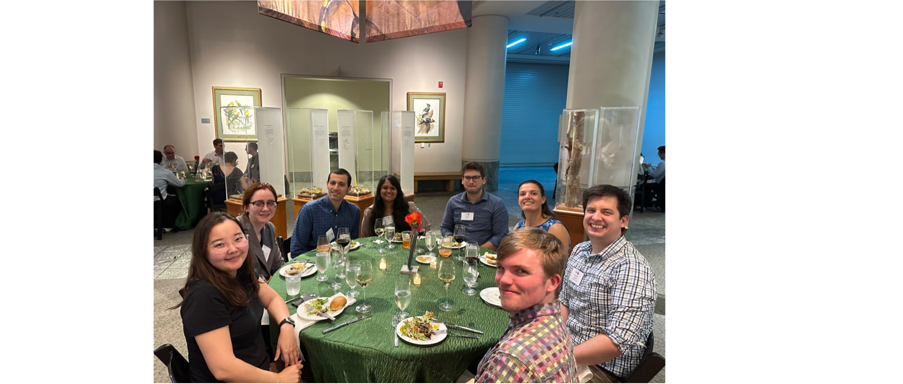

*Img caption.* Welcome to the Fpi15 conference! 

The Fpi15 conference ran from 16-21 June 2023 in Raleigh, North Carolina. The theme of this conference is *pi-electron systems* - which cover conjugated organics and their applications. On Friday 16 June 2023, there was a welcome reception to kick off the conference. The American "long weekend" consisted of 4.5 days of amazing talks. There was a poster session in the evening on the *Juneteenth* American holiday, and a banquet on the evening of 20 June. Overall it was a great conference, and I got to meet many people who inspired me. I feel motivated to finish my PhD and begin my career in science. 

From the first day at the Welcome reception, I already knew it would be a great conference. The welcome reception was at Agora Taverna (a Greek restaurant located ~900 m from the convention centre) from 6:30 - 9:30 pm. Here, there was amazing food and drink supplied (including cocktails). I met a lot of students and academics and I was so surprised to meet Young scientists who were already Assistant Professors! 

Some highlights of that night was speaking with Prof. John Reynolds - a super star in conducting polymer synthesis! He was so kind and introduced me to a few other academics. I also met a lot of cool PhD students and post-docs who I continued to get to know throughout the conference. 

*Img caption.* The pre-conference reception. 

The first day of the conference was Saturday (17 June 2023). It was pretty strange that the conference started on a Saturday. Not that it bothered me though, all the days seem to blur as I was travelling for sometime prior to the conference. Turns out that the organisers selected these dates as they were the only ones available at the time. 

There were a lot of amazing talks at this conference and very diverse in the science including small molecule synthesis, polymer synthesis and characterisation as well as device applications and physical chemistry. To be honest though, I have a very limited attention span, therefore, I really needed to select talks that I thought I could give my undivided attention. This usually worked out to be 5-6 talks per day. 

The general structure of the conference was: 
9-9.45 am: The first plenary speaker
9.45 - 10.30 am: The second plenary speaker.
10.30-10.50 am: Morning tea.
10:50-12:30 pm: Session 1 (which includes a 30 min talk from an invited speaker and then 3x 20 minute talks)
12:30 - 1:30 pm: Lunch
1:30- 3:00 pm: Session 2  (same format as session 1)
3:00 - 3:30 pm: Afternoon tea 
3:30-5 pm: Session 3 

Each session was divided into three-coherent streams in Room 301, 302 and 303 - so in each session there was 12 talks in total. This equates to 144 speakers in total. 

Almost everyone at the conference had a presentation. For most of the students, they presented posters during the poster session on Monday night (19/6). Not many students gave oral presentations - which meant that I was selected to present over many other students. This made me feel really good. 

*Img caption.* A snap at the poster session on Monday evening. 

My presentation was on Monday at 11:40 am in Room 301 (doping). I was really nervous beforehand as a lot of the talks were really good and I was afraid that I would not live up to the great work that other people are doing. Immediately after my 20 min talk, I sat down and just had my head down, in sheer embarrassment. This all went away when an academic, Kevin Noonan, approached me to compliment me and give me some tips to help with my experiments (**I love the tips**). 

Later that evening in the poster session, John Reynolds also made me feel a lot better by saying "No-one knows what you are going to say next. Nor do they know your research." It was a good point, that lifted my spirits a little bit. 

I also used the time in the poster session to get more information about how to analyse GIWAXs data - that I have been struggling with in the lab. It seems to be clearer now and hopefully I can complete this without help from my supervisors (They told me if I wanted help, I needed to add someone else to my future publications - which isn't fair considering I just need a little bit of guidance). 

The banquet on Tuesday night was so awesome! The food was great, and I spoke a lot with different people. One person in particular was Prof. Thuc-Quyen Nguyen, from Santa Barbara University. She gave me some useful tips for starting my career and said that the best thing to do after my PhD is just take a post-doc and learn something that I've always wanted to learn. 

*Img caption.* Fpi15 banquet dinner with new friends

I told her that I would love to learn how to program. She said that instead of doing nothing - just take a post doc where you do programming. I didn't realise that you could do this, but she said that it is very common. She also expressed the importance of meeting new people and expanding my network. Of course I already knew this, but she said it in a way that really motivated me. But she also expressed the importance of looking for a post-doc ASAP.

Another Professor, told me to add him on LinkedIn and email him when I am finished my PhD and he will hook-me up with another guy who does biodegradable polymers (this is a field that I would love to end up in). Everyone was so nice and made me feel like they want me to do well. I love this community, and it makes me want to stay in academia. 

-------------------------------- 

Some key messages that I take away from this conference: 

- Aggregation is a tricky thing to analyse, but is critical for the charge transport properties: 
1. Aggregates form the lowest energy state: so is important for charge transport. 
2. Crystalline materials form aggregates. 
3. Not all aggregates are crystalline. They may just form from the use of poor solvents. 
- GIWAXs is a very qualitative method of analysis. Different people analyse it in different ways. The most important thing you can get from it is information of the pi-pi stacking nature. 
- A lot of people in this field are working to improve characterisation techniques, including resonance small angle x-ray scattering. 
- Everyone has the same struggles with these polymers that I do: They are difficult to synthesise, become quite insoluble and often struggle to characterise them. 
- A lot of work is involving donor-acceptor CPs to decrease the energy gap. 
- There are 3 or more phases that exist in a CP system: Amorphous, crystalline and the interface between the two. The amorphous regions are important for charge transport but the crystalline regions help to bridge the polymers. 
- Better strategies are being developed to synthesise mono-disperse polymers: work by Prof. Dwight Seferos at the University of Toronto. Note for future job opportunities: he has a lot of funding and recently opened a centre for this research
- Keeping the potential low during characterisation produces a more stable film: which is exactly what I have observed in my research. More crystalline polymers will oxidise/charge at lower potentials. 

Some key problems in synthesis: 
1. Monomer synthesis - atomic efficiency is very low. 
2. The use of chlorinated solvents: a lot of people are trying to use water-systems for polymerisation and processing. 
3. Forming films: Blade coating through optimal temperature and solvent creates better defect free films. 

The importance of ionic CP electrolytes was also emphasised: Having a self-doping mechanism (like that in one of my projects) allows for faster switching in an OECT device because we are not relying on the diffusion of ions into the film (to turn on or off). 