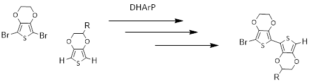
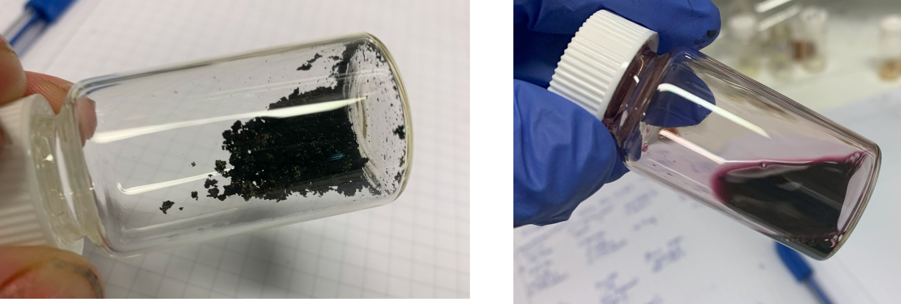

# Starting a new side-project with only a few months left in my PhD. 

### 2023-05-12

I am a polymer chemist. Synthesising new polymers is like going on a crazy adventure - it is so exciting. I love creating new polymers with interesting macro-architectures that could have applications in the real world. For example, during my honour’s year at the University of Sydney, I synthesised molecular polymer brushes for potential cartilage replacements. These are polymers with branches extending off the chain to literally look like a bottlebrush (on the nanoscale).

Throughout my PhD, I feel like I have taken a step in a different direction. Instead of making cool architectures like I did previously, I have moved towards conducting polymers. This entails basic synthesis such as mixing with FeCl3 or through electrochemical polymerisation. These are not methods that require any skill. I feel like most of the challenges has been surrounding monomer synthesis. It has been frustrating as I am not a small molecule chemist, nor do I want to be.

As I’ve been preparing for a trip to New Zealand to do Raman Spectroscopy of all my materials, I have been really pushing to get out a material that I have been working on for the last year. I was so excited last Saturday when I observed (through carbon and proton NMR) that I had the material. Upon workup, something happened and somehow, I lost it. I can’t quite figure out what went wrong. After an almost meltdown, I told my supervisor what had happened, and he decided that we should post-pone the trip. Wonderful! Now I get more time to recreate the material and really understand what is going on. But first, I need to wait for Jamie to make the starting material for me.

Instead of working on writing my thesis or doing something productive I decided to reward myself with another synthesis. Side note: I may have ADHD; I struggle to concentrate; my brain is constantly filled with ideas, and I often change my tasks without finishing them. 

But this isn’t a random synthesis, it is something I have been dreaming about for a while: [Direct Arylation Polymerisation](/docs/science/polymer-science/synthesis/darp.md)

Dreaming? ….

Yes, dreaming. I can’t tell you how often I have thoughts about DArp. When I’m running, when I’m cooking, when I am in bed…. This was stored in my idea notebook for quite sometime, and finally today, as a Friday treat, I decided to do this reaction.

I think if it works it will be great and Pawel has often said to methat it is never too late to do something cool. Damia and David disagree and say that I should focus on finishing my thesis. Me, I say that I am going to work on it as a side project, because it makes me excited to do polymer synthesis again! They don’t need to know 😊

### 15.5.23
I skipped #paddling this morning to go to the lab and workup the polymer that was reacting over the weekend via D(H)Arp. I was so excited when I saw that the solution was purple (this is a good indication that the polymer is present)! I poured the solution into water to precipitate it, then in methanol. The UV-vis spectroscopy showed that the polymer could oxidise with Cu[ClO4]2 and in DCM which is a good sign. The polarising optical microscope showed that this polymer displayed some crystallinity. So far it is a good sign. Currently, I sit in a classroom for CHEM103 teaching and I am so excited to head back to the lab to do more characterisations of this polymer. I am in love!!! 😍😍😍😍

*Fig caption.* Crystalline and soluble polymer powder prepared through Direct Arylation Polymerisation. 

### 24.5.23
The polymer that I made above wasn't electroactive in water, so I tweeked some of the polymerisation conditions (changed the ratios of the monomers). Today, I finished doing the bulk of the characterisation for both polymers. 

This is a little anecdote about experience. A guy fixes an instrument in 20 minutes and charges $20,000. When the customer remarks about the cost of fixing, he then says "it's 20K now, but also 20 years of my life. I am starting to realise the depth of this as the work that I did in two weeks is equivalent to about six months in my first year of PhD. If I started my PhD fresh, right now, I could probably smash it out in 6-9 months. But it took me 3 years to get to this point. 

Special note for PhD students struggling in their first year.. It really doesn't matter what you do, because once you have enough experience, you can complete the project very fast. 

Now, I am ready to get back to writing my thesis and finishing my PhD. 

