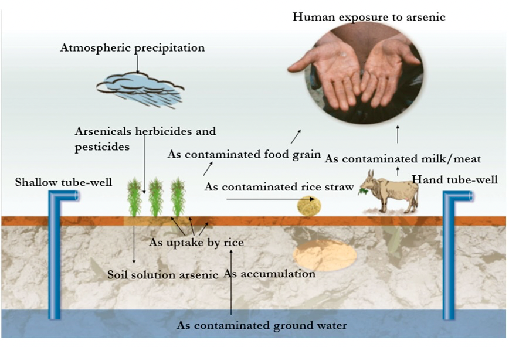

## Introduction

Have you heard the saying “we either grow it or mine it?” I heard this a lot when I was working at ANSTO Minerals, as we grow most of our food and we mine all of the heavy metals that are required in our day to day lives. I'm sure many miners say this to justify the work that they are doing. The issue with the constant mining and environmental pollution is that more heavy metals such as arsenic are ending up in the soil that we use to grow our crops and in the water that we drink. Arsenic has been listed in the top 10 chemicals of major public concern by the [World Health Organisation](https://www.who.int/news-room/fact-sheets/detail/arsenic).

If I can correct myself, Arsenic (As) is actually  a metalloid, which is basically an element that resembles a metal but is not really. Arsenic is in group 15 of the periodic table, underneath nitrogen and phosphorus due to the similar chemical reactivity. While nitrogen and phosphorus are essential for human life, arsenic is not. However, due to the similar chemical reactivity, the body can mistake arsenic for phosphorus, leading to toxicity.

Arsenic has been used in day-to-day life for a long time. Believe it or not, arsenic trioxide was used in medicines (antibiotics), in agriculture as a pesticide, and in alloys such as the lead acid batteries, and electronics. There is substantial evidence that arsenic is a group I carcinogen ([WHO, 2012](https://publications.iarc.who.int/Book-And-Report-Series/Iarc-Monographs-On-The-Identification-Of-Carcinogenic-Hazards-To-Humans/Arsenic-Metals-Fibres-And-Dusts-2012)), which has lead to the ban of arsenic for public use. Now, for workers to be exposed to arsenic containing materials, strict WHS procedures must be followed. 

## Arsenic geochemistry
Arsenic is found in many various minerals, predominantly as arsenic sulfides (eg. arsenopyrite). It is commonly found alongside silica, aluminium, phosphorus, titanium, and gold. Like arsenic, gold also forms sulfides and travels in the same molten fluids, which results in gold becoming “trapped” in arsenopyrite matrix. 
Thus, mining for gold results in an arsenic byproduct that is sent to mining dams or stockpiles. The increasing price of gold results in a higher demand for gold mining and thus an increase in arsenic waste. 

As mentioned, as well as gold, arsenic is also found alongside silica, iron, copper, aluminium, and coal. This means that there are ongoing mining, processing and refining, leading to increased arsenic in mining stockpiles and waste. This in turn leads to arsenic contamination in the air, soil and water, as inorganic arsenic (typically arsenic trioxide). 

Australia has strict legislation to limit the arsenic in stockpiles/waste, with reporting requirements. Many developing nations do not have this same legislation. As a result, many mining companies move the refining of arsenic containing ores/concentrates overseas, where waste disposals are not to a high standard and leaves workers as well as the public open for exposure. 

## Arsenic exposure
We are not safe from arsenic exposure. Arsenic in the waterways makes its way through the soil and into our food. Thus, the main route of human exposure is through ingestion of contaminated food and water. Now, we talk about how bad arsenic is, but up until now you probably have not heard of it. For arsenic to be a problem, it needs to be bioavailable and thus taken up by the human body. Yet, for arsenic to be bioavailable, it needs to be soluble. Arsenopyrite (the main mineral form of arsenic) is generally unreactive and insoluble. It is the arsenates (including arsenic trioxide) that are soluble, which end up in our waterways. 

There are a number of ways in which arsenic (as arsenopyrite or other unreactive minerals) can end up in our waterways, including: 
- Microorganisms increase the bioavailability of arsenic;
- weathering aids in oxidation of arsenopyrite to form arsenates; 
- Acid rain commonly dissolves arsenopyrite, so with increasing acidic waters due to climate change and the dissolution of carbon dioxide into the oceans, arsenic becomes soluble and able to contaminate our water. 

Thus the dissolution of arsenic due to environmental factors mentioned above is further facilitated by mining, in particular for gold, copper, and coal. 

Nowadays, many countries have high levels of arsenic present in their drinking water. This is catastrophic for public health. 

## Arsenic speciation
The type of arsenic that is present at any given time is dependent on on pH, temperature and the oxidative conditions. Arsenic, like many other metals likes to bond with oxygen or sulfur to form predominately arsenate or arsenite.  
-	Arsenate As5+: This is an oxidised and (relatively) less toxic/mobile form 
-	Arsenite As3+: This is the reduced and more toxic/mobile form. 

## Arsenic toxicity
When arsenic is ingested at low concentrations, arsenic is methylated by arsenic methyltransferase enzyme. In the process of arsenic metabolism, the arsenic species produces free radicals prior to clearance. With high concentrations or frequent exposures to extremely low doses, the free radicals can overwhelm our bodies natural defences, leading to cell and neural damage, ultimately causing cancers overtime.

At high arsenic doses (usually for industrial workers), the enzymes that methylate arsenic will become saturated. In this case, a small amount of the arsenic will be metabolised and the arsenate or arsenite will behave as a free molecule. Arsenite (As3+) is signficantly more toxic than arsenate.  

Arsenates (eg. AsO43-) are structurally similar to phosphate (PO43-). When arsenate is present in the body, the cells will confuse it for phosphate and take it up for adenosine triphosphate (ATP) production. 

If you haven't heard of ATP, ATP production is important for energy capture and metabolism. ATP generates energy by cleaving or hydrolysing a phosphate group to form adenosine diphosphate (ADP). The reverse reaction is also true, whereby glucose (the “energy”) can regenerate ATP (Equation 1).  

(Equation 1) ATP + H2O → ADP + HPO42- + H+ + energy

During the reverse process (synthesising ATP), if arsenate substitutes for phosphate, an ADP-arsenate will form, which is highly reactive and will breakdown almost immediately without the generation of energy (arsenolysis). 

In contrast to arsenate, arsenite is even more lethal. Arsenite has a high-affinity for -SH groups, which are commonly found on aminoacids, proteins and enzymes. Arsenite binds to the enzymes (particularly pyruvate dehydrogenase)  to ultimately deactivate them. 

The distruption of enzymatic function as well as the electron transport chains results in generation of reactive oxygen species (ROS) which eventually leads to cancers of the skin, lungs, bladder, liver, kidney and prostate. 

This is frightening to think of. Consuming water contaminated with a small amount of arsenic everyday could cause detrimental effects to our health. But it’s not just water that is contaminated with arsenic. Our plants are too. 

## Arsenic in our plants and food
Arsenic was previously used in herbicides and pesticides and is still present as a consequence. As shown in Figure 1, the arsenic from these pesticides has accumulated in the soil.

As3+ is the common arsenic species that is mobile in the soil. Yet, most of the arsenic in the soil is reduced by microbes under anaerobic conditions (without oxygen) (As5+ to As3+) thereby making arsenic more mobile.

|  |
|:---:|
|*Fig 1. The ecosystem of arsenic contamination. Taken from [Rahman, 2025]( https://pmc.ncbi.nlm.nih.gov/articles/PMC12473819/pdf/toxics-13-00768.pdf)*|

The arsenic in contaminated soil and water are taken up by the plants. Now, we all know that the most common lifestyle factor that can lead to lung cancer is smoking. Did you know that arsenic is commonly found in tobacco plants?

Tobacco plants are hyperaccumulators which means they take up heavy metals from the soil. Arsenic and lead are often found in the soil as they were historically used as pesticides in tobacco farming. 

You’ve heard of second-hand smoking? Or passive smoking? When a cigarette burns, the arsenic present can volatilise and be inhaled. Once inhaled, arsenic can make its way to the brain, liver and around the body to produce ROS and toxicity (eventually lung cancer). 

It’s not just tobacco that are hyperaccumulators. Rice plants in particular are known to take up inorganic arsenic, arsenite and to a lower extent arsenate. That’s why diets with predominately rice as the main carbohydrate can be dangerous and why rice cereals are not really recommended for babies. Adults can clear the small amount of arsenic that is present – but babies and small children may not be able to.

The grains that accumulate arsenic are then consumed by cattle. As a result, milk and meat become contaminated with arsenic. 

Arsenic also accumulates in fish. The good news here is that the arsenic in fish is an organic form, arsenobetaine (C5H11AsO2), which is not toxic to humans and is rapidly excreted. 

Funnily enough, when I was working with arsenic and required to perform a health check, I was advised not to eat seafood for 2 weeks prior to the blood test! This is because the blood test measures the organic arsenates present in the urine.

Back to the main point, the levels of arsenic in animals are usually too low to create any damage – as I said before, the arsenic will clear from the body by our own natural defences. Yet, with increasing arsenic contamination, the animals and fish may die from arsenic poisoning before we can consume them! 

## Treating arsenic poisoning
There are several ways to treat arsenic poisoning. The best way is through a combination of chelation therapies. 

Chelation therapy involves administration of an organic compound which binds to the metal to facilitate excretion by the body. 2,3-dimercaprol; and Meso 2, 3- dimercaptosuccinic acid (DMSA) are two effective chelating agents for arsenic poisoning. 

While natural remedies are not really used for arsenic toxicity, they are helpful to prevent oxidative stress caused by potential low level arsenic exposure. For example, a diet high in iron or selenium can protect against potential low level arsenic poisioning. Vitamin E is also known to protects cells from reactive oxygen species created by arsenic.

But treating individuals with arsenic poisoning is a last resort and not really fixing the problem, especially since arsenic exposures to the point of poisoning are known to cause cancers. As you're probably aware, there is no fix to cancers and cell mutations. We need to do more to prevent arsenic contamination in the first place. 

## What is being done? 
### Conventional methods
There are many solutions to arsenic contamination in the water and soil that are currently being used or have been proposed in the literature. I could spend weeks researching and analysing all of the studies - but I'm not going to do that here. Instead, I am going to list some of the recent strategies investigated and provide you with some review articles of these technologies - like [Nicomel et al. (2015)](https://pmc.ncbi.nlm.nih.gov/articles/PMC4730453/) who dives deep into the conventional processes for arsenic removal from soil and water.

To summarise: 

The conventional methods used today to remove Arsenic from soil includes: 
1. Oxidation from a mobile arsenite (As(III)) to a less mobile arsenate (As(V)) in soil. Oxidising agents typically used include oxygen, hypochlorite or permanganate.
2. Coagulation/flocculation: where treatment with iron or aluminium sulfate causes arsenic to aggregate into flocs, and thereby removed by filtration. 
3. Adsorption: Arsenic is adsorbed to solid materials such as iron hydroxide. 
4. Ion Exchange: Arsenic containing water is passed through beads/resins that tightly bind arsenic. 
5. Membrane filtration: as the name suggests, membranes filter out arsenic. 

Each of these strategies each suffer there own draw backs. For instance, membrane filtration is expensive and suffers from fouling overtime, while ion exchange is not selective and may bind silica or phosphorus instead. 

### Current research into arsenic decontamination
Researchers are working on solving the problems with arsenic contamination in both soil and drinking water. 

#### Soil supplementation
As mentioned, the reactivity of arsenic is affected by the presence of other elements. Soil supplementation with nitrogen, silicon, sulfur and selenium have been tried, with promise for decreasing the uptake of arsenic in the soil. Alternatively, elevated phosphorus in soils can hinder some of the arsenate uptake in plants. 

Biochars have been developed to adsorb arsenic in the soil. They are a charcoal like substance rich in carbon, made from heating feedstock. They are often used to improve soil fertility, water retention and nutrients.  

Researchers have developed a biochar made of iron, manganese, and magnesium for soil. They found that the biochar changes the chemical properties of the soil as well as the speciation of arsenic, making it less mobile for take up by plants.The issue now is that this biochar would need to be refreshed often to ensure that weathering does not alter the arsenic speciation again [(Zhang et al., 2026)](https://pubmed.ncbi.nlm.nih.gov/41745786/). In addition, not all biochar is created equally and may cause more harm if the source was created in an unsustainable matter (e.g. using coal to burn feedstock).

Alternatively, the treatment of soils with hydrogen peroxide (H2O2) results in up to 80% reduction in the uptake of arsenic in rice plants, as the As(III) is oxidised back to As(V).

Funnily enough, there is research being conducted into plant remediation - where plants are purposely used to clean arsenic from the soil. 

Selective breeding is also another strategy being used to develop rice varieties that accumulate less arsenic. 

#### Water remediation
Nanomaterials have potential for arsenic seperation from water. Proposed mechanisms include using magnetic nanoparticles to adsorb arsenic; and carbon-based membranes or metal-organic frameworks to capture the arsenic.

Some other solutions for As5+ remediation include: 
- precipitation with iron hydroxide composites from water
- microbial remediation: where the presence of natural or engineered bacteria oxidise arsenic to precipitate with iron (eg. as FeAsO4) or bind arsenic to the internal cells in the bacteria.
- Creating membranes derived of cellulose and other biomass materials to selectively remove arsenic

## What can we do at home?

On an individual level, we can do our best to keep ourselves safe with due diligence. You should check the water quality in your area and if it is known to contain arsenic. This can be done by downloading your EPA report (if in Australia), check that Arsenic is ≤ 0.01 mg/L (this is the globally recognised standard set by the World Health Organisation).

Next, you could place little value on gold. As previously mentioned, gold is often locked in an arsenopyrite matrix, which means that a higher demand for gold, leads to arsenic pollution as the arsenic is not often captured during gold refining and sent to mining stockpiles. While you may say that gold is irreplacable, it is actually the most useless metal (unless of course, you are an electrochemist wanting to use it as an electrode; or a biomedical engineer wanting to use it for implantable electronics). The high price of gold is driven only by human desire for shiny things. 

Similar to gold, coal mining is another anthropogenic source of [arsenic](https://www.researchgate.net/publication/284581748_Impact_of_elevated_arsenic_in_coal_on_the_geochemical_landscape_of_the_Eastern_US). We could put lower demand on coal mining by using the bulk of your electricity during the day, where the grid is powered by renewables. Better yet, you could install solar power with a battery, making your household 100% renewables. Go further and sell some of your power back to the grid to supply others with renewables. Buy an electric car..... You see where I'm going with this?

## Conclusion

Arsenic is not a new contaminant. It has been apart of the Earth's geochemistry for billions of years. While small amounts of inorganic arsenic could always dissolve in water and be consumed by humans, it was never a public health problem until increased environmental pollution and industrial activities lead to an increase of inorganic arsenic in the water and soil. 

As a type I carcinogen, arsenic exposure can be long lasting. Once it is ingested, the body metabolises arsenic to a methylated form, which in turn produces reactive oxygen species or radicals that can cause cellular damage. When our body is overwhelmed, the arsenic (III or V) can directly affect our energy production and disrupt enzymatic function, respectively. 

While there are methods to treat arsenic poisoning, it cannot overcome the risks of developing disease such as cancers, lung or liver disease. Therefore, the solution to arsenic contamination is through environmental remedies. The current methods of arsenic decontamination can decrease the amount of arsenic in the soil and waterways; but are not a long term solution to the problem, expecially considering that the global pollution is only increasing. 

Sure, there should be more legislation to make mining companies accountable, but it doesn't really solve the problem as waste ends up being shipped overseas to a more "leanient" country.

A more sustainable solution could be similar to what is being done at ANSTO with nuclear waste. At ANSTO, there are projects to tie up nuclear waste into benign synthetic rocks for disposal. Since arsenic contaminants were once from rocks in the earth, perhaps a synthetic rock that aims to store a synthetic arsenopyrite could be a way to more sustainably dispose of the arsenic wastea at a mine site before it ends up in the waterways and our food! 

In addition, we should be putting more emphasis on the recycling of metals instead of mining so that we can decrease the amount of incidental arsenic that is removed from deep under ground. 

Finally, with an increase in renewable energy and electronic vehicles, there will be a decrease in the demand for coal. The lower demand for coal will ultimately decrease the amount of arsenic sent to waste stockpiles or vapourised during downstream processing. 

## References

(1) World Health Organization. Arsenic. 2022. https://www.who.int/news-room/fact-sheets/detail/arsenic (accessed 14.8.26).

(2) O'Day, P. A. Chemistry and Mineralogy of Arsenic. Elements 2006, 2 (2), 77-83. DOI: https://doi.org/10.2113/gselements.2.2.77.

(3) Onishi, H.; Sandell, E. B. Geochemistry of arsenic. Geochimica et Cosmochimica Acta 1955, 7 (1), 1-33. DOI: https://doi.org/10.1016/0016-7037(55)90042-9.

(4) Lan, X.; Lin, W.; Ning, Z.; Su, X.; Chen, Y.; Jia, Y.; Xiao, E. Arsenic shapes the microbial community structures in tungsten mine waste rocks. Environmental Research 2023, 216, 114573. DOI: https://doi.org/10.1016/j.envres.2022.114573.

(5) Jelenová, H.; Drahota, P.; Falteisek, L.; Culka, A. Arsenic-rich stalactites from abandoned mines: Mineralogy and biogeochemistry. Applied Geochemistry 2021, 129, 104960. DOI: https://doi.org/10.1016/j.apgeochem.2021.104960.

(6) Bashir, S.; Sharma, Y.; Irshad, M.; Gupta, S. D.; Dogra, T. D. Arsenic-Induced Cell Death in Liver and Brain of Experimental Rats. Basic & Clinical Pharmacology & Toxicology 2006, 98 (1), 38-43. DOI: https://doi.org/10.1111/j.1742-7843.2006.pto_170.x (acccessed 2025/05/20).

(7) Wang, Y.; An, L.; Chen, L.; Fan, K.; Ying, J.; Lin, C.; Qin, J.; Qiu, R. Mitigating arsenic contamination and boosting rice yield with natural and anthropogenic H2O2 sources. Environmental Technology & Innovation 2026, 41, 104768. DOI: https://doi.org/10.1016/j.eti.2026.104768.

(8) Kozak, K.; Antosiewicz, D. M. Tobacco as an efficient metal accumulator. BioMetals 2023, 36 (2), 351-370. DOI: https://doi.org/10.1007/s10534-022-00431-3.

(9) Abedin, M. J.; Feldmann, J. r.; Meharg, A. A. Uptake Kinetics of Arsenic Species in Rice Plants. Plant Physiology 2002, 128 (3), 1120-1128. DOI: https://doi.org/10.1104/pp.010733.

(10) Poddar, S.; Mukherjee, P.; Talukder, G.; Sharma, A. Dietary protection by iron against clastogenic effects of short-term exposure to arsenic in mice in vivo. Food and Chemical Toxicology 2000, 38 (8), 735-737. DOI: https://doi.org/10.1016/S0278-6915(00)00062-4.

(11) Kalia, K.; Flora, S. J. S. Strategies for Safe and Effective Therapeutic Measures for Chronic Arsenic and Lead Poisoning. Journal of Occupational Health 2005, 47 (1), 1-21. DOI: 10.1539/joh.47.1.

(12) Shukla, K.; Pathak, S. K.; Banerjee, S.; Srivastava, S. Phosphorus-arsenic interaction mitigates toxicity and accumulation of arsenic in rice grown in contaminated fields. Plant Cell Reports 2026, 45 (5), 150. DOI: https://doi.org/10.1007/s00299-026-03814-9.

(13) Zhang, J.; Liang, M.; Qiao, M.; Zhang, Q.; Zhang, X.; Wang, D. Iron–Manganese–Magnesium Co-Modified Biochar Reduces Arsenic Mobility and Accumulation in a Pakchoi–Rice Rotation System. Toxics 2026, 14 (2), 112. DOI: https://doi.org/10.3390/toxics14020112.

(14) Wang, Y.; Guo, C.; Zhang, L.; Liu, Y.; Wang, Y.; Li, X. Comparison of arsenate and arsenite removal behaviours and mechanisms from water by FeLa binary composite (hydr)oxides. Journal of Water Process Engineering 2024, 57, 104603. DOI: https://doi.org/10.1016/j.jwpe.2023.104603.

(15) World Health Organization. Arsenic, Metals, Fibres, and Dusts. In IARC Monographs on the Evaluation of Carcinogenic Risks to Humans Volume, Vol. 100C; 2012. Available from: https://www.ncbi.nlm.nih.gov/books/NBK304380/

(16) Nicomel, N. R.; Leus, K.; Folens, K.; Van Der Voort, P.; Du Laing, G. Technologies for Arsenic Removal from Water: Current Status and Future Perspectives. Int J Environ Res Public Health 2015, 13 (1), ijerph13010062. DOI: https://doi.org/10.3390/ijerph13010062.

(17) Rahman, A. Integrated Approaches of Arsenic Remediation from Wastewater: A Comprehensive Review of Microbial, Bio-Based, and Advanced Technologies. Toxics 2025, 13 (9). DOI: https://doi.org/10.3390/toxics13090768 

