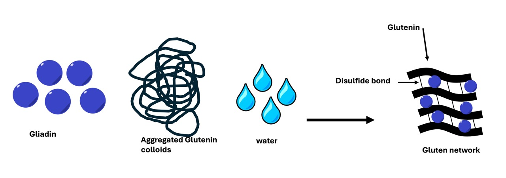

<!-- import Figure from '/Volumes/code/coolcarly.github.io/src/components/Figures/figures'; -->

## A bit of science behind bread

<!-- Over the past few weeks, I have had the desire to improve my baking skills, so I have invested time into making a perfect loaf of bread. With every small tweak in a recipe, I realised that there are dramatic changes, which motivated me to write about the changes in bread quality in relation to the chemistry.  -->

Flour contains proteins glutenin and gliadin, which are hydrophobic (water-hating) peptides. In the presence of water, they will self-assemble to form gluten (Fig 1). Self-assembly is a word that just descibes various things aggregating, or associating with each other. In the case of gluten, this occurs when the hydrophobic regions associate with each other to prevent them being in contact with water. 

Prior to the addition of water, glutenin exists as a colloid (basically a large, suspended molecule). Upon addition of water to the flour, the chains are allowed to stretch, seperate, and form new disulfide linkages. These disulfide linkages create a network of glutenin polymer that produces the strength and elasticity of bread dough. At the same time, the smaller gliadin proteins will disperse through the glutenin polymer network, which allows the bread to "rise". It is the constituent that facilitates formation of the gluten network. Due to it's self-assembling properties (as it is highly hydrophobic), it will associate into spherical particles and absorb other nutrients such as vitamin E. Thus, the quality of the gluten network that forms is dependent on the type of flour that is used.

|  |
|:---:|
|*Fig 1. Schematic of gluten formation*|

Mixing and kneading of the flour/water mixture encourages the gluten network to further develop. During this process, carbon dioxide is incorporated, producing a more porous dough once it is baked. 

However, we dont want the gluten networks to be so strong that they become chewy and tough. This is the reason that people turn to a "no-knead" method. Sometimes, a high water content is enough to facilitate strong gluten networks. 

Yet, there is one more ingredient that is required to create the gluten network... and that is salt. As mentioned in the ["salting-out"](/science/salt) post, salt helps to decrease the water content. In this instance, salt will remove water from the protein/polymer network to increase the strength and elasicity. 

## References
1. Cho, I.H. and D.G. Peterson, Chemistry of bread aroma: A review. Food Science and Biotechnology, 2010. 19(3): p. 575-582.
2. Sha, X., et al., The prolamins, fro structure, property, to the function in encapsulation and delivery of bioactive compounds. Food Hydrocolloids, 2024. 149: p. 109508.
3. Taghdir M, Mazloomi SM, Honar N, Sepandi M, Ashourpour M, Salehi M. Effect of soy flour on nutritional, physicochemical, and sensory characteristics of gluten-free bread. Food Sci Nutr. 2017; 5: 439–445. https://doi.org/10.1002/fsn3.411
