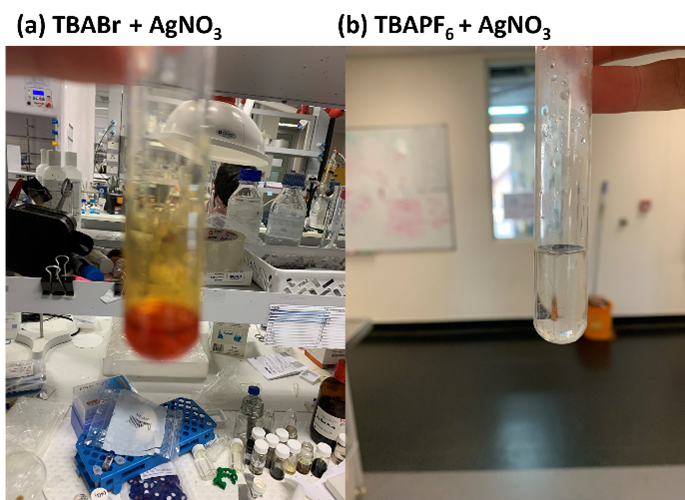

I didn’t do chemistry as a subject at high school. Somehow, I found my way to a PhD in chemistry. It wasn’t because I was particularly good at it either. It seemed like magic, and from the first time I did an organic extraction, I wanted my life to be all about chemistry. 

It was difficult to cement ideas in my mind, when at the same time I was trying to get my head around the chemistry lingo. Chemistry is a different language.

During my undergrad. I didn’t appreciate chemistry as much as I do now. A lot of the things we learned in first year, were not really cemented in the lab. It is only since teaching high school and undergraduate chemistry that I am truly understanding the things that I learned in undergrad.

Lets think about simple exchange reactions:

2NaOH + CaCl2 → Ca(OH)2 + NaCl

Reaction progression is visible here as the calcium hydroxide will precipitate in solution. This idea applies to all ionic species: the salts will exchange counterions. I used this often in my PhD to exchange various salts: primarily sodium for tetrabutylammonium. This phenomenon is also great to determine if reactions have completed and I will explain how I used this here.

In my PhD, I conduct electrochemistry experiments with either NaCl (aqueous) or tetrabutylammonium hexafluorophoshate (TBAPF6, organic). In Oct 2021, I ran out of TBAPF6. The alternative is to use TBAClO4 or TBABF­4 analogue. However, I want to keep all my work consistent (it would look weird in my thesis if I suddenly changed the electrolyte). 

TBAPF6 online is $650 for 100g or $952 for electrochemical grade, which in the scheme of science, isn’t too bad. But it is still money that we do not have at my institute. So instead, I synthesized it from products that we already have in the lab.

We had a large amount of tetrabutylammonium bromide (TBABr) and potassium hexafluorophosphate (KPF6). Each of these costs outweighed the price of TBAPF6 from a store like sigma-aldrich.

**Figure 1.** Salt exchange reaction to yield TBAPF6

**Experimental:** TBABr and KPF6 1:1 was combined in 1:1 water/dichloromethane (DCM) and mixed for 2 hours – until both solutions were clear. The organic layer was collected, dried with MgSO4, filtered, and evaporated to yield white crystals that were recrystallized with ethanol and filtered to yield needle-like crystals 85% yield.

Some notes of the reaction: (1) initially, the DCM solution was a pinkish colour à which turned clear. (2) When I spotted on TLC and stained with iodine, the TBABr was red compared to yellow for other compounds.

It is tricky to determine if the reaction was complete as the TBA cation does not change (so I cannot use NMR). I performed LCMS for both the TBABr and TBAPF6. Both salts had the same cationic spectra, which is expected. The PF6 gave a peak at 144 which corresponds to the molar mass of PF6, yet Br- gave a peak at 146. I could not trust this data.

After a tutoring session, I realized that I could test the presence of bromide by adding silver nitrate. If bromide is present, then AgBr will crash out as it is not water soluble. Thus, I tried it. I added either TBABr or TBAPF6 to an aqueous solution of AgNO3 + HNO3. I observed that the TBABr went a yellw/cream colour with precipitate, while the PF6 did not change.

**Figure 2.** Precipitation reactions of (a) TBABr and (b) TBAPF6with AgNO3

Since Oct 2021, I have been using this electrolyte and it has been working very well.

Patricia (the analytical chemist) also ran Raman spectroscopy for me. PF6 contains a typical vibration between 745 and 750 cm-1 which is very strong and has been reported previously.[1] People have also reported strong stretching vibrations of PF6 at 950-800 cm-1, 845-833 cm-1 for PF6 anion. This convinces me that I have what I wanted!

**References**
[1] Socrates, G., Infrared and Raman Characteristic Group Frequencies:  Tables and Charts. 3. 3 ed. 2002, Chichester, West Sussex, England: J. Wiley and Sons. 348.