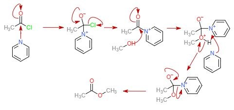

There are many types of reactions that occur in organic molecules. The three main are substitutions, additions and eliminations. In my PhD project, the main reaction that was used to synthesise small molecules was a **nucleophilic substitution.**

As I forget most of my first year chemistry, and I gave away all my notes (biggest mistake), I will only talk about the reactions used in my PhD project. _Side note:_ As a chemist, I do not remember much of my undergraduate chemistry. I think the most important thing to know is that these reactions exist and when you start working with them, you will become more familiar with them. As the phrase goes "use it or lose it."

An example of a nucleophilic substitution reaction that I used in my PhD is the **Williamson Ether Synthesis**. In this reaction, an alcohol group is treated with sodium hydride (NaH) to deprotonate the alcohol and form an alkoxide (a reactive nucleophile). Following deprotonation, an electrophile (usually containing a halide: eg. F, Cl, Br) is added and allowed to react. The reason that a halide (Row 17 atoms) is often used is because it pulls electron density from the carbon adjacent, which results in a very electron deficient carbon. This positive character attracts the alkoxide and forms a new bond: carbon-oxygen. At the same time, the carbon-halide bond is broken as the halide is a very good leaving group.

*Leaving group?* Well this is another term in organic chemistry that describes how easily a reaction will proceed. It is important for a substitution reaction as it is the group that “leaves” or is substituted. The thing that makes something a good leaving group is the bascicity of the compound that leaves. Halides make excellent leaving groups because they form weak bases when removed. Other criteria are also important but can be read [here](https://www.masterorganicchemistry.com/2011/04/12/what-makes-a-good-leaving-group/).

Another classic example of a Williamson ether synthesis is the tosylation of triethyleneglycol. In this reaction, KOH is used to form a sulfonyl intemediate that is electron deficient at the sulfur group, which allows the alcohol to attach to the sulfur. 

The coolest thing about this reaction is that the new tosyl group on the ethyleneglycol chains are good leaving groups. The tosyl group essentially behaves like a halide. This is because the free tosyl group is a weak base that is also stabilised by resonance in the aromatic ring.

*Note:* Tosyls are often used in organic chemistry as "protecting groups" i.e. protectors of free -OH groups. Removal of tosyl groups is often termed "deprotection". 

The **alcylation of alcohols** is another important reaction that was used in my PhD project. In this reaction, [pyridine](https://www.chemtube3d.com/pyridine-nucleophilic-catalyst/) or triethylamine is typically used as a weak base to activate the electrophile. This is typically conducted in DCM or THF solvents.

The limitation of this reaction is that the nucleophile needs to be somewhat reactive. In my experience, this reaction works very well for certain nucleophiles but when the nucleophile is less reactive, one of the reaction products is the pyridinium intermediate.