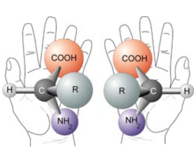

Chiral materials are objects that cannot be superimposed with their mirror image. The best way to think of this is with the analogy of your hands. You have a left and a right hand. They are identical and are mirror images of each other. But your left hand can never be in the same position as your right hand, unless you break some bones. This same idea applies to chiral compounds. Chiral compounds have two pairs: a right-handed and left-handed structure (R)- and (L)-. Each individual structure is called an *enantiomer.* The pair make up a *racemic mixture.*

*Chirality of nature:* Left-handed and right-handed nature of chiral compounds. Img taken from [1](https://www.vanderbilt.edu/AnS/physics/astrocourses/ast201/aastruct.html)

The (L)- and (R)- enantiomers are mirror images of each other, but differ in the way that they rotate light: the right-handed molecule will rotate circularly polarised light (CPL) to the right. A left-handed molecule will rotate CPL to the left. 

Nature uses chirality: All the amino-acids on Earth that are endogenous to the human body are left-handed. Why? No-one knows. Perhaps it has been a long process of evolution. This is so cool! And now, we can manipulate this property of nature. In 2021, Benjamin List and David MacMillan won the nobel prize for their independent discoveries of assymetric catalysis. In this discovery, they used an (L)- aminoacid in the synthesis of chiral compounds that selectively produced the (L)-enantiomer. 

Chemistry is so cool. 