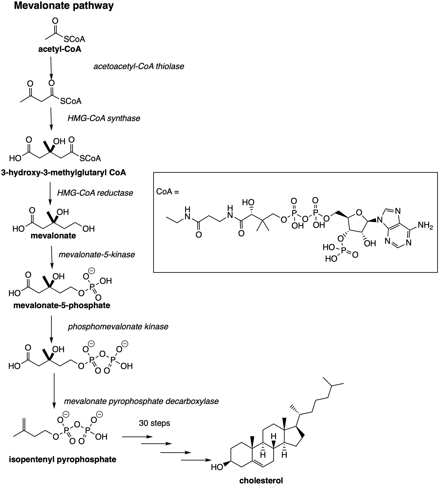
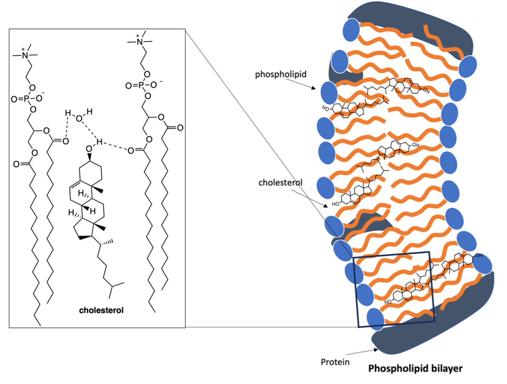
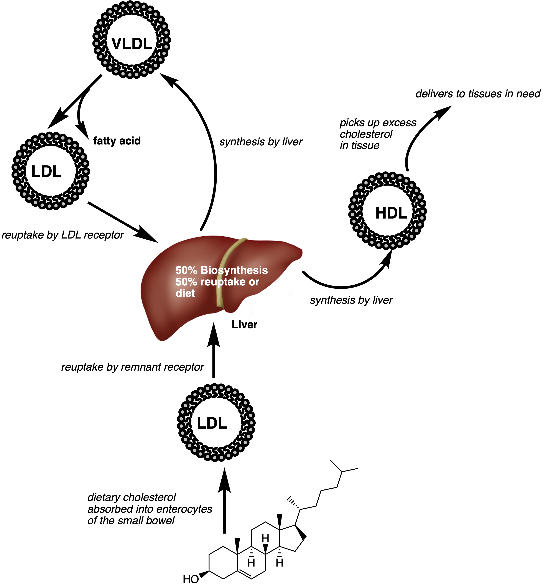

*Date: 2 April 2024*

Cholesterol is a very interesting molecule. The general population refer to cholesterol as bad. They often hear about it in relation to cardiac problems. However, cholesterol is very important for our survival. It is an endogenous biomolecule, meaning that it exists in the body and is made in the body. 

Cholesterol is synthesised in the body by our cells via a mevalonate pathway (Fig 1), with 50% of the total cholesterol content synthesised in the liver. Two molecules of acetyl CoA react to form 3-hydroxy-3-methylglutaryl CoA, aided by HMG-CoA synthase. HMG-CoA reductase converts HMG-CoA to mevalonate; mevalonate-5-kinase forms mevalonate-5-phosphate (Fig 1). Subsequent conversions (in 30 step synthesis) follow to yield ianosterol, then desmosterol and eventually cholesterol.[1]

**Figure 1.** Biosynthesis of cholesterol, involving the mevalonate pathway and 30 subsequent steps involving CYP enzymes to form cholesterol. 

The nature of cholesterol in the cell membrane is still under debate, however, the most accepted model is the theory of lipid rafts.[2] A lipid raft is a microdomain of the cell membrane, where cholesterol and other lipids such as sphingolipids are found.[2, 3] These regions are important for the influx of ions, for the conformational transitions of various proteins important in cell signalling and most importantly, for the maintenance of the selective bilayer.[4, 5] The organisation aspect of the cholesteric structure, the large temperature domain for ordering liquids and ability to compartmentalise regions of the cell is a key factor that drives eukaryotic existence and thus was extremely important in the evolution of humankind.[6] 

The functions of cholesterol are made possible through its molecular structure, that nature has perfected over millions of years. Cholesterol is a large molecule that has one polar region (-OH group), rigid steroidal ring system and an alkyl tail. This structure creates a water-loving (hydrophilic) and water-hating (hydrophobic) region. The presence of the free -OH group allows for cholesterol to hydrogen bond, which results in the formation of cholesterol bilayer arrangements in its crystalline state.[7, 8] In the cell membrane, the hydrogen bonding interactions between cholesterol, water and the phospholipids is stronger, which allows cholesterol to slot within the phospholipid bilayer and maintain positional order (Fig 2).[9] This arrangement allows cholesterol to exhibit liquid crystal phases in the cell membrane.[5, 10] 

**Figure 2.** Structure of cholesterol within the cell membrane.

In contrast, the high level of hydrophobicity in cholesterol means that cholesterol cannot travel around the body by itself and therefore requires a means of transport. To achieve the transport of cholesterol around the body, it is often incorporated into a lipoprotein (Fig 3). A lipoprotein is an assembly of macromolecules that exhibit elements of hydrophilicity and hydrophobicity. 

Most of the cholesterol in our body is transported by high density lipoproteins (HDL), low density lipoproteins (LDL) or very low-density lipoproteins (VLDL). When LDLs and VLDLs pass from the blood stream into the endothelial cells, they are readily oxidised which triggers macrophage encapsulation and ultimately produce foam cells of atherosclerotic plaques, leading to the onset of atherosclerotic lesions and subsequent atherosclerosis (a buildup of fats on the artery wall).[11] 

In contrast, HDLs provide a protective mechanism, that counteracts the foam cells and macrophage encapsulation, which is either due to inhibiting the LDL oxidation; or reverse cholesterol transport.[11] 

From 1997 to 1999, the serum levels (fluid in the blood) of 599 people of the age of 85, living in the Netherlands, were assessed for the LDL and HDL-cholesterol content. Over the course of four years, 152/599 elderly died from cardiovascular disease due to a high LDL-cholesterol level. However, in subjects with low HDL levels, there was increased risk of coronary artery disease, and stroke.[12] 

VLDLs are produced by the liver in response to low levels of cholesterol in the cells. In the plasma, they are metabolised to form LDLs which are cleared by LDL receptors.[13] HDLs are also produced by the liver. However, they aid in the clearance and redistribution of cholesterol.[14]

**Figure 3.** Cholesterol transport by HDLs, LDLs or through the diet. Image adapted from ref [6] and [14]

While cholesterol is not all that bad, like all essential molecules, excess cholesterol can be toxic. As previously mentioned, when cholesterol is intercalated in the cell membrane, it exhibits liquid-like properties. However, when there is a heavy excess of cholesterol, it tends to crystalise. Thus, consequences to high cholesterol levels within foam cells is to rupture, which leads to a heart attack. In contrast, crystallisation of cholesterol in the gut leads to cholesterol gall stones; and to diabetic retinopathy in the eyes.

The crystallisation of cholesterol arises in part from the level of hydration. As previously mentioned, inside the cell-membrane, the structure of cholesterol is controlled by forming a complex with the sphinholipids. However, outside the cell membrane, it is more likely to exhist in a hydrated form. Cholesterol monohydrate is more likely to crystallise than cholesterol, as it does not undergo a “polymorphism” or form a liquid-crystalline/gel-like state.[15]

In addition, a few parameters which influence the crystallisation of cholesterol include the temperature and pH. As the state of matter will change from a solid to a liquid with heating and a liquid to a solid with cooling, it should be no supprise that the temperature will affect cholesterol crystalisation. While our body works to maintain temperature homeostasis at 37 °C, on hot or cold days, our internal systems may rise by ± 3 °C, which can determine the difference between cholesterol in a gel-like state and crystalline state.[16] In addition, Vedre et al. showed that a higher volume is occupied by cholesterol at higher pH.[16]

## References

(1) Shi et al. *Front. Cell Dev. Biol.* **2022**, 10, 819281.

(2) Sezgin et al. *Nat. Rev. Mol. Cell Biol.* **2017**, 18 (6), 361-374.

(3) García-Arribas et al. *Chem.Phys. Lipids* **2016**, 199, 26-34.

(4) Marquardt et al. *Chem.Phys. Lipids* **2016**, 199, 17-25.

(5) Hosta-Rigau et al. *Nanoscale* **2013**, 5 (1), 89-109.

(6) Brown and Galea. *Evolution* **2010**, 64 (7), 2179-2183.

(7) Shieh et al. *Nature* **1977**, 267 (5608), 287-289.

(8) Rapaport et al. *Biophys. J.* **2001**, 81 (5), 2729-2736.

(9) Rowlands et al. *Chem. Commun.* **2020**, 56 (92), 14499-14502.

(10) Róg et al.* Biophys. J.* **2007**, 92 (10), 3346-3357.

(11) Kwiterovich. *Am. J. Cardiol.* **2000**, 86 (12), 5-10.

(12) Weverling-Rijnsburger et al. *Arch. Internal Med.* **2003**, 163 (13), 1549-1554.

(13) Venugopal, S.; Anoruo, M.; Jialal, I. (2023). Biochemistry, Low Density Lipoprotein. In StatPearls [Internet], StatPearls Publishing.

(14) Bailey, A.; Mohiuddin, S. (2022). Biochemistry, High Density Lipoprotein. In StatPearls [Internet], StatPearls Publishing.

(15) Park et al.* J. Am. Chem. Soc.* **2020**, 142 (52), 21872-21882.

(16) Vedre et al. *Atherosclerosis* **2009**, 203 (1), 89-96.

