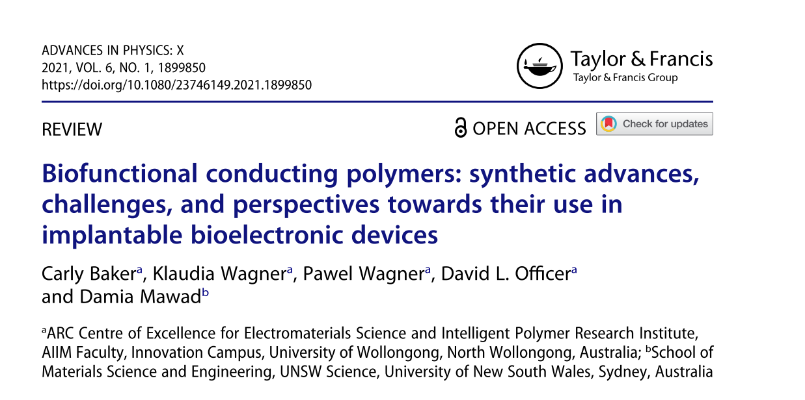

# Introduction 
### The need for new materials
Before I start this post, I should emphasize the importance of a molecule's properties: such as softness, flexibility, rigidity, shape, melting point and so on, on the fuction and application in the real world. This is the driver of materials science and with the syntheses of new functional materials, comes possibilities for solving grand challenges around the globe. One of these challenges is the successful implantation of a device in the brain. This is a challenge as our current materials do not properly match that of the brain. There are materials available for acute studies, but no long term implantable devices. I speak about this in my 3-minute thesis presentation: 

<iframe src="https://player.vimeo.com/video/733877002?h=ef40b4f2e8" width="640" height="564" frameborder="0" allow="autoplay; fullscreen" allowfullscreen></iframe> 

Before we can understand why there is a problem, we need to understand how the body works. 

### What are bioelectrics?
 Our bodies are machines that run off electrical signals. These signals, unlike metallic devices or wires, do not conduct through electrons. They conduct through ionic current: that is the flow of ions in and out of a cell. These ions include sodium, potassium, calcium and chloride. Thus, bioelectrics plays functional roles in regulation of involuntary actions incl. heartbeat and digestion to voluntary muscle contraction.[1]

Due to the importance of electrical signals in the body, malfunctions can resullt in disorders or disease. This has lead to the invention of life-saving devices such as the pacemaker [2, 3]  and other revolutionary technology such as cochlear implants and hearing aids. [4,5]. There is still room, however ,for improvement as challenges still rise with the detection and treatment of other illnesses in the body, ranging from brain-disorders, spinal cord injuries to cancers.  Thus, this field was expected to grow to a $30B market [6] and should be no suprise that key entrepeneurs such as [Elon Musk](https://neuralink.com/) have heavily invested.

### What is the problem?
Moving forward, the challenge of bioelectronics is the Biointerface. The biointerface is a region of contact between living cells, tissues, organs and the implanted material.[7] Once we are in control of the biointerface, do we really have control over the design of a functional biomaterial.[8] Thus, the appication of implantable devices is quite limited as material science has not yet solved the problem of the biointerface. Significant material mismatch increases the noise and interferes with the sensitivity of an implantable device to physiological signals.[9] Additionally, material mismatch triggers a foreign body response (FBR) that results in scar tissue formation overtime and ultimately device failure.[8]

Thus, material advancement in this area would revolutionize biotechnology and provide treatments for many devastating conditions such as spinal cord injuries.[10] The brain interface is a particularly difficult region to treat as brain-tissue tends to be more sensitive with a lower tolerance for foreign materials than the rest of the body. Thus, current materials available have very poor long-term stability and new materials and strategies for material development are desired.[8] 

Considering that all life on earth is made of carbon, the field of bioelectronics has shifted towards producing carbon-based electronics. This allows materials to become more flexible and strong, while also being soft, to better match the properties of the body.[1, 11] As one would think, organics are not as conductive as conventional metals, but a lot of work has been done to improve them and to date, there are some materials that outperform metal.

# Organic bioelectronics

As the name suggests organic bioelectronics are conductive materials that are made of carbon. There are many different materials that have potential for these devices: such as graphene, carbon nanotubes, Silicon (while it is not an organic material, it is very similar to carbon), conducting polymers as well as composites of these materials.[12] There are advantages and disadvantages to each which will be discussed in a different post. 

Conducting polymers are one of the most promising materials. Since their discovery in 1977, this field has boomed.[13] Funny story about the discovery of conducting polymers though, it was officially discovered by three scientists: a polymer chemist Hideki Shirakawa, an inorganic chemist Alan MacDiarmid and a physicist Alan Heeger. Now for three scientists from three different areas to come together and talk science, it is almost like speaking another language. The three disciplines have different jargon to describe the same idea! They made it happen. All three presented their discovery of a polyacetylene that had been doped with iodine to produce a conducting polymer! They all went on to win the nobel prize in 2000.[14]

But... How did they discover it? Well this story is worth more merit as it was by accident. A post-doc, working in Shirakawas lab read the recipe to make polyacetylene wrong. They used a large excess of catalyst, which produced a black, almost aluminium like sheet. Here they discovered that polymers can be doped to become conductive!!!! Revoluntionary!

Conducting polymers were first applied into biological sensors in the early 1980's for glucose detection and since then have grown into wearable and analytical biosensors. They can promote proliferation and differentiation of cells,[15] and can be easily modified to create material properties that are better suited for the tissue-electrode interface: i.e. interact with cells, tissues or organs in a way that metallic devices cannot.[16]

As part of my First Year Review, I wrote a [literature review](https://www.tandfonline.com/share/GGT6K5BVGRSTCVVNGMQZ?target=10.1080/23746149.2021.1899850) about this topic and how we can better create implantable materials. 

More evidence that polymers are the solution to everything. They are everything. 

### References
[1] Di Lauro, M., et al., Exploiting interfacial phenomena in organic bioelectronics: Conformable devices for bidirectional communication with living systems. Colloids and Surfaces B: Biointerfaces, 2018. 168: p. 143-147.
[2] Cingolani, E., J.I. Goldhaber, and E. Marbán, Next-generation pacemakers: from small devices to biological pacemakers. Nature reviews. Cardiology, 2018. 15(3): p. 139-150.
[3] Stevenson, I. and A. Voskoboinik, Cardiac rhythm management devices. Australian Journal for General Practitioners, 2018. 47(5): p. 264-271.
[4] Zeng, F., et al., Cochlear Implants: System Design, Integration, and Evaluation. IEEE Reviews in Biomedical Engineering, 2008. 1: p. 115-142.
[5] Kozai, T.D.Y., et al., Brain Tissue Responses to Neural Implants Impact Signal Sensitivity and Intervention Strategies. ACS Chemical Neuroscience, 2015. 6(1): p. 48-67.
[6] Leger, J.M., Organic Electronics: The Ions Have It. Advanced Materials, 2008. 20(4): p. 837-841
[7] Shende, P. and V.S. Wakade, Biointerface: a nano-modulated way for biological transportation. Journal of Drug Targeting, 2020: p. 1-12.
[8] Anderson, J.M., A. Rodriguez, and D.T. Chang, Foreign body reaction to biomaterials. Seminars in immunology, 2008. 20(2): p. 86-100.
[9] Guimarães, C.F., et al., The stiffness of living tissues and its implications for tissue engineering. Nature Reviews Materials, 2020. 5(5): p. 351-370.
[10] Tarabella, G., et al., New opportunities for organic electronics and bioelectronics: ions in action. Chemical Science, 2013. 4(4): p. 1395-1409.
[11] Löffler, S., et al., Organic bioelectronics in medicine. Journal of Internal Medicine, 2017. 282(1): p. 24-36.
[12] Feron, K., et al., Organic Bioelectronics: Materials and Biocompatibility. International journal of molecular sciences, 2018. 19(8): p. 2382.
[13] Someya, T., Z. Bao, and G.G. Malliaras, The rise of plastic bioelectronics. Nature, 2016. 540(7633): p. 379-385.
[14] Twenty-five years of conducting polymers. Chemical Communications, 2003(1): p. 1-4.
[15] Tsai, N.-C., et al., Poly(3,4-ethylenedioxythiophene) Polymer Composite Bioelectrodes with Designed Chemical and Topographical Cues to Manipulate the Behavior of PC12 Neuronal Cells. Advanced Materials Interfaces, 2019. 6(5): p. 1801576.
[16] Baker, C., et al., Biofunctional conducting polymers: synthetic advances, challenges, and perspectives towards their use in implantable bioelectronic devices. Advances in Physics: X, 2021. 6(1): p. 1899850.