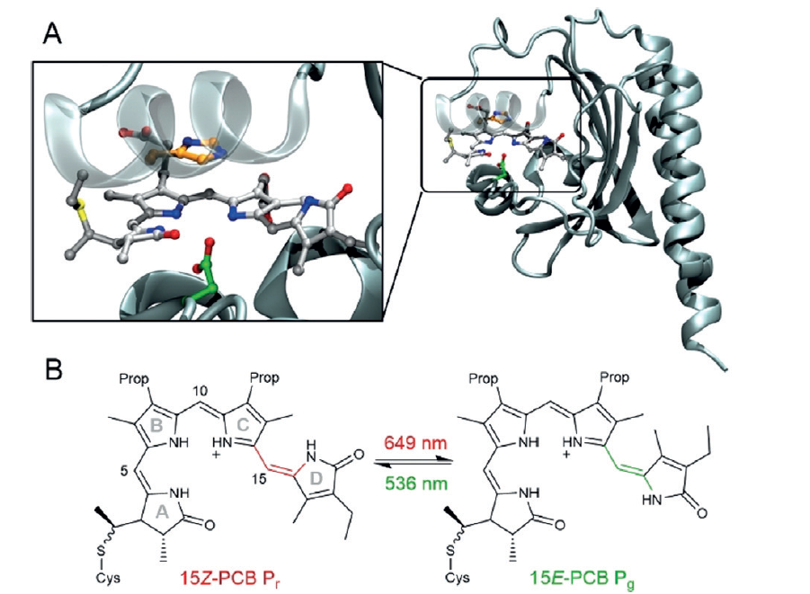

In chemistry, conjugation is a term used to describe how electrons are delocalised across a structure. It is represented in molecular structures through alternating sigma (σ-) and pi (π-bonds). 

It is the alternating sigma and pi bonds in the structure of a polymer such as poly(acetylene) that makes it semi-conducting. Once the semi-conducting polymer (CP) is doped, either chemically or electrochemically, electrons/ions can flow to make it conductive.

Doping a CP introduces polaron bands (see [[Band gaps in CPs]] for more information). UV-vis-near infrared spectroscopy is a common tool used to characterise the polarons, as they absorb light in the UV-vis-nir region of the electromagnetic spectrum. These wavelengths can be correlated with the energy gap between highest occupied molecular orbital (HOMO) and the lowest unoccupied molecular orbital (LUMO).

In their neutral state, semi-conducting polymers they will absorb between 400-600 nm.  When they are doped or oxidised, the polymer will adopt a more planar or quinoid structure which results in a decrease in the band gap and an increase in the absorbance, from UV-vis range to near infrared. These changes in absorbance can provide information about the *conjugation length* of the polymer.

For example, in a PEDOT-based polymer, dimers and trimers will absorb light at 300-400 nm, while the polymer will absorb light at 500-600 nm. However, this method of polymer length is mostly qualitative because polymers will reach their effective conjugation length.

Thus, an effective conjugation length is the length at which addition of extra monomer units to a polymer has no impact on the electronic properties of the polymer. The conjugation length is also impacted by:
- Packing between chains: Usually intermolecular interactions between chains results in an increase in conjugation length because charge is shared across different polymer chains.[1]
- Aggregation: same idea as packing between chains [1]
- Film vs. solution state: A film will have an increase in effective conjugation because the polymer chains are closer together and more densely packed. 
- Type of solvent and oxidation state: some polymers will increase/decrease their conjugation length depending on the type of solvent that is present. This is because the solvent significantly affects the polymer chain packing. .

Another important note is that the effective conjugation length will differ depending on the type of polymer that you have. For example, PEDOT will usually have a higher conjugation length than a poly(thiophene). This is caused by the electron donating nature of the dioxane ring that is attached. The dioxane ring enhances the delocalisation and planarity to produce a polymer with lower oxidation potentials[2].

Nature is the perfect machine for harnessing the energy from the sun. Plants take in the suns energy to stay alive. This is due to the photoreceptive proteins that can efficiently convert sunlight to energy.[3,4] Analogues of oligo(pyrroles) have been found in nature as photoreceptors, termed phytochromes. They use light to undergo a redox reaction (oxidation/reduction) to change colour. This colour change is associated with a change from higher to lower energy states and vice versa and is caused by a change from quinoid to planar structure. This also changes the effective conjugation length, like conducting polymers.[5]

*Fig. Caption.* (A) The binding pocket of the oligo(pyrrole) in a protein to facilitate energy transfer; (B) Redox changes from red to green in the oligo(pyrrole) anologues. Taken from Wiebeler et al.[5]

**References**
1. Zhao, X., P. Sun, and K. Zhao, The study of aggregation dynamics of conjugated polymer solutions in UV-vis absorbance spectra by considering the changing rate of average photon energy. Heliyon, 2021. 7(4): p. e06638.
2. Kim, E.-G. and J.-L. Brédas, Electronic Evolution of Poly(3,4-ethylenedioxythiophene) (PEDOT): From the Isolated Chain to the Pristine and Heavily Doped Crystals. Journal of the American Chemical Society, 2008. 130(50): p. 16880-16889.
3. Zeglio, E., et al., _Conjugated Polymers for Assessing and Controlling Biological Functions._ Advanced Materials, 2019. **31**(22): p. 1806712.
4. Du, J., C. Catania, and G.C. Bazan, Modification of Abiotic–Biotic Interfaces with Small Molecules and Nanomaterials for Improved Bioelectronics. Chemistry of Materials, 2014. **26**(1): p. 686-697.
5. Wiebeler, C., et al., _The Effective Conjugation Length Is Responsible for the Red/Green Spectral Tuning in the Cyanobacteriochrome Slr1393g3._ Angewandte Chemie International Edition, 2019. **58**(7): p. 1934-1938.