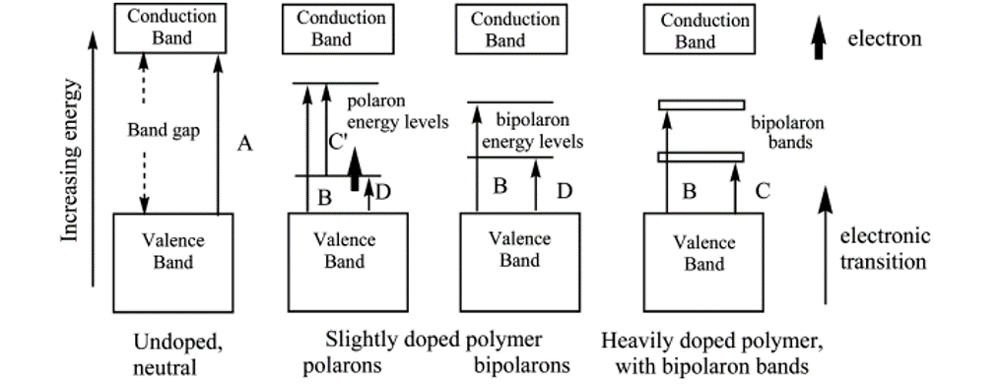
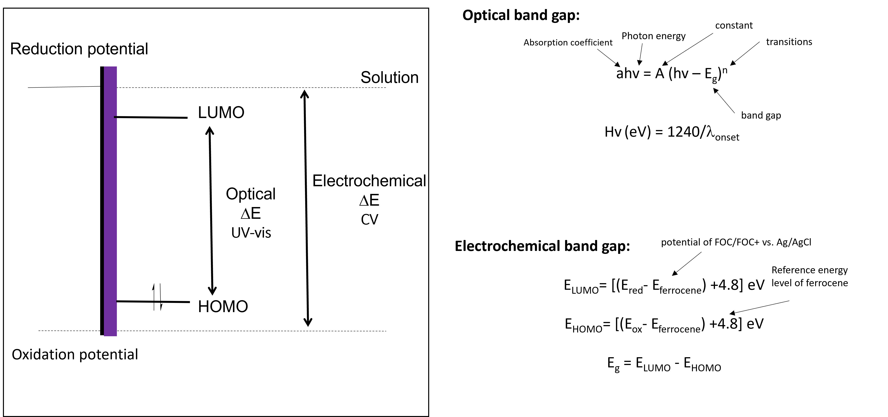
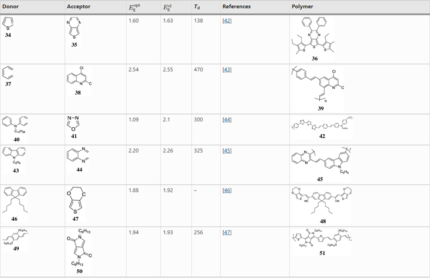
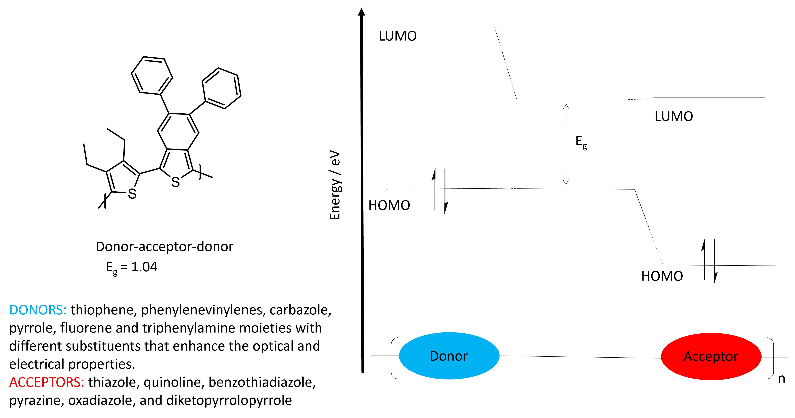

In literature, there is often a misconception of the [conduction band-gap](./conduction-band-gap.md) in conducting polymers. Due to the high degree of localisation and distortion of a conducting polymer backbone, there is minimal participation of conduction across the backbone. In/stead, what people refer to as the conduction band is really the upper polaron or bipolaron band (Fig 1) and usually reflects the optical or electrochemical band-gap.[1]

**Figure 1.** Generalized band diagrams for conducting polymer films: (A) band gap transition (π → π*); (B−D) electronic transitions; (bold arrow) unpaired electron, semioccupied level (SOMO).

The optical band gap can be calculated with UV-vis, while the electrochemical band gap is calculated through cyclic voltammetry (CV). The two values usually differ with the optical band gap being lower than the electrochemical band gap.[2] This is because the optical band gap measures the photons absorbed by the semi-conductor, while the electrochemical band gap becomes the difference in energy between the oxidation and reduction potentials of the polymer (Fig 2). Other things also contribute to the electrochemical band gap including the size of the counterion, film thickness, solvation energies and temperature.  

**Figure 2.** Calculating the optical vs. electrochemical band gap

Whether it is the electrochemical, optical or conduction band gap that we are talking about, the substituent or **R** group plays an important role in this value. Electron donating **R** groups decrease the band gap by increasing the highest occupied molecular orbital (HOMO), while electron withdrawing **R** groups decrease the band gap by decreasing the lowest unoccupied molecular orbital (LUMO). As shown in Fig 3, by simply adding an alkyl chain, we can decrease the band gap by 0.1-0.15 eV.  This provides us with opportunity to engineer the band-gap. 

**Figure 3.** The effect of substituent on the band gap of CPs.

##### Engineering a band-gap
Attempts to further decrease the electrochemical band gap has resulted in the use of donor and acceptor monomers. The name should be intuitive: donors are those molecules that donate electrons, causing it to form a positive charge (are p- type semiconductors), while acceptors are those that accept or take electrons, forming a negative charge (n- type semi-conductors).[3] Some Donor-Acceptor monomers are listed in Table 1. Examples of donating monomers include thiophene, phenylenecinylenes, carbazoles, pyrroles, fluorene and triphenylamine. Examples of acceptor monomers include thiazoles, quinolines, benzothiadiazole, pyrazine, oxadiazole, and diketopyrrolopyrrole

**Table 1** Different types of donors and acceptors in the conjugated backbone and their properties.
]
By synthesising Donor-Acceptor conducting polymers, the HOMO-LUMO energy gap is decreased as the HOMO depends on the electron-rich moiety and the LUMO is based on the electron-poor moiety (Fig 4). [4] These properties combined produces a lower net band-gap.[5] This provides opportunities for improving the efficiency of solar-cells through enhanced light harvesting. It also provides a way to engineer the colour and display of these CPs for OLED applications.

**Figure 4.** The band gap of a donor-acceptor molecule.

While the use of donor-acceptor copolymers decreases the band-gap, the backbone also becomes more planar as a result. Increasing the planarity of the backbone, produces enhanced charged transport along the backbone. This configuration also enhances packing that contributes to more efficient conducting polymers.[4] Furthermore, the arrangement of donor-acceptor molecules provides opportunities for photovoltaic devices as it can act as both an n- and p- type semiconductor.[6]

##### References
[1] Holze, R., _Optical and Electrochemical Band Gaps in Mono-, Oligo-, and Polymeric Systems: A Critical Reassessment1._ Organometallics, 2014. **33**(18): p. 5033-5042.
[2] Bredas, J.-L., Mind the gap! Materials Horizons, 2014. 1(1): p. 17-19.
[3] Mahesh, K., S. Karpagam, and K. Pandian, How to Design Donor–Acceptor Based Heterocyclic Conjugated Polymers for Applications from Organic Electronics to Sensors. Topics in Current Chemistry, 2019. 377(3): p. 12.
[4 ] Müllen, K. and W. Pisula, Donor–Acceptor Polymers. Journal of the American Chemical Society, 2015. 137(30): p. 9503-9505.
[5] Misra, A., et al., Electrochemical and optical studies of conjugated polymers for three primary colours. Indian Journal of Pure and Applied Physics, 2005. 43: p. 921-925.
[6] Khokhar, D., et al., Functionalization of conducting polymers and their applications in optoelectronics. Polymer-Plastics Technology and Materials, 2021. 60(5): p. 465-487.