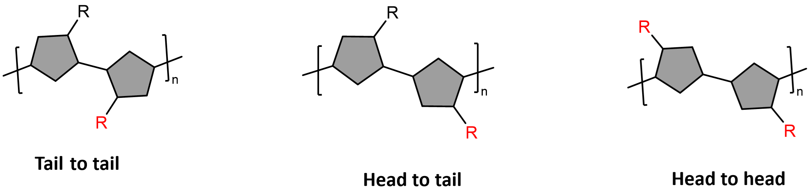

Previously I've said that a chemical structure will determine the properties of a polymer, but it's not just the structure of the monomer that is important. Another key aspect to consider, is it's regioregularity - which is a feature of a polymers structure.

Regio means selective, so regioregularity is a term to describe how selectively regular a polymer is - that is how many defects occur along the chain. Regioregularity plays a big part in deciding whether a polymer will be crystalline or armorphous.[1](https://www.nature.com/articles/ncomms14047) yet this measure only applies for asymmetric polymers i.e. polymers with side-chains. Here, I will refer to a side-chain as **R.**

When a polymer is synthesised, the polymer will make a head-to-head, a head-to-tail or a tail-to-tail arrangement (see the figure below). These arrangements are named based on the position of the R group. (Note: Observe the red R and how the position changes with the arrangements). Usually, literature will say that a head-to-tail arrangement along the whole polymer chain is the decider of a regioregular polymer. However, if the arrangement is head-to-head and it is repeated throughout the structure it may as well be considered somewhat regular.  Some polymers may have 30% defects and still considered regular. This is because the synthesis of polymers is not perfect. It is another art form in my life, that is both challenging and exciting.

Forming regioregular polymers is dependent on the method of synthesis: a more controlled synthesis will produce more regular polymers. Regioregularity is also dependent on the chemical structure of the monomer. If the monomer is symmetrical, the polymer will be regular as there is only one outcome for polymerisation. Alternatively, If the monomer is not symmetrical, it all comes down to selectivity: What configuration is kinetically favourable (see [[Kinetics vs thermodynamics]]) in the polymerisation?

While for some applications regioregularity is not important, in [[Conducting polymers]] , it is the driving factor behind most of the properties that we desire. A more regioregular polymer will be more crystalline with less defects along the chain, which prevents localised conductivity and makes the electron mobility and charge transfer easier from end to end much easier. [2](https://pubs.acs.org/doi/10.1021/jz200546x)

### References

[1] Ying, L., F. Huang, and G.C. Bazan, _Regioregular narrow-bandgap-conjugated polymers for plastic electronics._ Nature Communications, 2017. **8**(1): p. 14047.

[2] Adachi, T., et al., _Regioregularity and Single Polythiophene Chain Conformation._ The Journal of Physical Chemistry Letters, 2011. **2**(12): p. 1400-1404.