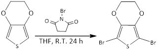
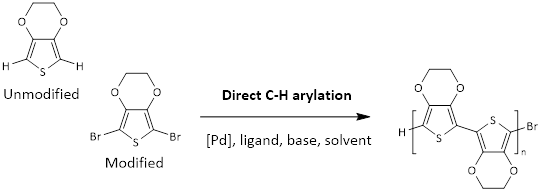

# Direct Arylation polymerisation (DArp)

In the polymer community, DArP is considered to be the eco-friendly alternative for polymer synthesis. In conventional coupling reactions such as Stille and Suzuki methods, excessive prefunctionalisation of monomers with boranes or stananes are required. This requires lagre amounts of solvents to run multiple columns as well as harsh reaction conditions, all in turn resulting in a poor atomic efficiency.[1, 2]

Direct Arylation polymerisation (DArp) only requires half of the monomers to be prefunctionalised with bromine groups, which is a relatively straight forward reaction.[3] In my PhD, I have synthesised monomers with di-bromo groups. An example is the dibromination of 3,4-ethylenedioxythiophene via n-bromosuccimide (Fig 1). The impurities in this reaction can be washed away with NaOH and water to yield a relatively pure product. Thus, column chromatography is not required.

*Fig 1.* Bromination of 3,4-ethylenedioxythiophene. 

You may realise that we still require some monomer prefunctionalisation, which results in wasted organic solvents and some harsh conditions on work up. Furthermore, C-H arylation or DArp method in Fig 2 requires a palladium catalyst which is detrimental to human health if it is not fully removed from the polymer network. The use of metal catalysts also makes this reaction relatively expensive. Thus, it is not until advances in these syntheses are made that we can make polymer science more sustainable.  

*Fig 2.* DArp of EDOT. 

The most attractive quality of this polymerisation is it allows one monomer to be used _as it is._ This means that protective groups are not required because they can be directly coupled via a palladium catalyst. Thus, simple monomers like EDOT can be brominated and then copolymerised with more complex monomers. This is especially important in my PhD project because the molecular structure of the polymers is very difficult to characterise: therefore, we need to know exactly what is attached to the monomer prior to polymerisation.

DArp also provides a way to control the polymerisation. Generally monomers that are polymerised via DArp are mmore regioregular, and due to the coupling between Br and H, you will get a defined copolymer  i.e. A-B-A. In comparison, coupling with FeCl3 which is typically used in CP synthesis, generally results in *random* copolymers and it then becomes difficult to determine the ratios incoporated in each polymer. 

Despite the advantages that this chemistry has over traditional methods, it is a shame that I didn't take advantage of it until late in my PhD. See [Side-projects](/phd/side-projects). 

**References**
[1] Bohra, H. and M. Wang, _Direct Arylation Polymerization for Synthesizing a Library of Conjugated Porous Polymers Containing Thiophene-Flanked Building Blocks._ ACS Applied Polymer Materials, 2019. **1**(7): p. 1697-1706.
[2] Zhao, H., et al., _Facile Syntheses of Dioxythiophene-Based Conjugated Polymers by Direct C–H Arylation._ Macromolecules, 2012. **45**(19): p. 7783-7790.**
[3] Bura, T., et al., Direct heteroarylation polymerization: guidelines for defect-free conjugated polymers. Chemical Science, 2017. 8(5): p. 3913-3925.