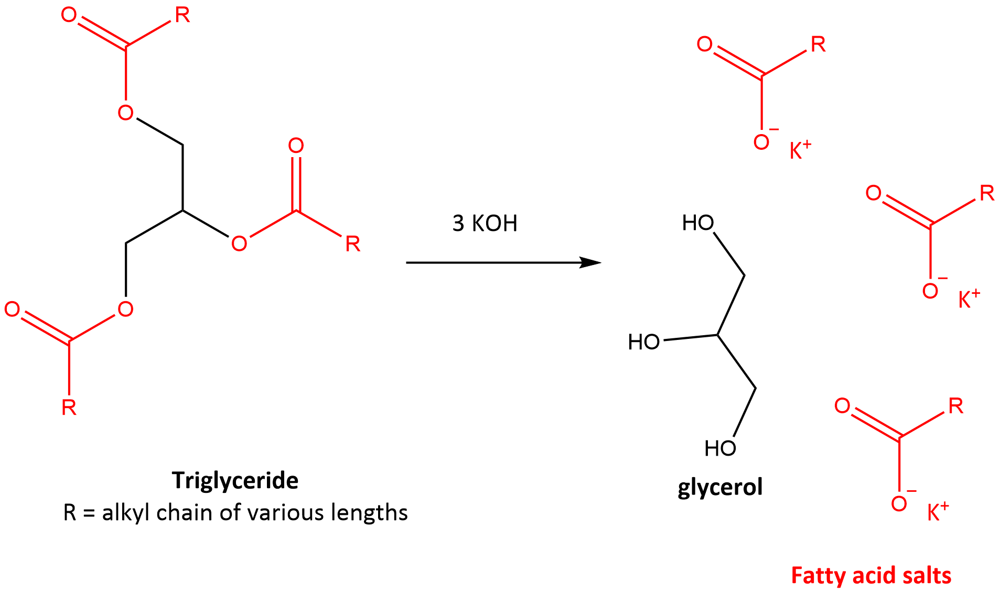

A soap is defined as an organic compound with a hydrophillic head and hydrophobic tail. This is usually achieved through the synthesis of salts with longer alkyl chains. Commercially (and in the food industry), it is achieved by saponifying oils/fats. Thus, saponification is the conversion of oil to soap (fatty acid salt) and is expressed by the chemical reaction:  

**fat/oil + KOH + water → glycerol + fatty acid salt (soap).**

This reaction can be expressed in terms of a saponification number. The higher the saponification number, the more capable the oil is at making soap. Higher triglyceride saponification values suggest more medium chain fatty acids.

**Fig 1.** Saponification: Conversion of triglyceride to glycerol and fatty acid salts via reaction with KOH.

The saponification number is dermined as the weight of KOH required to saponify 1 g of fat. KOH will react with the triglyceride via the carbonate bond (OC=O) (Red in Fig 1). Thus, the amount of KOH to fully cleave the triglyceride into glycerol + the soap can be determined by titrations and used to calculate the average molecular weight of fatty acids present in a sample based on stoiciometry. Thus, a higher saponification value (i.e. using more KOH per gram of fat) = lower MW of fatty acids. This is important because fats/oils with high saponification values are more suitable for soaps.  

The molecular weight is then calculated by: 
Molecular Weight (oil/fat) = (3 x 1000 x 56.1)/SN

Where, SN = saponification number, 3 is the fatty acids residues per triglyceride, 1000 is a conversion factor (mg/g) and 56.1 is the molecular weight of KOH.